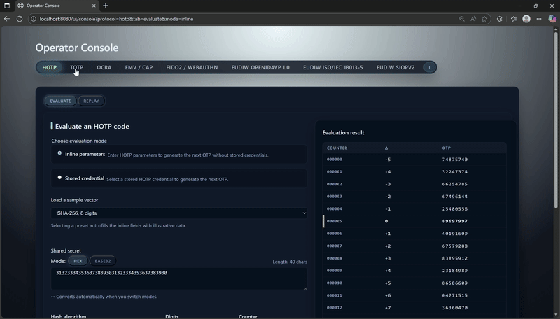

# OpenAuth Simulator

OpenAuth Simulator is a Java&nbsp;17, Gradle-based environment for emulating contemporary authentication credentials and protocols (HOTP/TOTP, OATH OCRA, EMV/CAP, FIDO2/WebAuthn, and EUDIW OpenID4VP wallet artefacts). The project is intentionally greenfield and AI-native; we optimise for fast iteration by AI agents, incremental steps, and the ability to evolve APIs as requirements change. The simulator can be consumed via five surfaces: a Native Java API, CLI commands, REST API endpoints, an operator console web UI, and an MCP agent facade.



## What is this?

This is an AI-native, spec-driven codebase: production feature code is generated by AI agents from specifications and runbooks, with humans acting as reviewers and owners rather than hand-writing implementation.

- Simulates OATH HOTP/TOTP and OCRA (RFC&nbsp;4226/6238/6287) using deterministic secrets and fixtures.
- Emulates EMV/CAP cardholder verification flows for lab, integration, and IAM workloads.
- Exercises FIDO2/WebAuthn assertions and EUDIW OpenID4VP wallet/verifier exchanges with synthetic PID artefacts.
- Provides five consumption surfaces:
  - Native Java API entry points (per protocol).
  - REST API (Spring Boot, OpenAPI-documented).
  - CLI (Picocli commands for credential lifecycle and evaluation).
  - Operator console UI for exploratory use.
  - MCP proxy tools for agent/automation integrations (Model Context Protocol).

Typical use cases include:

- Generating OTPs, assertions, and related responses as part of production customer authentication and authorisation flows in IAM systems.
- Re-evaluating stored OTP/assertion payloads and shared secrets to validate cryptographic traces for non-repudiation and incident investigation.
- Seeding test vectors and fixtures for external systems that need deterministic, spec-aligned authentication behaviour.

On a representative workload, the REST inline endpoints sustain:

- HOTP/TOTP/OCRA/EMV: ~3.4k–6.6k requests/sec with p95 ≲18 ms and p99 ≲28 ms.
- FIDO2/WebAuthn inline assertions: ~2.4k requests/sec with p95 ≈25 ms.
- EUDIW OpenID4VP wallet simulation + validation: ~3.7k–3.9k requests/sec with p95 ≈15–16 ms.

See [REST inline performance baselines](docs/3-reference/rest-inline-performance-baselines.md) for the detailed benchmark table and environment notes.

Licensed under the terms in [LICENSE](LICENSE).

## Current status (2025-11-16)

All major protocol simulators are ready for lab and tooling scenarios; highlights per module:

- ✅ `core` implements protocol primitives and fixtures for HOTP, TOTP, OCRA, FIDO2/WebAuthn, EMV/CAP, and EUDIW OpenID4VP.
- ✅ `application` exposes orchestration services and Native Java API seams (for example `HotpEvaluationApplicationService`, `TotpEvaluationApplicationService`, `OcraEvaluationApplicationService`, `EmvCapEvaluationApplicationService`, `WebAuthnEvaluationApplicationService`, `OpenId4VpWalletSimulationService`, `OpenId4VpValidationService`).
- ✅ `cli` ships Picocli commands for importing, listing, deleting, evaluating credentials, running MapDB maintenance tasks, and exercising fixtures across protocols.
- ✅ `rest-api` exposes JSON endpoints for the simulators, publishes OpenAPI snapshots, and serves Swagger UI at `http://localhost:8080/swagger-ui/index.html` when booted locally.
- ✅ `ui` hosts the operator console at /ui/console, reusing REST endpoints for inline and stored-credential evaluations.
- ✅ Documentation under `docs/` covers Java integrations, CLI usage, REST operations, Native Java usage from tools (JMeter/Neoload), test vector generation, and persistence tuning.

### Protocol reference

Protocol-specific behaviour, parameters, and trace fields are documented under:

- [HOTP](docs/3-reference/protocols/hotp.md)
- [TOTP](docs/3-reference/protocols/totp.md)
- [OCRA](docs/3-reference/protocols/ocra.md)
- [FIDO2/WebAuthn](docs/3-reference/protocols/fido2-webauthn.md)
- [EMV/CAP](docs/3-reference/protocols/emv-cap.md)
- [EUDIW OpenID4VP](docs/3-reference/protocols/eudiw-openid4vp.md)

Pair these references with the how-to guides under [docs/2-how-to](docs/2-how-to) for end-to-end usage patterns.

## Module map

| Module       | Purpose                                                                                       |
|--------------|-----------------------------------------------------------------------------------------------|
| `core`       | Protocol primitives (HOTP/TOTP/OCRA, FIDO2/WebAuthn, EMV/CAP, EUDIW helpers), crypto, fixtures |
| `application`| Orchestration services and Native Java API seams for all protocols                            |
| `cli`        | Picocli tooling for credential lifecycle, evaluation, maintenance, and simulator fixtures     |
| `rest-api`   | Spring Boot facade exposing JSON endpoints and Swagger/OpenAPI documentation                  |
| `ui`         | Server-rendered operator console built atop the REST API                                      |
| `infra-persistence` | MapDB-based `CredentialStoreFactory` and persistence defaults                          |
| `standalone` | Aggregates all simulator modules into the `openauth-sim-standalone` jar (no third-party deps bundled) |

## Quickstart by surface

### Native Java API (example: HOTP)

```java
import io.openauth.sim.application.hotp.HotpEvaluationApplicationService;
import io.openauth.sim.application.hotp.HotpEvaluationApplicationService.EvaluationCommand;
import io.openauth.sim.infra.persistence.CredentialStoreFactory;
import io.openauth.sim.core.otp.hotp.HotpHashAlgorithm;

var store = CredentialStoreFactory.openInMemoryStore();
var service = new HotpEvaluationApplicationService(store);

EvaluationCommand.Inline cmd = new EvaluationCommand.Inline(
        "3132333435363738393031323334353637383930",
        HotpHashAlgorithm.SHA1,
        6,
        0L,
        Map.of(),
        0,
        0);

String otp = service.evaluate(cmd).otp();
```

See [docs/2-how-to/use-hotp-from-java.md](docs/2-how-to/use-hotp-from-java.md), [docs/2-how-to/use-totp-from-java.md](docs/2-how-to/use-totp-from-java.md), [docs/2-how-to/use-ocra-from-java.md](docs/2-how-to/use-ocra-from-java.md),
[docs/2-how-to/use-emv-cap-from-java.md](docs/2-how-to/use-emv-cap-from-java.md), [docs/2-how-to/use-fido2-from-java.md](docs/2-how-to/use-fido2-from-java.md), and [docs/2-how-to/use-eudiw-from-java.md](docs/2-how-to/use-eudiw-from-java.md)
for full Native Java examples across all protocols.

### CLI

```bash
./gradlew --no-daemon :cli:run --args="hotp evaluate --help"
```

Protocol-specific CLI usage (HOTP/TOTP/OCRA/FIDO2/EMV/EUDIW) is documented under [docs/2-how-to](docs/2-how-to) guides (see the `*-cli-operations.md` files).

### REST API and UI

```bash
./gradlew --no-daemon --init-script tools/run-rest-api.init.gradle.kts runRestApi
```

- Swagger UI: `http://localhost:8080/swagger-ui/index.html`
- Operator console: `http://localhost:8080/ui/console`

OpenAPI snapshots live under [docs/3-reference](docs/3-reference) and are enforced by the `OpenApiSnapshotTest` suite.

### MCP proxy (agents)

1. Start the REST facade (see above) so `/api/v1/**` endpoints are available.
2. Create `~/.config/openauth-sim/mcp-config.yaml` (or pass `--config <path>`). Minimal example:

   ```yaml
   baseUrl: http://localhost:8080
   apiKey:
   timeouts:
     defaultMillis: 10000
     hotp.evaluate: 15000
   ```

3. Run the MCP proxy: `./gradlew --no-daemon :tools-mcp-server:run --args="--config ~/.config/openauth-sim/mcp-config.yaml"`.
4. Connect an MCP-aware client (for example `npx @modelcontextprotocol/cli`) to the spawned process. The server streams JSON-RPC messages over stdin/stdout using the standard `Content-Length` framing, exposing tools such as `hotp.evaluate`, `totp.evaluate`, `totp.helper.currentOtp`, `ocra.evaluate`, `emv.cap.evaluate`, `fido2.assertion.evaluate`, `eudiw.wallet.simulate`, `eudiw.presentation.validate`, and `fixtures.list`.

Each tool forwards the supplied JSON payload to the documented REST endpoint and returns the HTTP status/body to the MCP client, so assistants see precisely the same behaviour as human operators using the REST API or UI.

## Standalone distribution

- Published artifact: **`io.github.ivanstambuk:openauth-sim-standalone`**, an aggregated jar that contains all simulator modules (CLI/REST/UI/MCP) while leaving external libraries (Spring Boot, Picocli, MapDB, etc.) as Maven dependencies.
- Build and run locally:

  ```bash
  ./gradlew --no-daemon :standalone:jar
  java -jar standalone/build/libs/openauth-sim-standalone-0.1.3.jar --help
  ```

  (Replace the version suffix with the current `VERSION_NAME` when running locally.) The manifest’s `Main-Class` points to the CLI launcher; REST/MCP facades remain available by running their entry points via `java -cp` and resolving dependencies declared in the published POM. The publication filters out internal modules so the POM only lists third-party libraries—consumers can exclude the ones they do not need or add replacements using [docs/3-reference/external-dependencies-by-facade-and-scenario.md](docs/3-reference/external-dependencies-by-facade-and-scenario.md).

  Gradle (Kotlin DSL):

  ```kotlin
  dependencies {
      implementation("io.github.ivanstambuk:openauth-sim-standalone:0.1.3")
  }
  ```

  Maven:

  ```xml
  <dependency>
    <groupId>io.github.ivanstambuk</groupId>
    <artifactId>openauth-sim-standalone</artifactId>
    <version>0.1.3</version>
  </dependency>
  ```

- Example Gradle dependency snippet (Kotlin DSL):

  ```kotlin
  implementation("io.github.ivanstambuk:openauth-sim-standalone:<version>")
  ```

For release and publishing mechanics, see [docs/5-operations/standalone-release-runbook.md](docs/5-operations/standalone-release-runbook.md).

### Specification-Driven Development (SDD)

> AI-native codebase: all production feature code is generated by AI agents from specifications and runbooks, with humans acting as reviewers/owners rather than hand-writing implementation. That makes the SDD workflow non-negotiable.

- Specifications live under `docs/4-architecture/features/<NNN>/spec.md` and describe the intended behaviour for each feature.
- Each spec has a matching plan/tasks pair at `docs/4-architecture/features/<NNN>/plan.md` and `docs/4-architecture/features/<NNN>/tasks.md` that sequence tests-before-code increments.
- Before changing behaviour, update the spec, stage failing tests, then implement the smallest viable increment and run `./gradlew --no-daemon spotlessApply check`.
- For the full governance story, see [AGENTS.md](AGENTS.md) and the project constitution at [docs/6-decisions/project-constitution.md](docs/6-decisions/project-constitution.md), plus the [GitHub Spec Kit guidance](https://github.com/github/spec-kit/blob/main/spec-driven.md).

## Documentation

Long-form documentation lives in `/docs`:

| Path                     | Highlights                                                   |
|--------------------------|--------------------------------------------------------------|
| `docs/0-overview`        | Product overview, glossary, scope                            |
| `docs/1-concepts`        | Domain concepts, capability matrix, telemetry references     |
| `docs/2-how-to`          | Operator guides for REST, CLI, Java integrations, UI usage   |
| `docs/3-reference`       | Generated artifacts including OpenAPI snapshots              |
| `docs/4-architecture`    | Specifications, feature plans, tasks, roadmap, knowledge map |
| `docs/5-operations`      | Runbooks and analysis gate checklist                         |
| `docs/6-decisions`       | ADRs, including the project constitution                     |
| `docs/7-changelogs`      | Release notes / change log seeds                             |
| `docs/8-compliance`      | Security & compliance posture (stub)                         |
| `docs/_assets`           | Diagram sources and shared images                            |

Consult the living [Implementation Roadmap](docs/4-architecture/roadmap.md) for future priorities, and see [AGENTS.md](AGENTS.md) for AI agent expectations. Contributions welcome—read [CONTRIBUTING.md](CONTRIBUTING.md) before raising PRs.

### For AI assistants and agents

If you're running this repository alongside an AI assistant or agent:

- Use [ReadMe.LLM](ReadMe.LLM) for a compact, LLM-oriented overview of protocols, Native Java entry points, and minimal examples.
- Use [llms.txt](llms.txt) as the manifest of high-signal specs under `docs/4-architecture/features` when constructing context windows.
- Follow [AGENTS.md](AGENTS.md) for governance, workflow, and guardrails before making changes or suggesting refactors.
