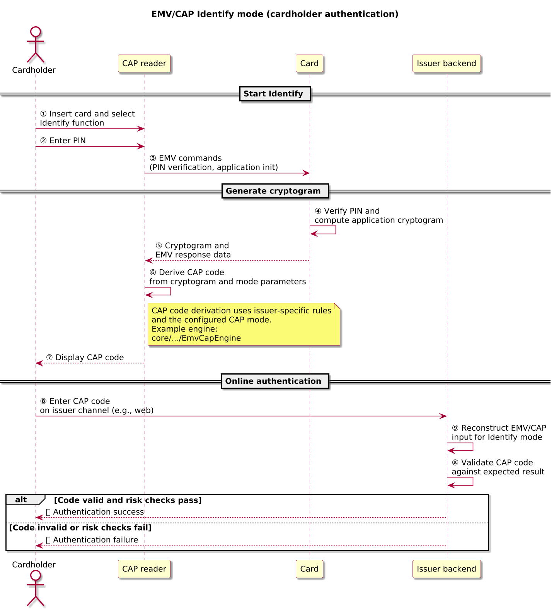
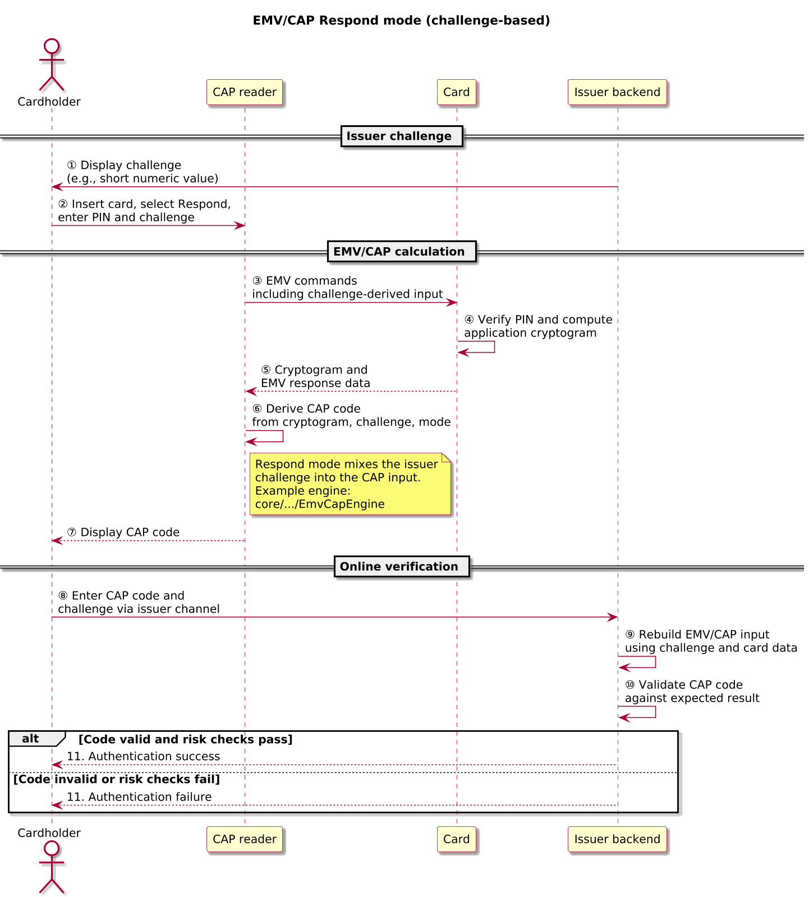
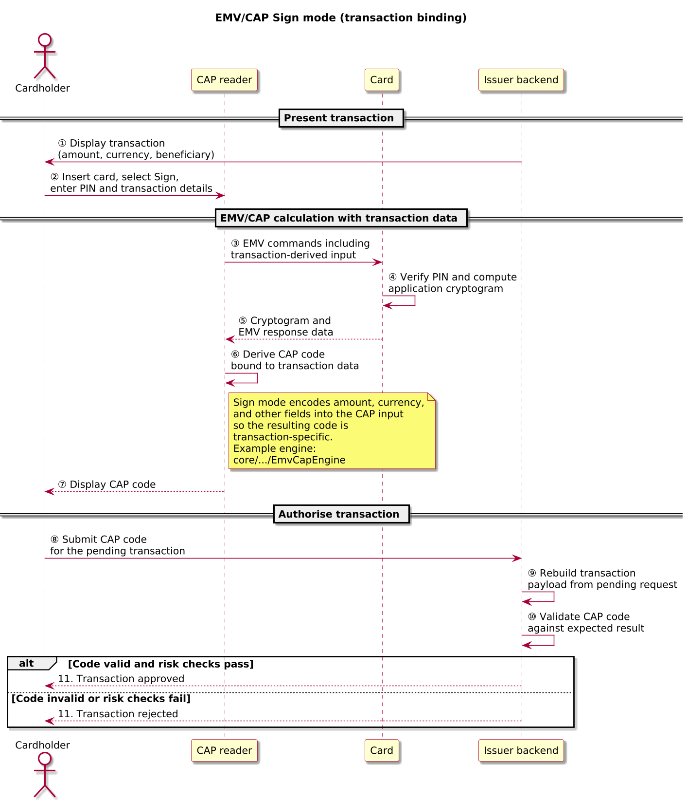
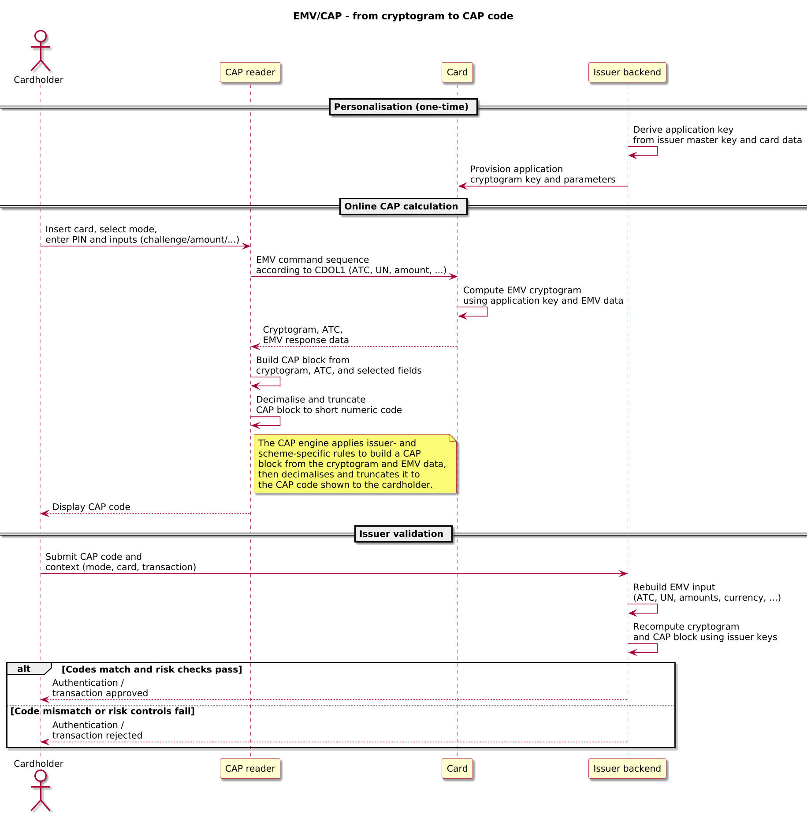

# EMV/CAP – Cardholder Authentication Program

> [!IMPORTANT]
> EMV and CAP specifications published by payment schemes and issuers are the normative references. This note explains roles, flows, and design choices used in the OpenAuth Simulator; whenever there is a difference, the scheme / issuer documentation takes precedence.

Audience: engineers exploring the simulator who already understand basic EMV concepts (PAN, ATC, UN, ARQC, CDOL1).

EMV/CAP (Cardholder Authentication Program) defines how EMV chip cards and readers generate short numeric codes from transaction and card data for use in remote authentication and transaction authorisation. Issuers use CAP modes such as Identify, Respond, and Sign to derive numeric codes that prove card possession and, in some variants, bind approvals to specific transaction details.

> [!NOTE]
> In this simulator, EMV/CAP sits alongside HOTP, TOTP, OCRA, and FIDO2/WebAuthn as one of several authentication and signing mechanisms. CAP reuses EMV transaction cryptography and card + PIN verification; the other documents in this directory describe HOTP/TOTP/OCRA-style OTPs and WebAuthn passkeys.

## EMV/CAP in one page

- Purpose: Derive short numeric codes from EMV chip card cryptograms for use in remote authentication and transaction authorisation.
- Model:
  - CAP reader runs a reduced EMV transaction with the card (PIN verification, ATC, UN, amounts, and risk-management data).
  - Card computes an application cryptogram over EMV input using a card-specific application cryptogram key.
  - Reader maps the cryptogram and selected EMV fields to a short numeric CAP code and displays it to the cardholder.
  - Issuer backend recomputes the same CAP code from its view of the EMV data and card keys and compares.
- Modes:
  - **Identify** – authenticates card + PIN without explicit transaction binding.
  - **Respond** – challenge–response mode where an issuer challenge influences EMV input and CAP code derivation.
  - **Sign** – transaction-binding mode where amount, currency, and beneficiary details are encoded into EMV inputs and bound into the CAP code.
- Security basis:
  - Card-specific symmetric keys derived from issuer master keys (for example, MK_AC) and card data.
  - On-card PIN verification (CVM) and EMV risk rules.
  - Application Transaction Counter (ATC), unpredictable numbers (UN), and issuer-side risk management around progression and replay.

## References and status

| Field | Value |
|-------|-------|
| Normative specs | [EMV specifications (EMV 4.x)](https://www.emvco.com/emv-technologies/specifications/), issuer-specific CAP profiles |
| Profiles | CAP Identify, CAP Respond, CAP Sign (issuer-specific variants) |
| Version focus | EMV/CAP authentication and transaction-signing flows based on commonly deployed profiles |
| Scope | Protocol behaviour and flows between card, reader, and issuer; simulator implementation details are secondary |

## Actors and terminology

The table below introduces only the roles needed to read the diagrams and discussion in this document.

| Actor | Role in this document | Typical term |
|-------|------------------------|--------------|
| Cardholder | Person using the payment card and reader | Cardholder |
| Card | EMV chip card holding keys and card data | ICC / Chip card |
| CAP reader | Device or application that talks to the card and displays CAP codes | CAP reader / token |
| Issuer backend | System that validates CAP codes and authorises authentication or transactions | Issuer backend |

## Core flows

### CAP Identify – cardholder authentication without transaction data

In CAP Identify mode, the cardholder inserts a chip card into a CAP reader, selects an Identify function, and enters a PIN. The reader performs an EMV-style interaction with the card using an application cryptogram request that does not include specific transaction data. The card returns a cryptogram and associated data, and the reader encodes this into a numeric CAP code that the cardholder types into an issuer backend-controlled channel.

Identify mode proves card possession and, when PIN verification is performed on-card, provides strong user authentication without binding the code to a specific transaction.

#### Sequence

1. The cardholder inserts a chip card into the CAP reader and selects Identify mode (diagram step ①).
2. The reader prompts for PIN; the cardholder enters the PIN on the reader keypad (diagram step ②).
3. The reader sends EMV commands to verify the PIN on the card and to request an application cryptogram without explicit amount/currency fields (diagram step ③).
4. The card verifies the PIN, computes an application cryptogram over the EMV input using the application cryptogram key, and returns the cryptogram and EMV response data (including ATC) to the reader (diagram steps ④–⑤).
5. The reader derives a CAP code from the cryptogram, ATC, and configured Identify-mode parameters and displays the code to the cardholder (diagram steps ⑥–⑦).
6. The cardholder enters the CAP code into the issuer backend’s online channel; the issuer backend reconstructs the EMV/CAP input for Identify mode and validates the CAP code and risk checks (diagram steps ⑧–⑪).

#### Key parameters

| Field | Description | Spec reference |
|-------|-------------|----------------|
| PAN and sequence | Primary account number and optional sequence number that uniquely identify the card | EMV Book 3 (Application Specification) |
| Application parameters | EMV application settings that influence cryptogram generation (AIP, AFL, risk management data) | EMV Books 2–3 |
| PIN | Cardholder verification data, typically verified by the card during the EMV interaction | EMV CVM lists |
| Cryptogram | Application cryptogram computed by the card from EMV input data | EMV Book 2 |
| CAP mode (Identify) | CAP configuration indicating that no external transaction data is included | Issuer-specific CAP profile |

#### Policy knobs & pitfalls

- Decide where Identify-mode codes are allowed: they are well-suited for login, step-up, or low-value operations, but not for transaction signing because they are not bound to specific amounts or beneficiaries.
- Align PIN retry and lockout behaviour across EMV, CAP, and backend risk rules so that PIN failures are handled consistently and abuse signals are visible in logs.
- Monitor ATC progression for CAP Identify operations relative to POS/ATM traffic to detect anomalies (for example, unexpected jumps, gaps, or a CAP-only ATC pattern).

#### What to remember

- Identify mode authenticates card + PIN but does not bind the CAP code to explicit transaction data.
- Backend validation relies on reconstructing the same EMV/CAP input as the reader used; configuration drift between card, reader, and issuer risks false negatives.
- Identify-mode CAP codes should be constrained to authentication or low-risk actions; using them for high-value operations weakens “what you see is what you sign”.

### CAP Respond – challenge-based authentication

CAP Respond introduces an issuer backend-provided challenge, such as a short numeric value displayed in an online session. The cardholder enters the challenge and, often, a PIN into the CAP reader along with the card. The reader constructs an EMV command sequence that incorporates the challenge (for example, as part of the unpredictable number or other EMV input), obtains a cryptogram from the card, and encodes it into a CAP code that depends on the challenge. The cardholder returns this CAP code to the issuer backend, which replays the EMV calculation using its own view of the challenge and card parameters.

The issuer backend verifies that the CAP code matches what the card should have produced for the challenge and card, providing a challenge–response style assurance of card possession and cardholder participation.

#### Sequence

1. The issuer backend generates a challenge and displays it to the cardholder through an issuer backend-controlled online channel (diagram step ①).
2. The cardholder inserts the chip card into the CAP reader, selects Respond mode, and enters the PIN and issuer challenge (diagram step ②).
3. The reader embeds the challenge into EMV input (for example, via the unpredictable number or related CDOL1 fields) and sends EMV commands to the card (diagram step ③).
4. The card verifies the PIN, computes an application cryptogram over the EMV inputs (including challenge-derived data), and returns the cryptogram and EMV response data (diagram steps ④–⑤).
5. The reader derives a CAP code from the cryptogram, challenge-derived fields, ATC, and mode parameters and displays it to the cardholder (diagram steps ⑥–⑦).
6. The cardholder types the CAP code (and often the challenge) into the issuer backend’s channel; the issuer backend reconstructs the EMV/CAP input using its record of the challenge and card data and validates the CAP code and risk checks (diagram steps ⑧–⑪).

#### Key parameters

| Field | Description | Spec reference |
|-------|-------------|----------------|
| Issuer challenge | Value displayed by the issuer and entered into the reader to influence the CAP calculation | Issuer-specific CAP profile |
| PIN | Cardholder verification data entered on the reader | EMV CVM lists |
| Cryptogram | Application cryptogram computed over EMV input and challenge-derived data | EMV Book 2 and CAP profile |
| CAP mode (Respond) | CAP configuration indicating how the challenge is encoded and how the code is derived | Issuer-specific CAP profile |

#### Policy knobs & pitfalls

- Treat the challenge as part of your entropy budget: prefer formats that provide sufficient entropy (for example, longer numeric challenges or structured alphanumeric values) and avoid predictable or sequential values.
- Define strict challenge lifetimes and replay rules (for example, one CAP response per challenge, short validity window) and integrate them with rate limiting and lockout policies.
- Ensure frontend and backend use identical rules for encoding the challenge into EMV input; subtle differences in padding or formatting can cause hard-to-diagnose validation failures.

#### What to remember

- Respond mode adds a challenge–response layer on top of card + PIN, making codes specific to an issuer backend challenge.
- Challenge design (format, entropy, and lifetime) is a central security parameter, not an implementation detail.
- Mismatched challenge-derived encoding between CAP reader and issuer backend is a common source of deployment bugs and validation errors.

### CAP Sign – transaction-binding mode

In CAP Sign mode, the issuer backend binds a CAP code to specific transaction details such as amount, currency, and beneficiary. The issuer backend presents the transaction context to the cardholder (for example, “EUR 123.45 to account X”) and instructs them to enter those details into the CAP reader along with their PIN and card. The reader encodes the transaction data into EMV input fields or proprietary CAP payloads, requests a cryptogram from the card, and derives a CAP code that is then sent back to the issuer backend.

The issuer backend reconstructs the same transaction payload from its record of the pending transaction and validates the CAP code against that payload, ensuring that the cardholder has explicitly authorised the transaction parameters they were shown.

#### Sequence

1. The issuer backend prepares a pending transaction (for example, amount, currency, and beneficiary) and displays those details to the cardholder (diagram step ①).
2. The cardholder inserts the card into the CAP reader, selects Sign mode, and enters the PIN and transaction details as instructed (diagram step ②).
3. The reader canonicalises the transaction details (for example, minor units for amount, ISO 4217 currency, normalised beneficiary identifiers) and encodes them into EMV input fields or the CAP payload, then sends EMV commands to the card (diagram step ③).
4. The card verifies the PIN, computes an application cryptogram over the EMV inputs (including transaction-derived data), and returns the cryptogram and EMV response data (diagram steps ④–⑤).
5. The reader derives a CAP code from the cryptogram, ATC, and transaction-derived fields and displays the code to the cardholder (diagram steps ⑥–⑦).
6. The cardholder submits the CAP code to the issuer backend’s channel; the issuer backend rebuilds the canonical transaction payload from the pending transaction record, reconstructs the EMV/CAP input, and validates the CAP code and risk checks before approving or rejecting the transaction (diagram steps ⑧–⑪).

#### Key parameters

| Field | Description | Spec reference |
|-------|-------------|----------------|
| Transaction amount | Monetary amount entered into the reader and recorded by the issuer backend | EMV Book 3; CAP profile |
| Transaction currency | Currency code associated with the transaction amount | EMV Book 3; CAP profile |
| Beneficiary / reference | Encoded account or reference details entered into the reader | Issuer-specific CAP profile |
| PIN | Cardholder verification data | EMV CVM lists |
| CAP mode (Sign) | CAP configuration indicating how transaction data is encoded and how the CAP code is derived | Issuer-specific CAP profile |

#### Policy knobs & pitfalls

- Define and document a deterministic mapping from human-readable transaction details to the encoded EMV/CAP input (amount in minor units, ISO 4217 currency codes, canonicalised beneficiary identifiers) so that issuer backend and CAP reader agree exactly.
- Decide which fields are transaction-binding inputs (for example, amount + currency only, or amount + currency + IBAN/reference); any change to these fields should result in a different CAP code.
- Treat “what you see is what you sign” as a core requirement: issuer backend UI, CAP reader prompts, and canonicalisation rules must all reflect the same transaction details to avoid approval of modified transactions.

#### What to remember

- Sign mode is the transaction-binding flavour of EMV/CAP: CAP codes are tied to specific canonicalised transaction details.
- Real security depends on both cryptography and UX; if cardholders cannot reliably compare what the reader shows with what the bank processes, the binding loses much of its value.
- Logging canonicalised transaction payloads (with appropriate privacy controls) helps diagnose discrepancies between what the cardholder saw and what the issuer backend validated.

## Cryptogram inputs and CAP code derivation

While CAP modes differ in how they collect cardholder input, they all rely on the same underlying EMV cryptogram machinery. At a high level, the CAP reader asks the card to compute a cryptogram over EMV data (including transaction, challenge, and risk-management fields), then derives a short numeric code from that cryptogram plus counters or other metadata. The issuer backend reconstructs the same inputs and runs the same derivation when validating a CAP code.

### Key material and EMV inputs

The exact keys and fields depend on scheme and issuer backend profiles, but CAP engines typically use the following parameters:

| Parameter | Purpose | Spec / profile reference |
|----------|---------|--------------------------|
| Issuer master key (MK\_AC) | Long-term symmetric key held by the issuer backend, from which per-card EMV application keys are derived | EMV Book 2; scheme CAP profiles |
| Application cryptogram key | Card-specific key derived from MK\_AC and card data (for example, PAN and sequence) and used by the chip to compute application cryptograms | EMV Book 2 |
| ATC (Application Transaction Counter) | Monotonic counter maintained by the card, incremented on each EMV transaction or CAP operation; used in both cryptogram computation and CAP code derivation | EMV Book 3 |
| UN (Unpredictable Number) | Terminal-generated random value supplied in EMV commands, often carrying CAP challenges or transaction-specific entropy | EMV Book 2; CAP profiles |
| CDOL1 (Card Risk Management Data Object List 1) | Template that defines which EMV fields (amount, currency, UN, terminal country, etc.) are included in the first GENERATE AC command | EMV Book 3 |
| Amount / currency / transaction data | Monetary and context data used in Sign/Respond modes; encoded into CDOL1 or related EMV fields | EMV Book 3; CAP profiles |
| Issuer / ICC proprietary data | Additional issuer backend-defined fields that may influence risk decisions or CAP code derivation | EMV Book 3; issuer CAP profiles |

### From EMV cryptogram to CAP code (overview)

Implementations differ in how they turn EMV data into a CAP code, but many follow the same conceptual structure.

Inputs (simplified):

- Card-specific application cryptogram key `K_ac`, derived from an issuer master key and card data.
- EMV input vector defined by CDOL1: ATC, UN, amounts, currency codes, and other EMV risk data.
- CAP profile parameters: mode (Identify/Respond/Sign), decimalisation algorithm, and number of digits `Digits`.

On card (cryptogram calculation):

1. Assemble EMV buffer `B` according to CDOL1 using the current ATC, UN, transaction data, and other fields mandated by the profile.
2. Compute an application cryptogram `C = Crypto(K_ac, B)` (for example, an ARQC-style cryptogram) and return `C`, `ATC`, and EMV response data to the reader.

On CAP reader (code derivation):

3. Build an intermediate CAP block `X` from `C`, `ATC`, and selected EMV fields (for example, parts of the UN or transaction data); the exact layout is scheme- and issuer-specific.
4. Decimalise `X` into an integer `N` (for example, interpret nibbles as digits and discard non-decimal nibbles according to the profile).
5. Compute the CAP code as `code = N mod 10^Digits` and format it as a `Digits`-digit string to display to the cardholder.

Issuer-side recomputation:

6. Rebuild `B` from the issuer backend’s view of card and transaction data, recompute `C` and CAP block `X` using issuer backend keys, and derive the expected CAP code. If the recomputed code matches the received code and risk rules (such as ATC progression, timeouts, and replay checks) are satisfied, the issuer backend accepts the operation.

Because CAP profiles are issuer- and scheme-specific, this document does not define a single normative CAP decimalisation algorithm. Instead, it describes the common structure so that readers can relate the simulator’s inputs (master key, ATC, CDOL1, amount, currency, challenge, etc.) back to the EMV building blocks that drive CAP code derivation.

#### Example (symbolic, not scheme-specific)

- Mode: CAP Sign, 8-digit code.
- Card PAN: `1234 5678 9012 3456`, ATC = `0x0123`.
- Transaction: `EUR 123.45` to account `X`.
- Reader canonicalises amount and currency to EMV fields (for example, amount in minor units and ISO 4217 currency) and builds CDOL1 input.
- Card computes cryptogram `C = Crypto(K_ac, B)` over the CDOL1-driven EMV buffer.
- Reader forms CAP block `X` from `C`, `ATC`, and selected transaction fields.
- Decimalisation produces an integer `N` (conceptually, for example, `9876543210`).
- CAP code = last 8 digits of `N` → `76543210`.
- The issuer backend repeats the same steps and accepts the operation if the CAP code it derives is `76543210` and risk checks pass.

## CAP configuration and profiles

The table below summarises common CAP configuration dimensions and how they affect behaviour.

| Dimension | Typical options | Effect on behaviour |
|----------|-----------------|---------------------|
| Supported modes | Identify, Respond, Sign (subset or all) | Determines which flows card + reader can perform and what assurances codes provide. |
| CAP digits | 6–8 digits | Balances guessing difficulty against usability; more digits increase entropy but may reduce usability. |
| Challenge format (Respond) | Numeric `n`-digit, alphanumeric, structured references | Influences entropy and user comprehension; weaker formats must be compensated with rate limiting and strict lifetimes. |
| Transaction data binding (Sign) | Amount + currency only, or amount + currency + beneficiary/reference | Defines how strongly CAP codes are tied to specific transaction details and how resilient they are to replay across transactions. |
| Decimalisation algorithm | Scheme profile A/B, issuer-specific variants | Controls how cryptograms and EMV fields map to CAP codes; differences here can break interoperability across profiles. |
| ATC use in CAP code | Included or excluded from CAP block | Affects replay detection and diagnostics; including ATC in the code improves anomaly detection but complicates decoding. |

## Deployment modes and risk controls

### Mode selection and card configuration

Cards and readers can support different CAP modes, often configured by the issuer backend during card personalisation. The supported modes and their behaviour are constrained by card and reader capabilities:

- Some deployments support only Identify and Respond, while others enable Sign for high-value operations.
- Mode selection can be driven by reader buttons, menu options, or protocol-level configuration; issuers must ensure that mode indicators are unambiguous to the user.
- The same underlying EMV engine may be reused with different CAP mode parameters, highlighting the importance of consistent card configuration and backend validation logic.

### Replay, timeouts, and risk controls

As with other one-time password schemes, EMV/CAP deployments must consider replay and guessing risks:

- CAP codes are typically limited to a small number of digits, so rate limiting and lockout policies are essential to prevent brute-force attempts.
- Issuers often enforce lifetimes or one-time semantics for CAP codes, rejecting codes that are reused or presented after a timeout or after the associated ATC has advanced.
- When CAP Sign is used, the binding to transaction data limits replay across different transactions, but does not remove the need for transport and session protections on the channel that carries CAP codes and transaction context.

### Reader UX and user guidance

- CAP readers and issuer backend channels should clearly label modes (Identify/Respond/Sign) and explain what each mode is being used for in the current journey.
- For Sign flows, the reader display and issuer backend UI must present transaction details in a way that ordinary users can realistically compare (for example, focusing on amount and key pieces of account identity rather than long opaque identifiers).
- Confusing or inconsistent UX can quietly undermine the intended security properties even when cryptography and configuration are correct.

## Security properties and failure modes

> [!WARNING]
> If EMV application keys or PIN handling are compromised, CAP codes no longer provide strong proof of cardholder intent. EMV/CAP inherits the security assumptions of the underlying EMV stack and adds its own dependencies on challenge design, configuration, and user interfaces.

- EMV/CAP derives its security from EMV cryptography (issuer backend master keys, per-card application keys) and cardholder verification; compromise of card keys, key derivation, or PIN handling allows attackers to generate valid CAP codes without genuine user intent.
- Identify mode offers strong cardholder authentication but does not bind codes to specific transactions; Respond and Sign modes add challenge-based and transaction-based binding at the cost of additional user interaction and careful UX design.
- ATC progression is a key diagnostic signal: unexpected jumps, repeated ATC values, or CAP-only ATC increments relative to POS/ATM transaction history can indicate partial cloning, device faults, or misuse of CAP-only profiles.
- Weak challenges, poorly designed transaction encoding schemes, or confusing user interfaces can erode the security benefits of CAP, even when cryptography is sound. Canonicalisation rules for amount, currency, and beneficiary must be clearly defined and applied consistently on both reader and issuer backend.
- CAP codes are typically used as one factor in a layered security model; issuers should integrate CAP flows with robust session management, device profiling, and fraud detection controls.
- CAP does not, by itself, mitigate endpoint compromise or man-in-the-browser attacks: malware that alters transaction details after the cardholder enters a CAP Sign code, or that relays challenges and responses across sessions, can still succeed unless the deployment uses hardened channels and careful session binding.

## Criticism and controversies

- **Opacity and proprietary profiles** – Unlike HOTP, TOTP, or OCRA, CAP profiles are largely scheme- and issuer-proprietary. Being “EMV/CAP compliant” does not guarantee interoperability with a particular bank’s configuration, which makes CAP a challenging candidate for ecosystem-wide standardisation but a realistic target for a simulator.
- **Security vs usability vs cognitive load** – CAP Sign offers strong transaction binding in theory, but expecting users to compare full IBANs and amounts on small reader displays is often unrealistic. In practice, many users focus only on the amount or ignore the device screen altogether, reducing the effective “what you see is what you sign” guarantee.
- **Deployment trends and alternatives** – Some issuers have moved away from physical CAP readers toward app-based approvals, SMS OTPs (with weaker security), or WebAuthn/passkeys. EMV/CAP remains important historically and in some regions and segments, especially for high-assurance flows, but is no longer the default choice everywhere.
- **Complex EMV stack dependencies** – CAP sits on top of an already complex EMV stack (multiple books, scheme rules, and issuer-specific configurations). Mistakes in EMV parsing, key derivation, or CDOL configuration can silently undermine CAP security even if CAP-specific logic follows this document closely.

## Simulator implementation pointers

While this document focuses on the protocol, the simulator implements EMV/CAP behaviour in the `core` and `application` modules. The table below maps flows and concerns to representative types and tests so readers can move directly from diagrams to code.

| Flow / concern | Key types | Representative tests |
|----------------|-----------|----------------------|
| CAP engine and mode handling | [EmvCapEngine.java](../../../core/src/main/java/io/openauth/sim/core/emv/cap/EmvCapEngine.java), [EmvCapMode.java](../../../core/src/main/java/io/openauth/sim/core/emv/cap/EmvCapMode.java), [EmvCapInput.java](../../../core/src/main/java/io/openauth/sim/core/emv/cap/EmvCapInput.java) | [EmvCapVectorFixtures.java](../../../core/src/main/java/io/openauth/sim/core/emv/cap/EmvCapVectorFixtures.java) (fixtures), EMV/CAP core tests |
| Credential descriptors and persistence | [EmvCapCredentialDescriptor.java](../../../core/src/main/java/io/openauth/sim/core/emv/cap/EmvCapCredentialDescriptor.java), [EmvCapCredentialPersistenceAdapter.java](../../../core/src/main/java/io/openauth/sim/core/emv/cap/EmvCapCredentialPersistenceAdapter.java) | [EmvCapReplayFixtures.java](../../../core/src/main/java/io/openauth/sim/core/emv/cap/EmvCapReplayFixtures.java), [EmvCapReplayMismatchFixtures.java](../../../core/src/main/java/io/openauth/sim/core/emv/cap/EmvCapReplayMismatchFixtures.java) |
| Identify/Respond/Sign evaluation flows | [EmvCapEvaluationApplicationService.java](../../../application/src/main/java/io/openauth/sim/application/emv/cap/EmvCapEvaluationApplicationService.java) | [EmvCapEvaluationApplicationServiceTest.java](../../../application/src/test/java/io/openauth/sim/application/emv/cap/EmvCapEvaluationApplicationServiceTest.java), [EmvCapNativeJavaApiUsageTest.java](../../../application/src/test/java/io/openauth/sim/application/emv/cap/EmvCapNativeJavaApiUsageTest.java) |
| Replay and mismatch diagnostics | [EmvCapReplayApplicationService.java](../../../application/src/main/java/io/openauth/sim/application/emv/cap/EmvCapReplayApplicationService.java) | [EmvCapReplayApplicationServiceTest.java](../../../application/src/test/java/io/openauth/sim/application/emv/cap/EmvCapReplayApplicationServiceTest.java) |
| Seeding and sample presets | [EmvCapSeedApplicationService.java](../../../application/src/main/java/io/openauth/sim/application/emv/cap/EmvCapSeedApplicationService.java), [EmvCapSeedSamples.java](../../../application/src/main/java/io/openauth/sim/application/emv/cap/EmvCapSeedSamples.java) | [EmvCapSeedApplicationServiceTest.java](../../../application/src/test/java/io/openauth/sim/application/emv/cap/EmvCapSeedApplicationServiceTest.java) |

These pointers are provided for convenience when exploring this repository. EMV and CAP specifications published by payment schemes and issuers remain the definitive description of EMV/CAP algorithms and profiles.
