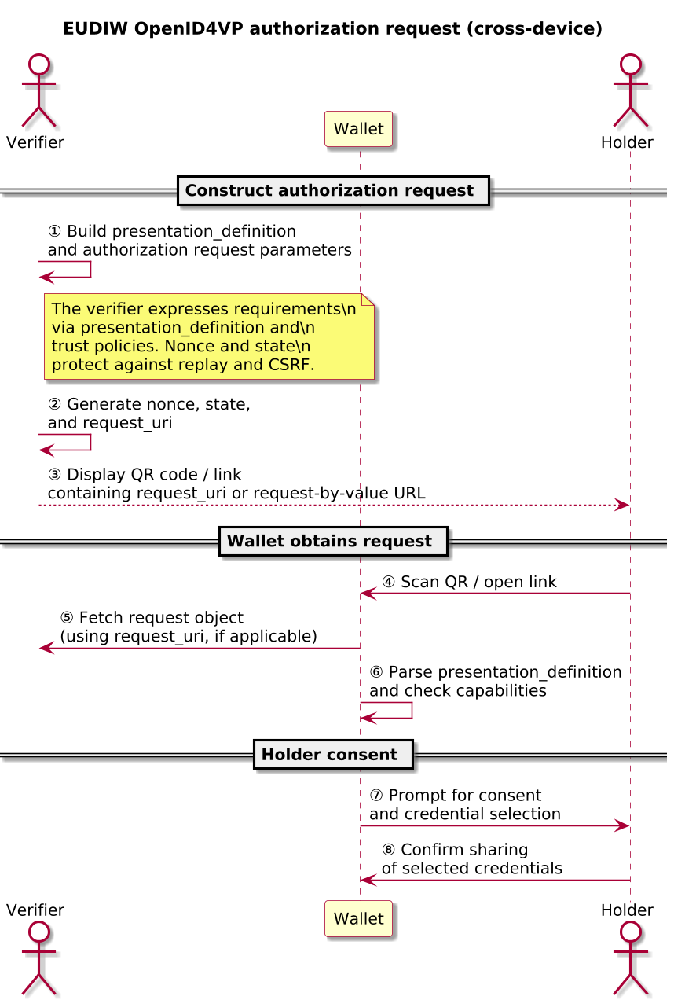
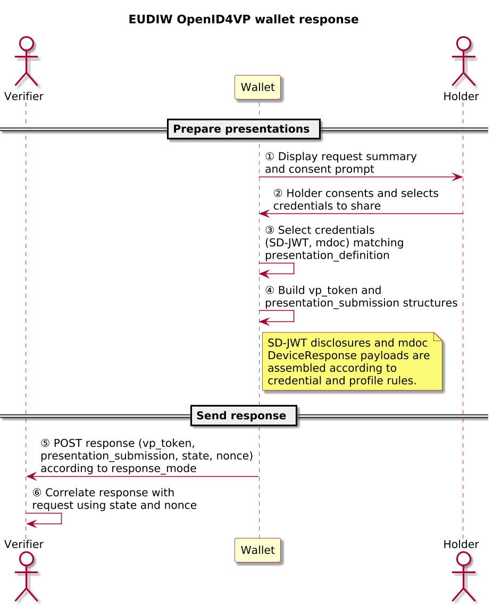
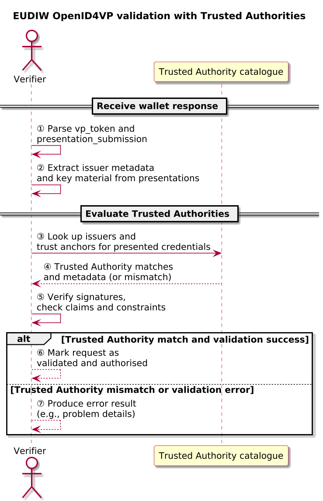

# EUDIW – OpenID for Verifiable Presentations (OpenID4VP)

OpenID for Verifiable Presentations (OpenID4VP) defines how a verifier requests and receives verifiable presentations from a wallet using OpenID-based flows. In the EUDIW context, verifiable presentations can be based on SD-JWT VCs and ISO/IEC 18013-5 mdoc PID payloads, transported in cross-device journeys where a wallet responds to an authorization request issued by a remote verifier.

> [!IMPORTANT]
> OpenID4VP, SD-JWT, ISO/IEC 18013-5, and the EUDIW High Assurance Interoperability Profile (HAIP) are normative. This document is an explanatory companion for the OpenAuth Simulator; the specifications remain authoritative whenever there is a difference.

Audience: engineers exploring the simulator who are familiar with OpenID Connect and verifiable credential basics.

## OpenID4VP in one page

- Purpose: Allow verifiers to obtain verifiable, selectively disclosed credentials from holder-controlled wallets.
- Phases:
  1. **Authorization request** – verifier describes required credentials and claims via `presentation_definition`, `response_type`, `response_mode`, `client_id`, `nonce`, and `state`.
  2. **Wallet response** – wallet selects SD-JWT VCs and/or mdoc credentials, applies selective disclosure, and returns `vp_token` plus `presentation_submission`.
  3. **Validation** – verifier checks cryptographic proofs, binds the response to the authorization request (`nonce`, `state`), and evaluates issuers against Trusted Authorities and policy.
- Key security bindings:
  - `nonce` binds each presentation to a specific authorization request.
  - `state` binds the response to the verifier’s session or browser context.
  - Trust lists and metadata bind credential issuers to Trusted Authorities and policy.
- EUDIW specifics:
  - Supported formats: SD-JWT VC (`application/dc+sd-jwt`) and mdoc PID DeviceResponse.
  - Cross-device flows where a remote verifier emits an authorization request and the wallet responds on another device.
  - HAIP profile that requires signed and encrypted `direct_post.jwt` responses and strict Trusted Authority policies, alongside a more relaxed Baseline profile.

## References and status

| Field | Value |
|-------|-------|
| Normative specs | [OpenID for Verifiable Presentations (OpenID4VP)](https://openid.net/specs/openid-4-verifiable-presentations-1_0-final.html)<br>[Selective Disclosure for JWTs (SD-JWT)](https://www.rfc-editor.org/rfc/rfc9421)<br>[ISO/IEC 18013-5 – mDL/mDoc](https://www.iso.org/standard/69084.html)<br>[EUDIW High Assurance Interoperability Profile (HAIP)](https://openid.github.io/OpenID4VC-HAIP/openid4vc-high-assurance-interoperability-profile-wg-draft.html) |
| Profiles | Baseline profile, HAIP profile (signed and encrypted `direct_post.jwt`) |
| Version focus | Cross-device OpenID4VP flows used by EUDIW PID wallets and verifiers |
| Scope | Protocol behaviour and flows between verifier, wallet, and Trusted Authorities; simulator implementation details are secondary |

## Actors and terminology

The table below introduces only the roles needed to read the diagrams and discussion in this document.

| Actor | Role in this document | Typical term |
|-------|------------------------|--------------|
| Verifier | Service that initiates an OpenID4VP authorization request and validates presentations | Verifier |
| Wallet | Holder-controlled wallet or agent that receives the authorization request and returns a presentation | Wallet |
| Holder | Person controlling the wallet and consenting to share credentials | Holder |
| Trusted Authority | Issuer or trust anchor whose keys and metadata determine which credentials are accepted | Trusted Authority / trust list entry |

## DCQL and `presentation_definition`

DCQL is the query and constraint language the simulator uses to express which credentials and claims a verifier requires. In OpenID4VP, DCQL expressions are embedded into `presentation_definition` objects that wallets evaluate when deciding which credentials can satisfy a request.

- Verifiers encode required and optional credentials/claims, allowed formats (SD-JWT VC, mdoc), and constraints (for example, minimum assurance level, nationality, age).
- Wallets map each `presentation_definition` to local credential stores and enforce their own policies before constructing `vp_token` and `presentation_submission`.
- The simulator exposes DCQL presets and fixtures via `FixtureDatasets` and related tests so operators can see how different policies impact wallet responses and validation outcomes.

## Core flows

### Authorization request – cross-device OpenID4VP

In a cross-device flow, the verifier constructs an OpenID4VP authorization request that describes which credentials it needs and how the wallet should respond. The request includes a `presentation_definition` (for example, via DCQL), a `response_type` such as `vp_token`, a `client_id`, and parameters such as `response_mode`, `nonce`, and (optionally) `request_uri`. The verifier makes this request available to wallets either by value (for example, encoded in a QR/URL) or by reference using a `request_uri` that points to a retrievable request object.

The wallet obtains the authorization request (often by scanning a QR code or following a deep link), evaluates whether it can satisfy the `presentation_definition`, and prompts the holder for consent before preparing a response.

> [!NOTE]
> In HAIP flows, the authorization request (or referenced request object) and subsequent response often rely on signed and encrypted `direct_post.jwt` payloads. Baseline flows may allow simpler response modes such as `direct_post`, but HAIP tightening tends to drive simulator defaults.



#### Sequence

1. The verifier generates high-entropy `nonce` and `state`, then builds a `presentation_definition` describing required credentials and constraints (diagram step ①).
2. The verifier selects `response_type=vp_token`, chooses `response_mode` (for example, `direct_post` or `direct_post.jwt`), and sets `client_id` according to its policy (diagram step ②).
3. The verifier packages parameters into an authorization request object (by value URL/QR or via `request_uri`) and exposes it to wallets (diagram step ③).
4. The holder’s wallet scans the QR code or follows the deep link and obtains the request or dereferences the `request_uri` (diagram step ④).
5. The wallet validates `client_id`, `nonce`, `presentation_definition`, and local policy, then prompts the holder if it can satisfy the request (diagram step ⑤).

Example (schematic, request by value):

```text
GET /authorize?
  client_id=https://bank.example/verifier&
  response_type=vp_token&
  response_mode=direct_post.jwt&
  nonce=4f8c...&
  state=af12...&
  request_uri=https://bank.example/requests/abc123
```

#### Key parameters

| Field | Description | Spec reference |
|-------|-------------|----------------|
| `presentation_definition` | Structure that describes which credentials, claims, and constraints the verifier requires | OpenID4VP and DCQL specs |
| `response_type` | Response type indicating that the wallet will return a verifiable presentation (for example, `vp_token`) | OpenID4VP core |
| `client_id` | Identifier for the verifier, used by the wallet to apply policy and trust decisions | OpenID4VP core |
| `response_mode` | Indicates how the wallet returns the response (for example, `direct_post`, `direct_post.jwt`) | OpenID4VP response modes |
| `nonce` | Fresh value used to prevent replay and bind the presentation to this request | OpenID4VP and OpenID Connect security guidance |
| `state` | Opaque value for the verifier to correlate request and response | OpenID4VP and OpenID Connect core |
| `request_uri` | Reference that the wallet can dereference to obtain the full authorization request object | OpenID4VP core |

#### Policy knobs & pitfalls

- Keep each `presentation_definition` as narrow as possible; over-broad definitions defeat the point of selective disclosure and make wallet UX harder to reason about.
- Align `response_mode` with the chosen profile and wallet capabilities; HAIP flows typically require `direct_post.jwt`, whereas Baseline flows may support simpler form posts.
- Govern `request_uri` integrity and lifetime carefully; stale or tampered request references can undermine both security and user expectations.
- Treat `nonce` and `state` as single-use values scoped to a session; re-use or weak randomness materially weakens replay and CSRF protections.

#### What to remember

- Authorization requests express “what the verifier needs” via `presentation_definition` plus OpenID parameters.
- `nonce` and `state` bind responses to a specific request and session.
- `response_mode` and profile (Baseline vs HAIP) determine how strongly the request and response are protected in transit.

#### Simulator mapping

- Authorization request construction and QR/URL handling:
  - `OpenId4VpAuthorizationRequestService`
  - `OpenId4VpAuthorizationRequestServiceTest`

### Wallet response – SD-JWT VC and mdoc DeviceResponse

After the wallet receives the authorization request and the holder consents, the wallet constructs a response that contains one or more presentations. In the EUDIW context, these may include SD-JWT VCs (`application/dc+sd-jwt`) and ISO/IEC 18013-5 mdoc PID `DeviceResponse` payloads. The wallet applies the `presentation_definition` to select appropriate credentials, filters disclosures as needed, and constructs a `vp_token` structure with corresponding `presentation_submission` metadata.

The wallet then returns the response to the verifier according to the chosen `response_mode` (for example, form post or `direct_post.jwt`), including the `state` so the verifier can correlate it with the original request.



> [!NOTE]
> Under HAIP, wallet responses are typically wrapped in signed and encrypted `direct_post.jwt` payloads; Baseline flows may allow plainer `direct_post` form posts, but simulators often default to the stricter profile.

#### Sequence

1. The holder reviews the request in the wallet and consents to share credentials if the `presentation_definition` can be satisfied (diagram step ①).
2. The wallet selects one or more credentials (SD-JWT VCs, mdoc PID) that match the `presentation_definition` and local policy (diagram step ②).
3. For SD-JWT VCs, the wallet chooses which disclosures to reveal, constructs an SD-JWT-based presentation, and updates `presentation_submission` accordingly (diagram step ③).
4. For mdoc PID, the wallet prepares a `DeviceResponse` payload and adds it to the `vp_token` with matching `presentation_submission` entries (diagram step ④).
5. The wallet returns `vp_token`, `presentation_submission`, `nonce`, and `state` to the verifier according to `response_mode` (for example, `direct_post.jwt`) (diagram step ⑤).

Example (schematic `vp_token` fragment):

```json
{
  "presentation_submission": { "...": "..." },
  "verifiablePresentations": [
    { "format": "dc+sd-jwt", "credential": "eyJ..." },
    { "format": "mdoc", "deviceResponse": "BASE64-DEVICE-RESPONSE..." }
  ]
}
```

#### Key parameters

| Field | Description | Spec reference |
|-------|-------------|----------------|
| `vp_token` | Verifiable presentation token containing one or more SD-JWT or mdoc presentations | OpenID4VP core |
| `presentation_submission` | Metadata that maps presentation content to the `presentation_definition` requirements | OpenID4VP and Presentation Exchange |
| `nonce` | Value echoed from the request to prove that the response corresponds to a specific authorization request | OpenID4VP security considerations |
| `state` | Opaque value echoed from the request so the verifier can correlate the response | OpenID4VP and OpenID Connect core |
| SD-JWT disclosures | Selected disclosures that reveal claim values while preserving unlinkability for unused claims | SD-JWT VC spec |
| mdoc `DeviceResponse` | ISO/IEC 18013-5 structure carrying mdoc payloads such as PID | ISO/IEC 18013-5 and EUDIW wallet profiles |

#### Policy knobs & pitfalls

- Wallets must respect the `presentation_definition` while enforcing holder privacy; SD-JWT’s selective disclosure model only helps if verifiers do not over-specify required fields.
- DeviceResponse payloads can be large; deployments need to balance the amount of PID data requested with performance and UX.
- Multi-credential and multi-format responses require clear policy about whether “any one” credential is sufficient or whether multiple credentials must be presented together.
- The chosen `response_mode` determines where integrity, confidentiality, and replay protections are enforced (form response vs signed/encrypted `direct_post.jwt`).

#### What to remember

- Wallets filter credentials against `presentation_definition` and local policy, then construct `vp_token` plus `presentation_submission`.
- SD-JWT enables selective disclosure; only disclosed claims are revealed, others remain unlinkable across verifiers.
- mdoc DeviceResponse payloads bring their own COSE-level verification requirements.
- `response_mode` and profile (Baseline vs HAIP) determine how strongly wallet responses are protected on the wire.

#### Simulator mapping

- Wallet simulation for SD-JWT and mdoc presentations:
  - `OpenId4VpWalletSimulationService`
  - `MdocWalletSimulationService`
  - `OpenId4VpWalletSimulationServiceTest`
  - `MdocWalletSimulationServiceTest`

### Validation against Trusted Authorities

Once the verifier receives a wallet response, it must validate the presentations against Trusted Authorities and its own policy. This involves checking cryptographic proofs (signatures, key material), verifying that the issuer or trust anchor matches the expected Trusted Authority set, and confirming that the `presentation_submission` satisfies the `presentation_definition`.

The verifier maps the received presentations to a set of Trusted Authority policies and decides whether the presented credentials are acceptable. Validation may yield success, a Trusted Authority mismatch, or other failures such as invalid proofs or missing claims.



#### Sequence

1. The verifier receives the wallet response (and, in HAIP flows, first decrypts and verifies any outer `direct_post.jwt` wrapper) (diagram step ①).
2. The verifier checks that `state` matches the session that initiated the request and that `nonce` matches the original authorization request (diagram step ②).
3. For each presentation in `vp_token`, the verifier validates cryptographic proofs:
   - For SD-JWT VCs, verify issuer signature and disclosures; reconstruct the payload.
   - For mdoc DeviceResponse, verify COSE signatures and issuer metadata (diagram step ③).
4. The verifier looks up issuers in the active trust lists and evaluates them against Trusted Authority policies (diagram step ④).
5. The verifier checks that `presentation_submission` satisfies the `presentation_definition` (required credentials/claims present and constraints met) (diagram step ⑤).
6. The verifier combines per-presentation results and returns a final outcome: success, Trusted Authority mismatch, invalid proof, policy violation, or error (diagram step ⑥).

#### Key parameters

| Field | Description | Spec reference |
|-------|-------------|----------------|
| Trusted Authority policy | Expression of which issuers or trust anchors are acceptable (for example, identified by Authority Key Identifier) | EUDIW HAIP and trust list guidance |
| Trust list / metadata | Data structure containing issuer certificates, keys, and metadata from ETSI or other sources | EUDIW HAIP, ETSI trust list guidance |
| VP Token proofs | Signatures, key bindings, and binding between subject, audience, and claims | OpenID4VP core and credential-specific specs |
| Validation result | Outcome indicating success, Trusted Authority mismatch, or validation error | OpenID4VP error handling guidance |

#### Policy knobs & pitfalls

- Trusted Authority evaluation connects cryptographic material in presentations to a governed trust framework; mismatches should result in clear, auditable validation errors.
- Validation must consider both structure (correct token shapes, signatures, binding to the request) and semantics (required claims present, correct values, acceptable issuers).
- Trust-list lifecycle matters: updates, revocations, and rollbacks must be managed so that newly untrusted issuers are rejected without breaking legitimate traffic.
- When multiple presentations or formats can satisfy a requirement, acceptance policy (for example, prefer HAIP-conformant issuers, require all mandatory claims from a single credential) should be explicit.

#### What to remember

- Validation is where request binding, cryptographic proofs, and Trusted Authority policies come together.
- Failures split roughly into malformed request/response, invalid proofs, Trusted Authority mismatches, and policy violations.
- Trust lists and their update cadence are security-critical; stale or incorrect lists can silently weaken assurance.

#### Simulator mapping

- Validation of wallet responses and Trusted Authority evaluation:
  - `OpenId4VpValidationService`
  - `TrustedAuthorityEvaluator`
  - `OpenId4VpValidationServiceTest`
  - `TrustedAuthorityEvaluatorTest`

## End-to-end verifier algorithm (simplified)

On authorization request creation:

1. Generate high-entropy `nonce` and `state`.
2. Build a `presentation_definition` within policy (request only what is needed).
3. Construct the authorization request (by value or via `request_uri`) and expose it to wallets.

On response reception:

4. If `response_mode` is `direct_post.jwt`, decrypt and verify the outer JWT according to the Baseline/HAIP profile.
5. Extract `vp_token`, `presentation_submission`, `nonce`, and `state` from the response.
6. Check that `state` matches the one issued for this session and `nonce` matches the original request.

For each presentation in `vp_token`:

7. Validate cryptographic proofs:
   - SD-JWT VC: verify issuer signature and disclosures; reconstruct payload.
   - mdoc DeviceResponse: verify COSE signatures and issuer metadata.
8. Evaluate the issuer against Trusted Authorities (trust-list lookup plus policy).
9. Check that `presentation_submission` satisfies the `presentation_definition` (required credentials and constraints).

10. Combine all validation results into a final decision: accept, reject (for example, TA mismatch, invalid proof, missing claim), or error (malformed or incomplete response).

In the simulator, these steps are primarily implemented in `OpenId4VpValidationService` and `TrustedAuthorityEvaluator`, with error mapping handled by `Oid4vpProblemDetailsMapper`.

## Configuration parameters and profiles

OpenID4VP deployments expose a number of configuration knobs that strongly influence security, privacy, and interoperability.

| Parameter | Typical values / options | Effect / trade-off |
|----------|--------------------------|--------------------|
| `response_mode` | `direct_post`, `direct_post.jwt` | Simpler integration vs stronger integrity/confidentiality guarantees |
| Profile | Baseline vs HAIP | Interop focus vs high-assurance requirements (JOSE/COSE, trust policies) |
| Credential formats | SD-JWT VC, mdoc PID, or both | Privacy/UX vs issuer availability and wallet capabilities |
| `presentation_definition` | DCQL constraints, required vs optional claims | Data minimisation vs verifier flexibility and success rate |
| Trusted Authorities set | Minimal, broad, or environment-specific | Acceptance breadth vs trust assumptions and risk appetite |
| Trust-list source | ETSI TL, national TL, synthetic test lists | Governance and auditability vs experimentation and local testing |
| Error response strategy | Simple codes vs RFC 7807 problem details | Implementation simplicity vs diagnostics and observability |

Baseline vs HAIP behaviour:

- Baseline profiles typically allow simpler `response_mode` values and a wider range of credential formats, focusing on interoperability.
- HAIP profiles tighten requirements around `direct_post.jwt`, JOSE/COSE algorithms, Trusted Authority policies, and credential attributes. The simulator’s EUDIW flows are aligned with HAIP defaults unless otherwise noted.

## Error handling and problem details

Validation can fail for many reasons, including malformed requests, missing or invalid presentations, or Trusted Authority mismatches. Robust deployments surface these issues via structured error responses and clear telemetry.

The simulator maps errors to RFC 7807 problem-details payloads using `Oid4vpProblemDetailsMapper`. Conceptually:

| Category | Typical HTTP status | Example problem-details `type` | Notes |
|----------|---------------------|--------------------------------|-------|
| Malformed or invalid authorization request | 400 | `invalid_request` | Missing parameters, bad `presentation_definition`, inconsistent `response_mode` |
| Unsatisfiable `presentation_definition` | 400 | `invalid_scope` / profile-specific type | Wallet cannot satisfy required constraints |
| Wallet refusal or user cancellation | 400 / 403 | `wallet_unavailable` / `access_denied` | Holder declined or wallet aborted the flow |
| Invalid proof (SD-JWT / mdoc) | 400 / 422 | `invalid_presentation` | Signature failures, disclosure mismatch, inconsistent subject/audience binding |
| Trusted Authority mismatch | 403 | `insufficient_trust` (simulator-specific) | Issuer not in Trusted Authorities set or revoked |
| Policy violation (missing required claim) | 422 | `invalid_presentation` | Presentation structurally valid but does not meet verifier policy |

Implementations should:

- Avoid leaking unnecessary details about internal trust policies or validation paths in error payloads.
- Log enough telemetry (including error category and reason) to support diagnostics and security monitoring while respecting privacy requirements.

## Security properties and failure modes

- OpenID4VP builds on the security properties of OpenID flows (use of nonces, state, and origin binding) and adds verifiable presentation semantics; misuse or reuse of `nonce` or `state` values can weaken protection against replay and CSRF-style attacks.
- Wallet responses are only as trustworthy as the Trusted Authority framework and credential issuance process; if trust lists or issuer key management are compromised, verifiable presentations may no longer provide strong assurances.
- Selective disclosure mechanisms such as SD-JWT can protect holder privacy when used correctly, but misconfigured or over-broad `presentation_definition` values can lead to unnecessary data exposure.
- SD-JWT improves privacy against third parties and unintended observers; relying parties and wallets can still correlate sessions via `client_id`, network metadata, and repeated interactions unless deployments consciously minimise linkability.
- Cross-device flows depend on secure channels between holder, wallet, and verifier; QR codes, deep links, and back-channel transports must be protected against tampering and phishing, and wallet UX should make verifier identity clear.
- Trust-list freshness, revocation handling, and audit logging are critical; silent failures in trust-list updates can leave systems accepting revoked issuers or rejecting legitimate ones without clear diagnostics.

## Related mechanisms in the simulator

OpenID4VP in this simulator sits alongside several other mechanisms:

- HOTP/TOTP/OCRA: symmetric OTPs and challenge/transaction signing based on shared secrets and counters/time-steps.
- EMV/CAP: card-based authentication and transaction signing using EMV cryptograms and CAP modes (Identify/Respond/Sign).
- FIDO2/WebAuthn: phishing-resistant public-key authentication and assertion/attestation handling for passkeys.
- OpenID4VP (EUDIW): presentation of previously issued credentials (for example, PID) into new contexts via OpenID-based flows and Trusted Authority policies.

These mechanisms share some conceptual ground (binding secrets to subjects, explicit transaction context, trust anchors) but are optimised for different deployment models and regulatory environments.

## Criticisms and open questions

This section briefly flags areas where the broader ecosystem has ongoing debates; the simulator does not attempt to resolve them, but they are useful context when reasoning about design choices.

- **Protocol complexity vs deployability** – OpenID4VP plus SD-JWT, mdoc, HAIP profiles, and trust-list management is a substantial stack. Many implementers struggle with JOSE/COSE details, trust-list integration, and DCQL semantics; the simulator exists partly to make this tractable.
- **Wallet centralisation and governance** – EUDIW’s wallet model raises questions about who operates wallets, how platforms shape distribution and UX, and how much influence RPs and holders have over wallet behaviour. The protocol assumes honest wallets and well-governed Trusted Authorities; real deployments may be messier.
- **Interoperability between profiles and ecosystems** – OpenID4VP is generic, but EUDIW HAIP is only one high-assurance profile. Other ecosystems may define incompatible profiles, so “OpenID4VP-compliant” does not automatically imply cross-profile interoperability.
- **Privacy vs verifiability tension** – SD-JWT and selective disclosure are designed for privacy, but verifiers are often incentivised (or required by regulation) to request broad attribute sets. `presentation_definition` is where privacy wins or loses; over-broad definitions defeat the point of selective disclosure.
- **Cross-device UX and phishing risk** – QR-based flows can reduce some phishing vectors but do not eliminate them. Users may still scan arbitrary codes or consent without understanding context; wallet UX, RP branding, and education are as important as correct cryptography.

## Simulator implementation pointers

While this document focuses on the protocol, the simulator implements EUDIW OpenID4VP behaviour in the `core` and `application` modules. The table below highlights representative entry points for readers who want to relate these flows to the code.

| Flow / concern | Module and type | Representative tests |
|----------------|-----------------|----------------------|
| Authorization request (cross-device) | [OpenId4VpAuthorizationRequestService.java](../../../application/src/main/java/io/openauth/sim/application/eudi/openid4vp/OpenId4VpAuthorizationRequestService.java) | [OpenId4VpAuthorizationRequestServiceTest.java](../../../application/src/test/java/io/openauth/sim/application/eudi/openid4vp/OpenId4VpAuthorizationRequestServiceTest.java) |
| Wallet simulation (SD-JWT VC, mdoc PID) | [OpenId4VpWalletSimulationService.java](../../../application/src/main/java/io/openauth/sim/application/eudi/openid4vp/OpenId4VpWalletSimulationService.java), [MdocWalletSimulationService.java](../../../application/src/main/java/io/openauth/sim/application/eudi/openid4vp/MdocWalletSimulationService.java) | [OpenId4VpWalletSimulationServiceTest.java](../../../application/src/test/java/io/openauth/sim/application/eudi/openid4vp/OpenId4VpWalletSimulationServiceTest.java), [MdocWalletSimulationServiceTest.java](../../../application/src/test/java/io/openauth/sim/application/eudi/openid4vp/MdocWalletSimulationServiceTest.java) |
| Trusted Authority fixtures and metadata snapshots | [TrustedAuthorityFixtures.java](../../../core/src/main/java/io/openauth/sim/core/eudi/openid4vp/TrustedAuthorityFixtures.java), [SyntheticKeyFixtures.java](../../../core/src/main/java/io/openauth/sim/core/eudi/openid4vp/SyntheticKeyFixtures.java) | EUDIW OpenID4VP core tests and fixture smoke tests |
| DCQL and DeviceResponse fixtures | [MdocDeviceResponseFixtures.java](../../../core/src/main/java/io/openauth/sim/core/eudi/openid4vp/MdocDeviceResponseFixtures.java), [FixtureDatasets.java](../../../core/src/main/java/io/openauth/sim/core/eudi/openid4vp/FixtureDatasets.java) | [MdocDeviceResponseFixturesTest.java](../../../core/src/test/java/io/openauth/sim/core/eudi/openid4vp/MdocDeviceResponseFixturesTest.java), related fixture tests |
| Trusted Authority evaluation | [TrustedAuthorityEvaluator.java](../../../application/src/main/java/io/openauth/sim/application/eudi/openid4vp/TrustedAuthorityEvaluator.java) | [TrustedAuthorityEvaluatorTest.java](../../../application/src/test/java/io/openauth/sim/application/eudi/openid4vp/TrustedAuthorityEvaluatorTest.java) |
| Validation and problem-details mapping | [OpenId4VpValidationService.java](../../../application/src/main/java/io/openauth/sim/application/eudi/openid4vp/OpenId4VpValidationService.java), [Oid4vpProblemDetailsMapper.java](../../../application/src/main/java/io/openauth/sim/application/eudi/openid4vp/Oid4vpProblemDetailsMapper.java) | [OpenId4VpValidationServiceTest.java](../../../application/src/test/java/io/openauth/sim/application/eudi/openid4vp/OpenId4VpValidationServiceTest.java), [Oid4vpProblemDetailsMapperTest.java](../../../application/src/test/java/io/openauth/sim/application/eudi/openid4vp/Oid4vpProblemDetailsMapperTest.java) |

These pointers are provided for convenience when exploring this repository. OpenID4VP specifications and EUDIW HAIP documents remain the definitive description of these flows and their requirements.
