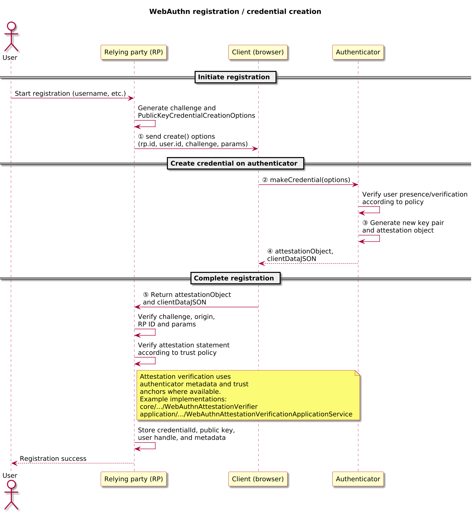
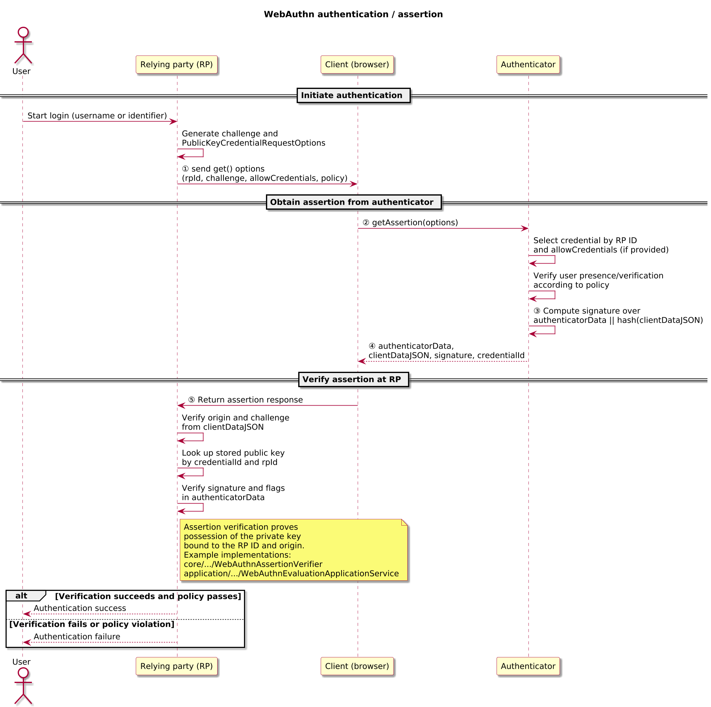

# FIDO2 / WebAuthn – Registration and Authentication

> [!IMPORTANT]
> The W3C Web Authentication (WebAuthn) specification and FIDO2 Client to Authenticator Protocol (CTAP) documents are normative. This note explains roles, flows, and design choices used in the OpenAuth Simulator; when in doubt, the specifications win.

> [!NOTE]
> WebAuthn uses origin-bound public-key credentials (“passkeys”) instead of shared-secret one-time passwords. See the HOTP, TOTP, and OCRA protocol notes in this repository for the corresponding OTP and challenge–response flows.

Audience: engineers exploring the simulator who are familiar with basic public-key cryptography and web security concepts.

FIDO2 and WebAuthn use public-key cryptography to authenticate users without shared secrets, replacing or strengthening passwords with passkeys and hardware-backed credentials. A relying party (RP) registers a public key credential for a user and later verifies signed authentication assertions produced by an authenticator under the control of the user.

This document explains the main WebAuthn roles, flows, and design properties for readers of this repository. The WebAuthn and CTAP specifications remain the normative references; whenever there is a difference, those specifications take precedence.

## WebAuthn in one page

- Purpose: phishing-resistant authentication using per-RP public-key credentials (“passkeys”).
- Model:
  - Registration: the RP stores a public key credential (credential ID, public key, and metadata) for a user.
  - Authentication: the authenticator proves possession of the private key by signing over `authenticatorData || SHA-256(clientDataJSON)`.
- Key structures:
  - `clientDataJSON`: JSON describing the client-side context (type, origin, challenge, and related fields).
  - `authenticatorData`: binary structure containing `rpIdHash`, flags (UP/UV/backup/attested/extension bits), `signCount`, and optional attested credential data and extensions.
- Core security properties:
  - Credentials are scoped to an RP ID and origin, making phishing significantly harder when RPs and browsers enforce the rules correctly.
  - Each assertion is bound to a fresh RP-issued challenge and the client context captured in `clientDataJSON`.
  - Signature counters can signal cloning or abnormal authenticator behaviour but are best-effort and require careful interpretation.
- Typical deployments: web applications calling browser WebAuthn APIs with platform authenticators (passkeys) or roaming security keys, often alongside or replacing passwords and OTPs.

## References and status

| Field | Value |
|-------|-------|
| Normative specs | [W3C Web Authentication (WebAuthn)](https://www.w3.org/TR/webauthn-2/) [FIDO2 CTAP2](https://fidoalliance.org/specifications/) |
| Profiles | None (baseline WebAuthn RPs and authenticators) |
| Version focus | WebAuthn Level 2/3 semantics as implemented by modern browsers and authenticators |
| Scope | Protocol behaviour and flows between RP, client, and authenticator; simulator implementation details are secondary |

## Actors and terminology

The table below introduces only the roles needed to read the diagrams and discussion in this document.

| Actor | Role in this document | Term in WebAuthn spec |
|-------|------------------------|------------------------|
| User | Person attempting to register or authenticate | User |
| Relying party (RP) | Service that issues registration/authentication requests and verifies responses | Relying Party |
| Client | Browser or WebAuthn client library that mediates between RP and authenticator | Client |
| Authenticator | Device or platform component that holds private keys and produces assertions | Authenticator (roaming or platform) |

## Data structures and verification algorithm

### `clientDataJSON`

Key fields:

- `type`: `"webauthn.create"` for registration or `"webauthn.get"` for authentication.
- `challenge`: base64url-encoded representation of the RP-issued challenge.
- `origin`: effective origin of the calling web page (for example, `https://auth.example.com`).
- Optional fields such as `topOrigin` and `crossOrigin` describe embedding context; the simulator focuses on `type`, `challenge`, and `origin`.

### `authenticatorData`

Binary structure produced by the authenticator:

- `rpIdHash`: SHA-256 of the RP ID string (for example, `example.com`).
- `flags`: bitfield capturing user presence (UP), user verification (UV), backup eligibility/backup state (BE/BS), attested credential data included (AT), and extensions included (ED).
- `signCount`: best-effort signature counter that may increment on each successful assertion, remain zero, or reset depending on authenticator implementation.
- `attestedCredentialData`: credential ID and public key, present in registration responses.
- `extensions`: CBOR-encoded map of extension outputs when extensions are in use.

### Registration verification (RP-side, simplified)

Given: RP ID, expected origin set, attestation policy, issued challenge, and a registration response.

1. Parse `clientDataJSON` and verify:
   - `type == "webauthn.create"`.
   - `origin` is one of the allowed origins for this RP ID.
   - `challenge` matches the value you issued.
2. Parse `attestationObject` into `authenticatorData` and the attestation statement.
3. Check `rpIdHash == SHA-256(rp.id)` inside `authenticatorData`.
4. Inspect flags: require UP to be set; require UV if your registration policy demands user verification.
5. Evaluate the attestation statement according to your policy (for example, accept only specific authenticators or allow self-attestation).
6. Extract credential ID, public key, and initial `signCount`, and store them for future authentications.

### Assertion verification (RP-side, simplified)

Given: stored public key and metadata for a credential, expected RP ID, allowed origins, issued challenge, and an assertion from the client.

1. Parse `clientDataJSON` and verify:
   - `type == "webauthn.get"`.
   - `origin` is one of the allowed origins for this RP ID.
   - `challenge` matches the value you issued.
2. Parse `authenticatorData` and verify:
   - `rpIdHash == SHA-256(rp.id)`.
   - Flags: require UP; require UV if you requested user verification.
   - `signCount` is consistent with the stored value (or handle anomalies according to your policy).
3. Compute `dataToBeSigned = authenticatorData || SHA-256(clientDataJSON)`.
4. Verify `signature` over `dataToBeSigned` using the stored public key for this `credentialId`.
5. If all checks pass, treat the user as authenticated, update the stored `signCount` if you track it, and proceed with your application’s session or token logic.

### Worked example – assertion verification

This worked example uses the simulator’s ES256 assertion vector `ES256:uv0_up1` from [docs/webauthn_assertion_vectors.json](docs/webauthn_assertion_vectors.json). It is intentionally high-level: the goal is to show which fields the RP inspects and how they relate to the verification algorithm above.

Given:

- RP ID: `example.com`.
- Allowed origin set: `{ "https://example.com" }`.
- Issued challenge (base64url): `FuQPVg8SQt9QMm_YSPHm6df9Rgq5AHJ2gNSE4YPlQRw`.
- Stored credential:
  - `credentialId`: `0RslpdQUn7oso12_9jP3Dm7XDJrDo4xhVNGKtX2vqnE` (base64url).
  - Public key: ES256 key corresponding to the vector’s `publicKeyCose_b64u`.
- Assertion response:
  - `clientDataJSON` (base64url): `eyJ0eXBlIjoid2ViYXV0aG4uZ2V0IiwiY2hhbGxlbmdlIjoiRnVRUFZnOFNRdDlRTW1fWVNQSG02ZGY5UmdxNUFISjJnTlNFNFlQbFFSdyIsIm9yaWdpbiI6Imh0dHBzOi8vZXhhbXBsZS5jb20iLCJjcm9zc09yaWdpbiI6ZmFsc2V9`.
  - `authenticatorData` (base64url): `o3mm9u6vuaVeN4wRgDTidR5oL6ufLTCrE9ISVYbOGUcBAAAAAA`.
  - `signature` (base64url): `MEUCIQCMYUI38KCW7pDw9PdiAvzxpCirwxWRD-xV6igCv6eC8AIgN3iwZjxhsC4iFOWjDda25WBUcWJBthFKOmdc0eTv60Y`.

Verification steps:

1. Decode `clientDataJSON` from base64url and parse the JSON.
   - `type` is `"webauthn.get"` → correct ceremony.
   - `origin` is `"https://example.com"` → in the allowed origin set.
   - `challenge` matches the RP-issued challenge above.
2. Decode `authenticatorData` from base64url and parse the binary structure.
   - `rpIdHash` equals `SHA-256("example.com")` → the assertion is scoped to the expected RP ID.
   - Flags show UP = 1 (user present) and UV = 0 (no user verification), which matches the RP’s `userVerification="discouraged"` policy for this request.
   - `signCount` is interpreted according to the RP’s counter policy (for this vector, the counter is zero and treated as best-effort).
3. Compute:
   - `clientDataHash = SHA-256(clientDataJSON_bytes)`.
   - `dataToBeSigned = authenticatorData_bytes || clientDataHash`.
4. Verify `signature` over `dataToBeSigned` using the stored ES256 public key for `credentialId`.
5. Because all checks pass, the RP:
   - Treats the user as authenticated for `example.com`.
   - Updates stored `signCount` if it is tracking counters for this credential.

## Core flows

### Registration / credential creation (attestation)

During registration, the relying party and authenticator establish a new credential for a user. The RP generates a challenge and a `PublicKeyCredentialCreationOptions` structure, including the RP identifier, user handle, required algorithms, and policy hints. The client passes these options to the authenticator, which performs any required user verification, creates a new key pair, and returns an attestation object. The client returns the attestation and client data to the RP, which verifies the origin, challenge, parameters, and attestation statement before storing the resulting credential.

The registration flow binds a credential to a specific RP identifier and origin, enabling phishing-resistant authentication in later flows.

#### Sequence

1. (①) The RP builds `PublicKeyCredentialCreationOptions` with a fresh `challenge`, RP ID, user identity, supported algorithms, and authenticator policy hints, then sends it to the client.
2. (②) The client verifies it is operating in the correct origin, applies browser security checks, and forwards the options to the selected authenticator.
3. (③) The authenticator performs user presence and, when required, user verification, generates a new key pair, and constructs `authenticatorData` and an attestation statement.
4. (④) The client packages `clientDataJSON` together with the `attestationObject` and returns them to the RP.
5. (⑤) The RP validates `clientDataJSON` (type, origin, challenge), parses `authenticatorData`, evaluates attestation against its policy, and stores the resulting credential (credential ID, public key, and any metadata such as `signCount`).

#### Key parameters

| Field | Description | Spec reference |
|-------|-------------|----------------|
| `rp.id` | RP identifier, typically a registrable domain suffix such as `example.com` | WebAuthn §4 (Relying Party) |
| `user.id` | Application-specific, opaque identifier for the user | WebAuthn §5.4.3 (user) |
| `challenge` | Fresh, unpredictable value used to prevent replay of registration responses | WebAuthn §5.4.3 (challenge) |
| `pubKeyCredParams` | List of acceptable public key credential parameters (algorithms, types) | WebAuthn §5.4.3 (pubKeyCredParams) |
| `clientDataJSON` | JSON structure describing the client-side context (type, origin, challenge) | WebAuthn §5.8.1 |
| `attestationObject` | CBOR-encoded structure containing `authData` and an attestation statement | WebAuthn §6 |
| `credentialId` | Identifier for the new credential, used later during authentication | WebAuthn §5.3 |

#### Policy knobs & pitfalls

- Generate fresh, unpredictable `challenge` values for each registration attempt and enforce a narrow validity window; reusing challenges weakens replay protection.
- Choose `rp.id` deliberately: it should be a registrable domain suffix of the origins you intend to support. Overly broad values (for example, a parent domain covering many apps) increase blast radius; overly narrow values break login across subdomains.
- Decide how strictly to enforce attestation: self-attestation only, metadata-backed authenticators, or “none”. Tighter policies improve device assurance but may exclude legitimate devices and raise privacy concerns.
- Define how you treat attestation failures or unknown authenticators (for example, soft-fail with logging versus hard rejection) and document these choices.

#### Simulator mapping

- Attestation generation and verification: `WebAuthnAttestationGenerator`, `WebAuthnAttestationVerifier`, and their application-layer services and tests.
- Credential modelling and persistence: `WebAuthnCredentialDescriptor`, `WebAuthnStoredCredential`, and the persistence smoke tests.

#### What to remember

- Registration results in a stored tuple of RP ID, credential ID, public key, and related metadata (including `signCount` and attestation information).
- The RP must validate `clientDataJSON` and `authenticatorData`, not just store whatever the client returns.
- Attestation is a policy choice: you can require specific authenticators, accept self-attestation, or treat attestation as advisory depending on your risk tolerance.

### Authentication / assertion (request and response)

During authentication, the RP asks the client to obtain an assertion from an authenticator for a previously registered credential. The RP generates a fresh challenge and a `PublicKeyCredentialRequestOptions` structure, specifying the RP ID, allowed credentials, and policy hints such as user verification requirements. The client forwards these options to the authenticator, which performs user verification if required, selects the appropriate credential, and signs over the client and authenticator data. The client returns the assertion to the RP, which verifies the signature, origin, challenge, and authenticator data before treating the user as authenticated.

This flow consumes the public key stored during registration and demonstrates possession of the private key bound to the RP identifier.

#### Sequence

1. (①) The RP builds `PublicKeyCredentialRequestOptions` with a fresh `challenge`, RP ID, optional `allowCredentials` list, and a `userVerification` policy, then sends it to the client.
2. (②) The client verifies the origin context, applies browser security checks, and forwards the request to an appropriate authenticator (platform or roaming).
3. (③) The authenticator performs user presence and, when required, user verification, selects a credential (discoverable or from `allowCredentials`), and produces `authenticatorData` and a `signature` over `authenticatorData || SHA-256(clientDataJSON)`.
4. (④) The client returns `clientDataJSON`, `authenticatorData`, `signature`, and the chosen `credentialId` to the RP.
5. (⑤) The RP validates `clientDataJSON` (type, origin, challenge), checks `authenticatorData` (`rpIdHash`, flags, `signCount`), verifies the signature with the stored public key, interprets any counter anomalies, and then proceeds with its session or token logic if verification succeeds.

#### Key parameters

| Field | Description | Spec reference |
|-------|-------------|----------------|
| `rpId` | Relying party identifier for which the assertion is requested | WebAuthn §5.4.4 |
| `challenge` | Fresh, unpredictable value used to prevent replay of assertions | WebAuthn §5.4.4 |
| `allowCredentials` | Optional list of credentials that the RP is willing to accept | WebAuthn §5.10.3 |
| `userVerification` | Policy indicating whether user verification is required, preferred, or discouraged | WebAuthn §5.10.3 |
| `clientDataJSON` | JSON structure describing the client-side context (type, origin, challenge) | WebAuthn §5.8.1 |
| `authenticatorData` | Binary structure containing RP ID hash, flags (user presence/verification), and counters | WebAuthn §6.1 |
| `signature` | Digital signature over `authenticatorData` and `hash(clientDataJSON)` using the credential’s private key | WebAuthn §6.2 |
| `credentialId` | Identifier of the credential selected by the authenticator | WebAuthn §5.3 |

#### Policy knobs & pitfalls

- Treat `allowCredentials` as a precise filter when you know which credentials are acceptable; for discoverable credential flows, ensure your UX still lets users disambiguate between multiple accounts or authenticators.
- Align `userVerification` policy with journey risk: `required` for high-value operations, `preferred` for most login flows, and `discouraged` only when other strong checks exist.
- Define how you handle counter anomalies (for example, first log, then require additional factors, and only lock accounts when anomalies cluster) to avoid unnecessary lockouts.
- Avoid overly broad origin allow-lists; assertions should only be accepted from the minimal set of origins that legitimately serve your RP.

#### Simulator mapping

- Assertion request and verification: `WebAuthnAssertionRequest`, `WebAuthnAssertionVerifier`, and the evaluation application services.
- End-to-end evaluation and verbose tracing: `WebAuthnEvaluationApplicationService` and its vector/verbose-trace tests, plus assertion-generation services and tests where applicable.

#### What to remember

- Authentication is a signature check over `authenticatorData || SHA-256(clientDataJSON)`, tied to a specific RP ID and origin.
- The RP must validate challenge, origin, RP ID, flags, and signature together; skipping any piece weakens guarantees.
- `signCount` is useful but not definitive; treat it as one signal in a broader risk model.

## Credential types and UX patterns

### Resident vs non-resident credentials

WebAuthn supports resident (client-side discoverable) credentials and server-side credentials referenced by `credentialId`. In resident flows, the authenticator can select a credential based on user interaction without the RP specifying explicit `allowCredentials` values; in non-resident flows, the RP provides `credentialId` values that the authenticator should consider.

- Resident credentials (often implemented as passkeys or client-side discoverable credentials) can simplify user experience by enabling username-less flows, but require careful management of authenticator storage and user verification.
- Non-resident credentials keep credential identifiers on the RP side but require the RP to manage and supply `credentialId` lists and to design UX that helps users choose the right account.

### Passkeys and multi-device credentials

Modern WebAuthn deployments increasingly rely on passkeys: credentials that can be synced across devices via platform mechanisms or stored on roaming security keys.

- Multi-device passkeys improve recovery and cross-device usability but can make counter semantics more subtle (for example, per-device counters or resets on migration).
- Single-device security keys may provide more straightforward counter behaviour but can increase friction when users lose or replace devices.
- The simulator models both patterns through metadata and policy while keeping the on-wire WebAuthn messages the same.

## User verification & authenticator policy

The `userVerification` parameter allows the RP to specify whether the authenticator should verify the user (for example, via biometrics or PIN) before producing an assertion. Deployments must align `userVerification` settings with their risk models:

- `required` provides strong protection against use of an unlocked authenticator by another party, at the cost of stricter authenticator requirements and potentially more friction.
- `preferred` allows user verification when available but does not fail if it is not; this can be appropriate for medium-risk scenarios where other signals (for example, device health or session history) are also considered.
- `discouraged` can be acceptable for low-risk scenarios or where user verification happens in other channels, but must be used deliberately.

In all cases, the RP must inspect flags in `authenticatorData` to confirm whether user verification actually occurred and decide how to treat responses that do not meet the desired policy.

## Error handling and operational considerations

WebAuthn clients and authenticators return structured errors for conditions such as user cancellation, timeouts, or unsupported parameters. While this document focuses on successful flows, deployments should:

- Surface clear, user-friendly messages when operations are cancelled or time out.
- Distinguish between protocol-level errors (for example, verification failures) and transport or UI errors.
- Apply rate limiting and monitoring to repeated failures to detect abuse and to feed into broader risk-scoring.

## RP configuration parameters (non-exhaustive)

The table below summarises common RP configuration parameters and their trade-offs.

| Parameter                  | Typical values                               | Effect / trade-off                                                                 |
|----------------------------|----------------------------------------------|-------------------------------------------------------------------------------------|
| `userVerification`         | `required`, `preferred`, `discouraged`       | Controls whether UV is enforced at the authenticator; stronger security vs UX cost.|
| Attestation policy         | none, self, metadata-backed                  | Balances device assurance against privacy; strict policies limit device diversity. |
| Authenticator attachment   | platform, cross-platform (roaming)           | Platform improves UX on a single device; roaming keys travel between devices.      |
| Resident credentials       | allowed / required / discouraged             | Enables username-less flows but consumes authenticator storage and needs careful UX.|
| Allowed RP IDs and origins | Explicit RP ID + origin allow-list           | Enforces scoping; misconfiguration can either break auth or weaken phishing resistance. |
| Timeout                    | e.g. 30–120 seconds                          | Shorter timeouts reduce attack windows for active prompts but can frustrate users.  |

## Security properties and failure modes

> [!WARNING]
> WebAuthn’s guarantees depend on correct implementation of origin/RP ID validation, challenge handling, attestation/verification logic, and session integration. Misconfigurations in these areas can negate the intended phishing resistance.

- Phishing resistance via origin and RP ID scoping:
  - Credentials are scoped to an RP identifier and are only usable from allowed origins. Attackers who control a different domain cannot, in principle, obtain valid assertions for the target RP—assuming both RPs and browsers enforce the rules correctly.
- Replay protection via challenges and client context:
  - Each registration or authentication uses a fresh, unpredictable challenge; assertions are bound to that challenge and to `clientDataJSON`. Replaying an assertion with a different challenge or origin should fail verification.
- Counters as cloning and anomaly signals:
  - `signCount` can help detect cloned credentials or abnormal authenticator behaviour, but some authenticators always return zero or reset counters. Treat anomalies as risk signals (log, step up, or soft-lock) rather than unconditional proof of compromise.
- Attestation and privacy trade-offs:
  - Strong attestation policies (for example, only specific models or vendors) can improve device assurance but reveal stable information about a user’s authenticators. Many RPs accept self-attestation or ignore attestation entirely to reduce privacy impact.
- Integration and systemic risk:
  - WebAuthn authenticates a single ceremony, not an entire session. Session fixation, CSRF, token handling, and broader web security controls remain necessary; weaknesses there can undermine even correctly implemented WebAuthn.

#### What to remember

- WebAuthn’s phishing resistance comes from RP ID + origin scoping plus challenges, not from public-key signatures alone.
- `authenticatorData || SHA-256(clientDataJSON)` is the core value being signed; RPs must verify both structures, not just the signature.
- Counters are advisory; interpret anomalies in context and combine them with other risk signals.
- Attestation and UX decisions (passkeys, resident credentials, UV requirements) are risk-management choices that must be documented and revisited as authenticators evolve.

## Integration considerations

- Treat WebAuthn as one building block in your login architecture alongside robust session management, CSRF protection, and API access controls.
- Decide how WebAuthn interacts with other factors (passwords, OTPs, device binding) for each journey: for example, password + WebAuthn vs WebAuthn-only passkey login.
- Plan for device loss, recovery, and revocation, especially when using multi-device passkeys and resident credentials that may be synced across ecosystems.

## Criticism and controversies

- Passkeys UX vs deployment reality:
  - WebAuthn is often marketed as a clean password replacement, but many RPs still wrap it in username/password flows, and device loss or ecosystem lock-in can make recovery experiences uneven.
- Attestation vs privacy:
  - Strict attestation policies can improve security posture but reveal device model and sometimes stable identifiers; regulators and privacy advocates may view pervasive attestation as problematic, so many RPs soften or disable attestation checks in production.
- Counter semantics and over-reliance:
  - The specifications explicitly note that counters are best-effort. Over-reliance on monotonic counters can lead to unnecessary lockouts; ignoring them completely forfeits a useful signal.
- Complexity of the CBOR/COSE/metadata stack:
  - Real deployments rely on WebAuthn, CTAP, COSE, CBOR parsing, and metadata statements. Bugs in any layer—especially parsing or signature verification—have historically led to vulnerabilities; the simulator exposes these flows to aid testing and auditing.

## Simulator implementation pointers

While this document focuses on the protocol, the simulator implements WebAuthn behaviour in the `core` and `application` modules. The table below maps the flows described above to representative types and tests so readers can move directly from diagrams to code.

| Flow / concern                                | Module and type                                                                                                                                     | Representative tests                                                                                                                                                                                                 |
|-----------------------------------------------|------------------------------------------------------------------------------------------------------------------------------------------------------|------------------------------------------------------------------------------------------------------------------------------------------------------------------------------------------------------------------------|
| Registration: attestation generation/verification | [WebAuthnAttestationGenerator.java](../../../core/src/main/java/io/openauth/sim/core/fido2/WebAuthnAttestationGenerator.java), [WebAuthnAttestationVerifier.java](../../../core/src/main/java/io/openauth/sim/core/fido2/WebAuthnAttestationVerifier.java) | [WebAuthnAttestationGenerationApplicationServiceTest.java](../../../application/src/test/java/io/openauth/sim/application/fido2/WebAuthnAttestationGenerationApplicationServiceTest.java), [WebAuthnAttestationVerificationApplicationServiceTest.java](../../../application/src/test/java/io/openauth/sim/application/fido2/WebAuthnAttestationVerificationApplicationServiceTest.java) |
| Registration: credential model and persistence | [WebAuthnCredentialDescriptor.java](../../../core/src/main/java/io/openauth/sim/core/fido2/WebAuthnCredentialDescriptor.java), [WebAuthnStoredCredential.java](../../../core/src/main/java/io/openauth/sim/core/fido2/WebAuthnStoredCredential.java) | [WebAuthnCredentialPersistenceSmokeTest.java](../../../application/src/test/java/io/openauth/sim/application/fido2/WebAuthnCredentialPersistenceSmokeTest.java)                                                                                             |
| Authentication: assertion request modelling   | [WebAuthnAssertionRequest.java](../../../core/src/main/java/io/openauth/sim/core/fido2/WebAuthnAssertionRequest.java)                               | Covered by assertion evaluation tests in the application layer                                                                                                                                                         |
| Authentication: assertion verification and evaluation services | [WebAuthnAssertionVerifier.java](../../../core/src/main/java/io/openauth/sim/core/fido2/WebAuthnAssertionVerifier.java), [WebAuthnEvaluationApplicationService.java](../../../application/src/main/java/io/openauth/sim/application/fido2/WebAuthnEvaluationApplicationService.java), [WebAuthnAssertionGenerationApplicationService.java](../../../application/src/main/java/io/openauth/sim/application/fido2/WebAuthnAssertionGenerationApplicationService.java) | [WebAuthnEvaluationApplicationServiceTest.java](../../../application/src/test/java/io/openauth/sim/application/fido2/WebAuthnEvaluationApplicationServiceTest.java), [WebAuthnJsonVectorEvaluationApplicationServiceTest.java](../../../application/src/test/java/io/openauth/sim/application/fido2/WebAuthnJsonVectorEvaluationApplicationServiceTest.java), [WebAuthnAssertionGenerationApplicationServiceTest.java](../../../application/src/test/java/io/openauth/sim/application/fido2/WebAuthnAssertionGenerationApplicationServiceTest.java) |
| CBOR/COSE and signature helpers               | [CborDecoder.java](../../../core/src/main/java/io/openauth/sim/core/fido2/CborDecoder.java), [CoseKeyInspector.java](../../../core/src/main/java/io/openauth/sim/core/fido2/CoseKeyInspector.java), [SignatureInspector.java](../../../core/src/main/java/io/openauth/sim/core/fido2/SignatureInspector.java) | [WebAuthnPublicKeyDecoderTest.java](../../../application/src/test/java/io/openauth/sim/application/fido2/WebAuthnPublicKeyDecoderTest.java), [WebAuthnGeneratorSamplesTest.java](../../../application/src/test/java/io/openauth/sim/application/fido2/WebAuthnGeneratorSamplesTest.java) |
| Replay and trust-anchor resolution            | [WebAuthnReplayApplicationService.java](../../../application/src/main/java/io/openauth/sim/application/fido2/WebAuthnReplayApplicationService.java), [WebAuthnTrustAnchorResolver.java](../../../application/src/main/java/io/openauth/sim/application/fido2/WebAuthnTrustAnchorResolver.java) | [WebAuthnReplayApplicationServiceTest.java](../../../application/src/test/java/io/openauth/sim/application/fido2/WebAuthnReplayApplicationServiceTest.java), [WebAuthnTrustAnchorResolverTest.java](../../../application/src/test/java/io/openauth/sim/application/fido2/WebAuthnTrustAnchorResolverTest.java), [WebAuthnTrustAnchorResolverMetadataTest.java](../../../application/src/test/java/io/openauth/sim/application/fido2/WebAuthnTrustAnchorResolverMetadataTest.java) |
| Native Java usage                             | [WebAuthnEvaluationApplicationService.java](../../../application/src/main/java/io/openauth/sim/application/fido2/WebAuthnEvaluationApplicationService.java) | [WebAuthnNativeJavaApiUsageTest.java](../../../application/src/test/java/io/openauth/sim/application/fido2/WebAuthnNativeJavaApiUsageTest.java) |

These pointers are provided for convenience when exploring this repository. The WebAuthn and FIDO2 CTAP specifications remain the definitive description of the protocol and its requirements.
