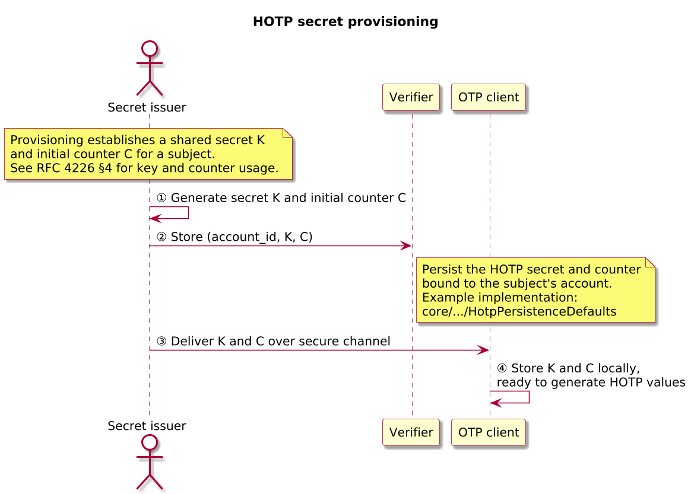
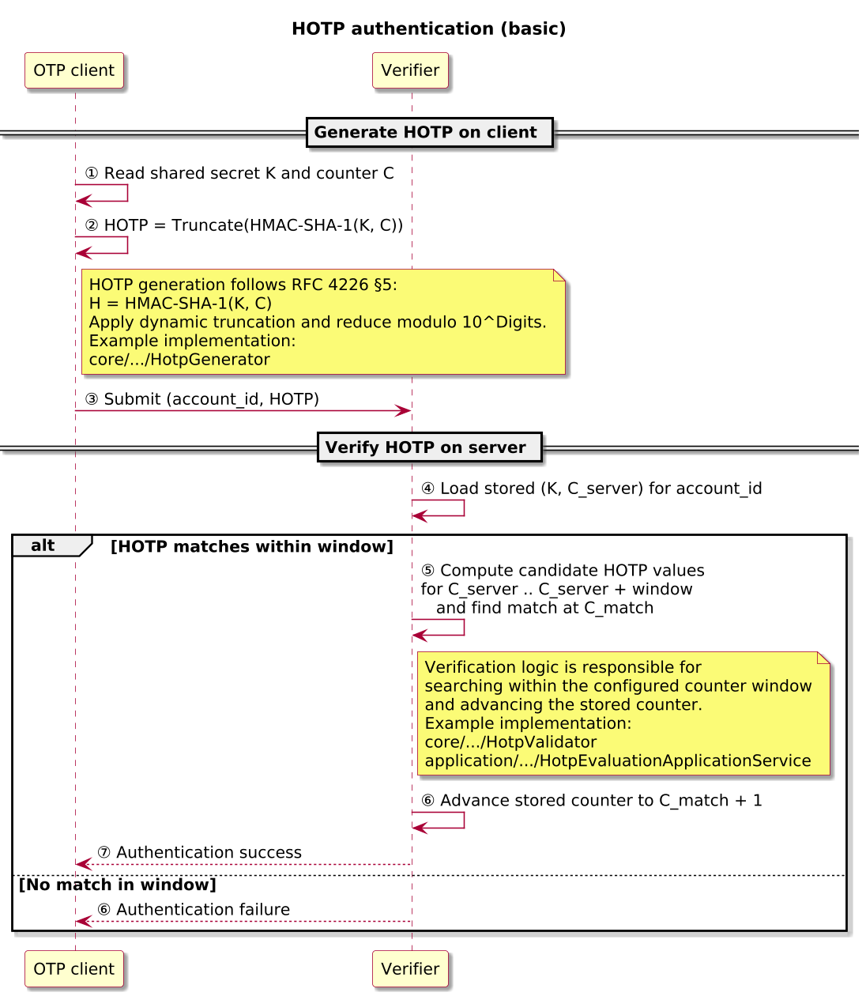
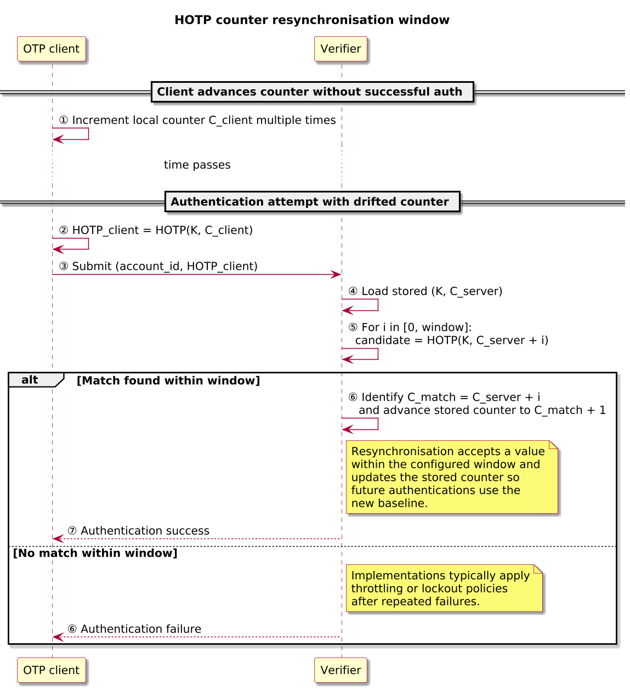
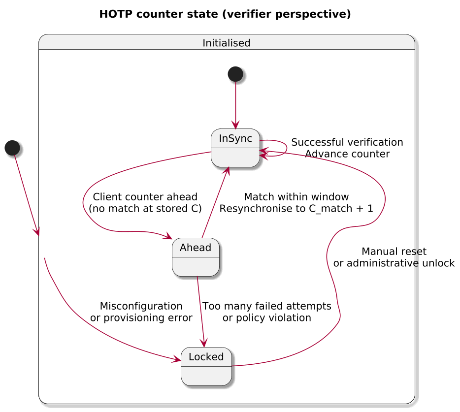

# HOTP – HMAC-Based One-Time Password

> [!IMPORTANT]
> RFC 4226 is the normative HOTP specification. This note is an explanatory companion for the OpenAuth Simulator; when in doubt, follow the RFC.

> [!NOTE]
> HOTP uses a counter as the moving factor. TOTP replaces the counter with a time-step, and OCRA generalises to challenge–response; this document focuses only on HOTP.

Audience: engineers exploring the simulator who are familiar with basic HMAC and OTP concepts.

HOTP is a counter-based one-time password algorithm that derives short numeric codes from a shared secret key `K` and a monotonically increasing counter `C`. It is widely used in hardware and software tokens as a second factor for authenticating users to services.

## HOTP in one page

- Purpose: Counter-based one-time password for second-factor authentication.
- Shared state (per `account_id`): secret key `K`, counter `C`, number of digits `Digits`.
- Algorithm (per RFC 4226): `HOTP(K, C) = Truncate(HMAC-SHA-1(K, C)) mod 10^Digits`.
- Moving factor: the OTP client increments `C` on each HOTP generation.
- Verifier policy knobs:
  - Look-ahead window size `s` for windowed verification.
  - Resynchronisation window for recovering from counter drift.
  - Rate limiting and lockout thresholds for online guessing resistance.
- Typical uses: hardware tokens, software OTP clients, backup code generators.
- Example: with a random 20-byte secret `K`, counter `C = 42`, and `Digits = 6`, the verifier might compute `HOTP(K, 42) = 371924` and accept that value for the account’s current counter.

## References and status

| Field | Value |
|-------|-------|
| Normative specs | [RFC 4226 – HMAC-Based One-Time Password (HOTP) Algorithm](https://www.rfc-editor.org/rfc/rfc4226) |
| Profiles | None (base HOTP only) |
| Version focus | HOTP as defined in RFC 4226 |
| Scope | Protocol behaviour and flows; simulator implementation details are secondary |

## Actors and terminology

The table below introduces only the roles needed to read the diagrams and discussion in this document.

| Actor | Role in this document | Term in RFC 4226 |
|-------|------------------------|------------------|
| Secret issuer | System that provisions HOTP secrets and counters for a subject | Not explicitly named |
| OTP client | Device or application that generates HOTP values for a subject | Token / client |
| Verifier | Service that validates HOTP values and drives account authentication | Authentication server |

## Core flows

### HOTP secret provisioning

In a typical deployment, a secret issuer provisions a subject with an HOTP secret key `K` and an initial counter value `C`. The same values are stored on the verifier side, tied to an account identifier. Provisioning may happen via QR code, secure file exchange, direct injection into a hardware token, or other methods; the transport itself is out of scope for RFC 4226 but must be secured to protect `K`.

Once provisioning completes, the OTP client and verifier share the same secret and starting counter for the subject. All subsequent HOTP values generated by the OTP client and verified by the verifier depend on the integrity and confidentiality of this shared state.

#### Sequence

1. The secret issuer selects or generates `K` and an initial counter value `C` for a given `account_id` (diagram step ①).
2. The verifier stores `K` and `C` for that `account_id` in its credential store (diagram step ②).
3. The OTP client receives `K` and `C` via a secure provisioning channel (for example, QR code, secure file exchange, or hardware injection) (diagram step ③).
4. After provisioning completes, the OTP client stores `K` and `C` locally so that both OTP client and verifier hold the same `(K, C)` pair for the subject (diagram step ④).

#### Key parameters

| Field | Description | Spec reference |
|-------|-------------|----------------|
| `K` | Shared secret key used as the HMAC input key for HOTP generation | RFC 4226 §4 |
| `C` | Initial counter value shared between the OTP client and verifier | RFC 4226 §4 |
| `account_id` | Local identifier that associates the secret with a subject or account | Not defined by RFC 4226 |

#### Policy knobs

- Treat `K` as a long-term shared secret; if `K` is exposed, an attacker can generate valid HOTP values for all future counters.
- Decide and document how the initial counter `C` is chosen and bound to `account_id` (for example, starting at 0 versus using a random initial value); issuer and verifier must agree or verification will fail.
- Choose a provisioning channel that matches the deployment’s threat model; RFC 4226 does not standardise a specific method.

### HOTP authentication (basic)

During authentication, the OTP client uses its local copy of `K` and `C` to compute an HOTP value and present it to the verifier, typically via a user who reads or copies the code into a login form. The verifier looks up the account, recomputes candidate HOTP values in a configured counter window, and compares them to the submitted value. On a successful match, the verifier advances its stored counter to keep the client and server in sync.

This is the primary flow covered by RFC 4226: the algorithm for deriving HOTP from `K` and `C`, and the rules for validating HOTP values within a counter window.

#### Sequence

1. The user triggers OTP generation on the OTP client for a particular `account_id`; the client reads the shared secret `K` and current counter `C` (diagram step ①).
2. The OTP client computes `HOTP(K, C)` using its current counter `C` and displays the resulting code (diagram step ②).
3. The user submits the HOTP value together with `account_id` to the verifier (for example, via a login form) (diagram step ③).
4. The verifier looks up the stored `(K, C_s)` for `account_id` and recomputes HOTP values across a configured window of counters (for example, from `C_s` through `C_s + s`) to find any match (diagram steps ④–⑤).
5. If a match is found at some counter `C*` within the window, authentication succeeds and the verifier advances its stored counter to `C* + 1`; otherwise, authentication fails and the verifier may apply rate limiting or lockout policies (diagram steps ⑥–⑦).

#### Key parameters

| Field | Description | Spec reference |
|-------|-------------|----------------|
| `HOTP` | Numeric one-time password value derived from HMAC-SHA-1 and dynamic truncation | RFC 4226 §§2, 5 |
| `C` | Counter value used by the client when generating the HOTP value | RFC 4226 §4 |
| `account_id` | Identity or account for which the HOTP value is being verified | Not defined by RFC 4226 |

#### Policy knobs

- Choose and document the look-ahead window size `s` used for verification; larger windows tolerate more counter drift but increase the surface for online guessing.
- Decide how the verifier handles failed attempts (for example, rate limiting, lockout thresholds, and logging) when no matching HOTP value is found within the window.
- Ensure the verifier advances its stored counter to the matching value on success and never decrements counters; administrative resynchronisation tools that rewrite counter state should be treated as privileged operations and logged accordingly.

#### What to remember

- HOTP relies on shared `(K, C)` state per `account_id`; both client and verifier must agree on these values.
- Verifiers rarely check a single counter; they search a look-ahead window and update stored counters only on successful matches.
- Counter values must never be decremented during normal operation; manual resynchronisation rewrites state and should be treated as an administrative action.
- Larger verification and resynchronisation windows improve usability but must be paired with rate limiting, lockout, and monitoring to keep online guessing in check.

#### Resynchronisation and drift

If the OTP client advances its counter without corresponding successful authentications (for example, the user generates codes and does not use them), the client counter may move ahead of the verifier’s stored counter. To compensate, implementations often define a resynchronisation window: when verification fails at the stored counter, the verifier checks a limited range of future counter values.

If a valid HOTP value is found within this resynchronisation window, the verifier updates its stored counter to the matching value and accepts the authentication. If no match is found, the verifier rejects the attempt and may apply rate limiting or lockout policies.

Some readers find it useful to visualise how the counter evolves over time. The following state diagram sketches one possible model for the stored counter on the verifier side. This is informational and does not introduce new protocol rules beyond what deployments implement; counters must still never be decremented in normal operation, and any manual resynchronisation that rewrites stored counters should be logged and treated as an administrative action.

## Configuration knobs

The table below summarises common deployment-time decisions for HOTP-based systems.

| Knob | Description | Examples / notes |
|------|-------------|------------------|
| Secret length and encoding | Length of `K` and how it is represented to operators and clients. | 20-byte random secret encoded in Base32 or hex; must be generated by a cryptographically secure RNG. |
| Initial counter `C` | Starting counter value per `account_id`. | Common patterns include `C = 0` for all tokens or randomised initial counters to reduce collisions; issuer and verifier must agree. |
| Digits | Number of decimal digits in HOTP output. | Typically 6–8 digits; more digits reduce guessing probability at the cost of usability. |
| Look-ahead window `s` | Window of future counters the verifier scans during authentication. | For example, checking counters from `C_s` through `C_s + s`; values should be documented per deployment. |
| Resynchronisation window | Additional range used to recover from significant counter drift. | Often larger than the normal look-ahead window and typically guarded by stricter rate limiting and audit logging. |
| Rate limiting and lockout | Policies controlling repeated failed attempts. | Per-account attempt counters, exponential backoff, temporary lockouts, and alerting on suspicious activity. |
| Logging and audit fields | What is recorded for each HOTP event. | Account identifiers, counter ranges, truncated result codes or hashes, and reason codes; never log secrets or full OTP values. |

## Security properties and failure modes

> [!WARNING]
> If the HOTP secret `K` is compromised, an attacker can forge valid OTPs for all future counters; HOTP does not provide forward secrecy.

- HOTP security depends on the secrecy of `K`, the integrity of the shared counter `C`, and the quality of the random number generator used to derive `K`; weak keys or key disclosure allow attackers to generate valid HOTP values for any counter. Although RFC 4226 specifies HMAC-SHA-1, whose collision resistance is considered weak today, the more relevant property for HOTP codes is preimage resistance; the simulator intentionally follows the RFC algorithm.
- Counters advance on successful authentication; once the verifier’s stored counter has moved past the value used to generate a particular HOTP, reusing that HOTP must fail. Counters must never be decremented as part of normal operation.
- Large verification and resynchronisation windows, combined with weak rate limiting or absent lockout mechanisms, significantly increase the feasibility of online guessing attacks; deployments should pair conservative windows with robust throttling, lockout policies, and monitoring.
- HOTP values are not bound to a specific session or transport channel; in multi-factor setups they are commonly paired with passwords or other factors and rely on external protections (for example, TLS and phishing-resistant UX) to mitigate interception risks.

## Simulator implementation pointers

While this document focuses on the protocol, the simulator implements HOTP behaviour in the `core` and `application` modules. The table below maps the flows described above to representative types and tests so readers can move directly from diagrams to code.

| Flow / concern | Key types | Representative tests |
|----------------|-----------|----------------------|
| Provisioning (seed `K`, `C`, defaults) | [HotpSeedApplicationService.java](../../../application/src/main/java/io/openauth/sim/application/hotp/HotpSeedApplicationService.java), [HotpPersistenceDefaults.java](../../../core/src/main/java/io/openauth/sim/core/otp/hotp/HotpPersistenceDefaults.java) | [HotpIssuanceApplicationServiceTest.java](../../../application/src/test/java/io/openauth/sim/application/hotp/HotpIssuanceApplicationServiceTest.java) |
| Authentication and windowed verification | [HotpValidator.java](../../../core/src/main/java/io/openauth/sim/core/otp/hotp/HotpValidator.java), [HotpEvaluationApplicationService.java](../../../application/src/main/java/io/openauth/sim/application/hotp/HotpEvaluationApplicationService.java) | [HotpValidatorTest.java](../../../core/src/test/java/io/openauth/sim/core/otp/hotp/HotpValidatorTest.java), [HotpEvaluationApplicationServiceTest.java](../../../application/src/test/java/io/openauth/sim/application/hotp/HotpEvaluationApplicationServiceTest.java), [HotpNativeJavaApiUsageTest.java](../../../application/src/test/java/io/openauth/sim/application/hotp/HotpNativeJavaApiUsageTest.java) |
| Replay and resynchronisation scenarios | [HotpReplayApplicationService.java](../../../application/src/main/java/io/openauth/sim/application/hotp/HotpReplayApplicationService.java) | [HotpReplayApplicationServiceTest.java](../../../application/src/test/java/io/openauth/sim/application/hotp/HotpReplayApplicationServiceTest.java), [HotpReplayApplicationServiceVerboseTraceTest.java](../../../application/src/test/java/io/openauth/sim/application/hotp/HotpReplayApplicationServiceVerboseTraceTest.java) |
| Core HOTP algorithm (`HOTP(K, C)`) | [HotpGenerator.java](../../../core/src/main/java/io/openauth/sim/core/otp/hotp/HotpGenerator.java) | [HotpGeneratorTest.java](../../../core/src/test/java/io/openauth/sim/core/otp/hotp/HotpGeneratorTest.java) |

These pointers are provided for convenience when exploring this repository. RFC 4226 remains the definitive description of the HOTP algorithm and its requirements.
