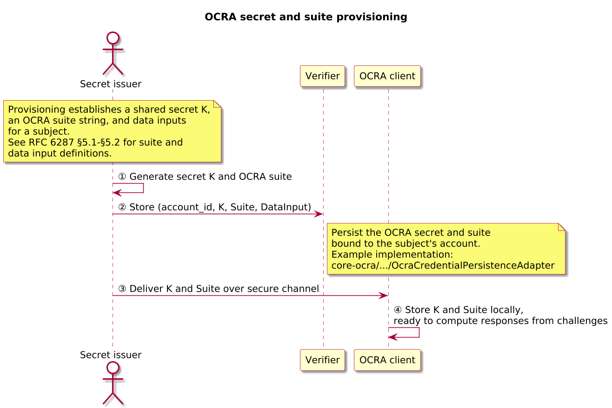
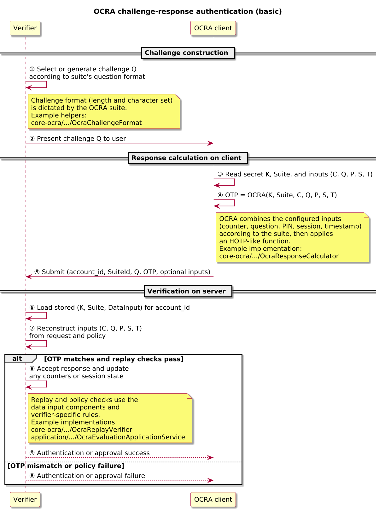
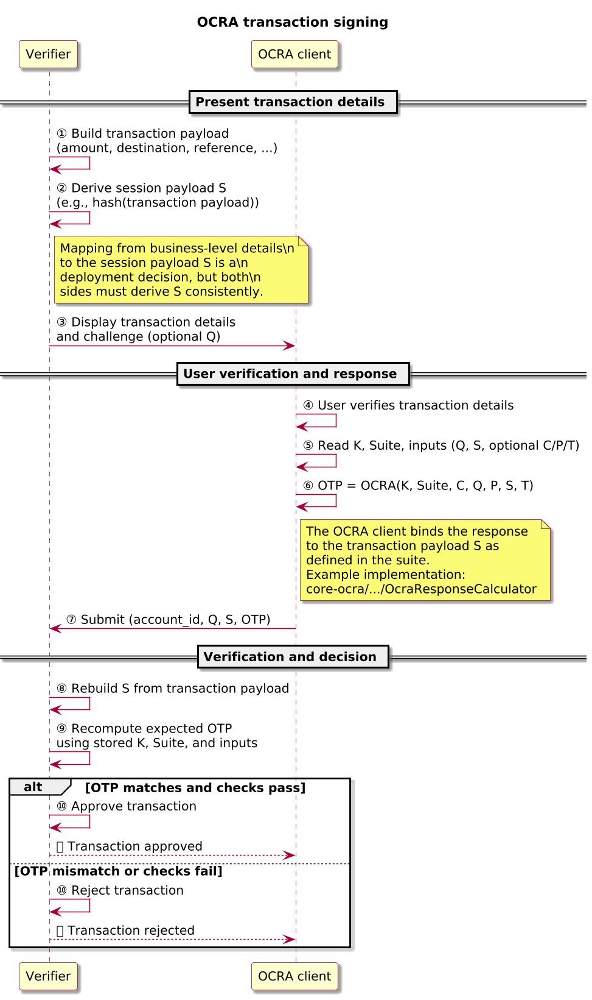

# OCRA – OATH Challenge-Response Algorithm

> [!IMPORTANT]
> RFC 6287 defines the OATH Challenge–Response Algorithm (OCRA). This note explains the roles, flows, and design choices used in the OpenAuth Simulator; the RFC remains normative. It does **not** specify how secrets are provisioned or how business data is encoded into S—those deployment choices dominate real-world security.

Audience: engineers exploring the simulator who already understand HOTP/TOTP and HMAC-based constructions.

OCRA is a flexible challenge–response algorithm from the OATH family that generalises HOTP-style one-time passwords to support structured challenges, optional PINs, timestamps, session data, and counters. It is used for use cases such as online banking, transaction signing, and step-up authentication where the verifier issues a challenge and the client returns a response derived from shared secret material and protocol parameters.

## OCRA in one page

- Purpose: Flexible challenge–response algorithm binding responses to a shared secret `K` and structured inputs (`C`, `Q`, `P`, `S`, `T`).
- Relationship to HOTP/TOTP:
  - HOTP: `HOTP(K, C)` where `C` is a counter.
  - TOTP: `HOTP(K, T(t))` where `T(t)` is a time-derived counter.
  - OCRA: `HOTP(K, DataInput(C, Q, P, S, T))` where `DataInput` is canonicalised according to the suite.
- Suites:
  - The suite string declares the hash function, output length, and which data inputs are present (and how they are encoded).
  - Client and verifier must share both `K` and the exact same suite.
- Core idea:
  - Canonicalise inputs (`C`, `Q`, `P`, `S`, `T`) into a deterministic `DataInput` string.
  - Compute an HOTP-style response using HMAC over `DataInput` and truncate/modulo to the required number of digits.
- Typical uses:
  - Challenge–response login and step-up authentication.
  - Transaction signing, where `S` encodes transaction details the user can verify.
  - Out-of-band authorisation for higher-risk actions.
 - Example (based on RFC 6287 Appendix C and [docs/ocra_validation_vectors.json](docs/ocra_validation_vectors.json)):
   - Suite: `OCRA-1:HOTP-SHA1-6:QN08`, shared secret `K` = ASCII `"12345678901234567890"` (hex `3132333435363738393031323334353637383930`), challenge `Q = "00000000"`.
   - The canonicalised data input for `(K, Suite, Q)` produces an OCRA response of `237653`; any change to `Q` or `K` yields a different result.

## Relationship to HOTP and TOTP

OCRA reuses the HOTP-style construction but generalises the input:

- HOTP computes `HOTP(K, C)` for a counter `C`.
- TOTP computes `HOTP(K, T(t))` where `T(t) = floor((t - T0) / X)` is a time-derived counter.
- OCRA computes a response over a canonicalised `DataInput(C, Q, P, S, T)` string defined by the suite.

For details of HOTP dynamic truncation and counter semantics, see the HOTP and TOTP protocol references in this repository. OCRA sits on top of the same primitives with a richer input model.

## References and status

| Field | Value |
|-------|-------|
| Normative specs | [RFC 6287 – OATH Challenge-Response Algorithm (OCRA)](https://www.rfc-editor.org/rfc/rfc6287) |
| Profiles | None (base OCRA only) |
| Version focus | OCRA as defined in RFC 6287, building on HOTP (RFC 4226) |
| Scope | Protocol behaviour and flows; simulator implementation details are secondary |

## Actors and terminology

The table below introduces only the roles needed to read the diagrams and discussion in this document.

| Actor | Role in this document | Term in RFC 6287 |
|-------|------------------------|------------------|
| Secret issuer | System that provisions OCRA secrets, suites, and parameters for a subject | Not explicitly named |
| OCRA client | Device or application that generates OCRA responses from challenges | Client / token |
| Verifier | Service that validates OCRA responses and drives account authentication or transaction approval | Verifier / server |

## Core flows

### OCRA calculation (simplified)

Given:
- Secret `K`.
- Suite (declares hash function `H`, output digit length `d`, and which of `C`, `Q`, `P`, `S`, `T` are present).
- Inputs `C`, `Q`, `P`, `S`, `T` as required by the suite.

The OCRA response can be understood as:

1. Canonicalise each input according to the suite (for example, pad `Q` to a fixed length, encode `S` as a fixed-format binary string).
2. Construct `DataInput` from the canonicalised inputs in the order and format defined by RFC 6287 §§6–7.
3. Compute `R = HMAC_H(K, DataInput)`.
4. Apply HOTP-style dynamic truncation to `R` to obtain a 31-bit integer `S_trunc`.
5. Compute the final response as `Response = S_trunc mod 10^d` and format it as `d` digits.

The verifier mirrors this process using its own view of `C`, `Q`, `P`, `S`, and `T`.

### OCRA secret and suite provisioning

In a typical deployment, a secret issuer provisions a subject with an OCRA secret key `K` and an OCRA suite definition that describes how OCRA inputs are constructed. The suite string encodes the underlying cryptographic function (for example, HOTP with a chosen hash and digit length) and the data inputs that the deployment will use (such as counters, questions, PINs, timestamps, or session information).

The issuer stores the secret and suite on the verifier side, tied to an account identifier. Provisioning often happens via QR code, secure file exchange, device personalisation, or other secure channels; RFC 6287 focuses on the algorithm and leaves provisioning mechanisms to deployments. Once provisioning completes, the OCRA client and verifier share the same secret, suite, and input expectations for the subject.

#### Sequence

1. The secret issuer selects or generates a secret key `K` and chooses an OCRA suite string for a given `account_id`.
2. The verifier stores `K` and the suite for that `account_id` in its credential store, together with any static parameters implied by the suite.
3. Provisioning data (for example, `K`, suite, and identifiers) is delivered to the OCRA client over a secure channel (QR code, device personalisation, or secure file import).
4. The OCRA client stores `K` and the suite and confirms activation; from this point onward, both client and verifier agree on `K`, suite, and expected inputs for the subject.

#### Key parameters

| Field | Description | Spec reference |
|-------|-------------|----------------|
| `K` | Shared secret key used as the base key for OCRA response calculation | RFC 6287 §5 |
| `Suite` | OCRA suite string that defines the cryptographic function and data inputs (for example, `OCRA-1:HOTP-SHA256-8:QA08-S064`) | RFC 6287 §5.1 |
| `DataInput` | Logical list of data input components such as counter, question, PIN, session information, and timestamp | RFC 6287 §5.2 |
| `account_id` | Local identifier that associates the secret and suite with a subject or account | Not defined by RFC 6287 |

#### Policy knobs & pitfalls

- Treat each `(K, Suite)` pair as a distinct credential; reusing the same `K` across unrelated suites or services increases the blast radius of compromise and can leak information across contexts.
- Choose suites and provisioning channels together: higher-assurance suites (for example, transaction signing) generally deserve stronger provisioning flows (device personalisation, out-of-band confirmation) than basic login suites.
- Define clear lifecycle policies for OCRA credentials (issuance, rotation, decommissioning) alongside the suites; RFC 6287 does not cover secret management.

#### Simulator mapping

- Suite representation and parsing: [`OcraSuite.java`](../../../core-ocra/src/main/java/io/openauth/sim/core/credentials/ocra/OcraSuite.java), [`OcraSuiteParser.java`](../../../core-ocra/src/main/java/io/openauth/sim/core/credentials/ocra/OcraSuiteParser.java).
- Credential creation and persistence: [`OcraCredentialFactory.java`](../../../core-ocra/src/main/java/io/openauth/sim/core/credentials/ocra/OcraCredentialFactory.java), [`OcraCredentialPersistenceAdapter.java`](../../../core-ocra/src/main/java/io/openauth/sim/core/credentials/ocra/OcraCredentialPersistenceAdapter.java), plus application seeding via [`OcraSeedApplicationService.java`](../../../application/src/main/java/io/openauth/sim/application/ocra/OcraSeedApplicationService.java).

### OCRA challenge-response authentication (basic)

During authentication, the verifier and OCRA client use the provisioned suite and inputs to run a challenge-response exchange. In a typical flow, the verifier constructs or selects a challenge `Q` that satisfies the format rules encoded in the suite (for example, numeric or alphanumeric, fixed length) and presents it to the user. The user enters or acknowledges the challenge on the OCRA client, which combines the challenge with the secret key and any other required inputs (counter, PIN, session, timestamp) to compute an OCRA response.

The client returns the response to the verifier, which reconstructs the data inputs according to the suite, recomputes the expected response from its copy of `K`, and compares the results. If the values match and any replay or timestamp checks succeed, the verifier accepts the authentication; otherwise, it rejects the attempt and may apply lockout or throttling policies.

#### Sequence

1. The verifier selects a challenge `Q` that satisfies the suite’s question format (for example, numeric/alphanumeric, fixed length) and presents it to the user (diagram steps ①–②).
2. The user enters or confirms `Q` on the OCRA client; the client gathers any additional required inputs (`C`, `P`, `S`, `T`) based on the suite (diagram step ③).
3. The OCRA client canonicalises the inputs into `DataInput(C, Q, P, S, T)` and computes the response `R = OCRA(K, Suite, C, Q, P, S, T)` (diagram step ④).
4. The client returns the response to the verifier (diagram step ⑤).
5. The verifier loads the stored `K` and suite for the `account_id`, reconstructs its own view of `C`, `Q`, `P`, `S`, and `T`, recomputes the expected response, and compares the values (diagram steps ⑥–⑦).
6. Based on the comparison and replay/timestamp checks, the verifier either accepts the authentication and updates any counters or session state or rejects the attempt and may apply lockout or throttling policies (diagram steps ⑧–⑨).

#### Key parameters

| Field | Description | Spec reference |
|-------|-------------|----------------|
| `Suite` | OCRA suite string, which determines the presence and formatting of each input component | RFC 6287 §5.1 |
| `Q` (challenge / question) | Challenge value presented to the client, constrained by the suite’s question format (for example, numeric or alphanumeric, fixed length) | RFC 6287 §5.2 |
| `C` (counter) | Optional counter value when the suite uses counters for replay protection | RFC 6287 §5.2 |
| `P` (PIN) | Optional PIN or passphrase component that is mixed into the OCRA calculation when enabled by the suite | RFC 6287 §5.2 |
| `S` (session data) | Optional session or transaction data component included in the OCRA calculation | RFC 6287 §5.2 |
| `T` (timestamp) | Optional timestamp input used for additional freshness constraints | RFC 6287 §5.2 |

#### Policy knobs & pitfalls

- Challenge design: choose challenge formats (`Q`) with sufficient entropy for the deployment; short or predictable challenges undermine security, especially when other inputs provide limited variation.
- Replay protection: decide whether to rely on counters (`C`), timestamps (`T`), session identifiers in `S`, or a combination, and ensure the verifier rejects reused responses according to these choices.
- PIN semantics: if `P` is included, define how PIN entry, retry limits, and device compromise are handled; avoid logging or transmitting PIN material in clear form outside the OCRA calculation.
- Error handling and monitoring: log failures with enough context (for example, challenge ID, suite, replay reason) to diagnose misuse or attack patterns.

#### Simulator mapping

- Challenge format and data input modelling: [`OcraChallengeFormat.java`](../../../core-ocra/src/main/java/io/openauth/sim/core/credentials/ocra/OcraChallengeFormat.java), [`OcraDataInput.java`](../../../core-ocra/src/main/java/io/openauth/sim/core/credentials/ocra/OcraDataInput.java).
- Response calculation and replay verification: [`OcraResponseCalculator.java`](../../../core-ocra/src/main/java/io/openauth/sim/core/credentials/ocra/OcraResponseCalculator.java), [`OcraReplayVerifier.java`](../../../core-ocra/src/main/java/io/openauth/sim/core/credentials/ocra/OcraReplayVerifier.java).
- Application-level evaluation and verification: [`OcraEvaluationApplicationService.java`](../../../application/src/main/java/io/openauth/sim/application/ocra/OcraEvaluationApplicationService.java), [`OcraVerificationApplicationService.java`](../../../application/src/main/java/io/openauth/sim/application/ocra/OcraVerificationApplicationService.java), plus their verbose-trace tests.

### OCRA transaction signing

Beyond basic authentication, OCRA is often used to sign transaction details or other context so that a human can verify what they are authorising. In this pattern, the verifier presents transaction information (for example, an amount and destination account) and derives a session or payload value that is fed into the OCRA data input as `S`. The OCRA client shows the same transaction details, and the user confirms them before generating a response.

The OCRA response is then bound not only to the subject and challenge, but also to the transaction details encoded in `S`. When the verifier recomputes the expected response, any change to the transaction payload will cause a mismatch and the request will be rejected.

#### Sequence

1. The verifier prepares transaction details (for example, amount and destination account) and derives a canonical session or payload value `S` from those details (diagram steps ①–②).
2. The verifier presents the transaction details (and optionally a human-readable challenge `Q`) to the user through an appropriate channel (for example, banking UI and a separate token display) (diagram step ③).
3. The user verifies the displayed transaction details on the OCRA client and confirms them (diagram step ④).
4. The OCRA client builds `DataInput(C, Q, P, S, T)` according to the suite, computes the OCRA response, and displays or returns it (diagram steps ⑤–⑥).
5. The user submits the OCRA response back to the verifier (diagram step ⑦).
6. The verifier reconstructs `S` from its own view of the transaction, recomputes the expected response, and either approves or rejects the transaction based on the comparison and replay checks (diagram steps ⑧–⑪).

#### Key parameters

| Field | Description | Spec reference |
|-------|-------------|----------------|
| `S` (session / transaction data) | Encoded representation of transaction or session details that the client and verifier both include in the OCRA calculation | RFC 6287 §5.2 |
| `Q` (challenge / question) | Optional human-readable challenge for the user in addition to transaction information | RFC 6287 §5.2 |
| `Suite` | OCRA suite string, which determines how `S` is encoded and combined with other inputs | RFC 6287 §5.1 |

#### Policy knobs & pitfalls

- Canonicalisation of `S`: define a stable, documented encoding for transaction details (amount formatting, currency, account identifiers, reference strings) so client and verifier derive exactly the same `S`. Non-canonical or locale-dependent formats can lead to “what you see is not what you sign” failures.
- Presentation vs encoding: ensure the user sees exactly the data that is encoded into `S`; any mismatch between displayed data and encoded data undermines the protection OCRA provides.
- Channel separation: consider using out-of-band channels or dedicated devices for OCRA clients to reduce the risk that malware can tamper with on-screen transaction details.

#### What to remember

- OCRA transaction signing is only as strong as the mapping from business data to `S` and the fidelity between what the user sees and what is encoded.
- Suites must be chosen so that `S` has enough structure/space to capture all security-relevant transaction fields.
- The verifier must recompute `S` from its own transaction view and reject responses if any part of the transaction context has changed.

#### Simulator mapping

- Data input and transaction payload modelling: [`OcraDataInput.java`](../../../core-ocra/src/main/java/io/openauth/sim/core/credentials/ocra/OcraDataInput.java) and related specification tests such as [`OcraPrimitiveSpecificationTest.java`](../../../core-ocra/src/test/java/io/openauth/sim/core/credentials/ocra/OcraPrimitiveSpecificationTest.java) and [`OcraTimestampSpecificationTest.java`](../../../core-ocra/src/test/java/io/openauth/sim/core/credentials/ocra/OcraTimestampSpecificationTest.java).
- Application-level flows: [`OcraEvaluationApplicationService.java`](../../../application/src/main/java/io/openauth/sim/application/ocra/OcraEvaluationApplicationService.java) and [`OcraVerificationApplicationService.java`](../../../application/src/main/java/io/openauth/sim/application/ocra/OcraVerificationApplicationService.java) together with their verbose-trace tests, which show how transaction payloads and responses are logged for operators.

## Suite design and configuration

The OCRA suite string defines:

- Version.
- Cryptographic function (HMAC hash + digit length).
- Data inputs: which of `C`, `Q`, `P`, `S`, and `T` are present and how they are encoded.

### Example suites

| Suite example | Interpretation (high level) | Typical use case |
|---------------|-----------------------------|------------------|
| `OCRA-1:HOTP-SHA1-6:QN08` | SHA-1, 6 digits, numeric challenge of 8 digits | Simple login challenge–response |
| `OCRA-1:HOTP-SHA256-8:QA08-S064` | SHA-256, 8 digits, alphanumeric challenge + 64-bit session data | Transaction signing with short payloads |
| `OCRA-1:HOTP-SHA256-8:CT-QN08-PSHA1` | Counter + numeric challenge + PIN hashed via SHA-1 | High-assurance step-up with counter and PIN |

When designing suites:

- Consider interop: some ecosystems or vendors support only a small subset of suites.
- Match suite complexity to risk: transaction signing typically uses stronger hashes and larger responses than basic login.
- Ensure that `S`-carrying suites have enough space and structure for the business data they need to protect.

## Security properties and failure modes

> [!WARNING]
> If the OCRA secret `K` is compromised, an attacker can compute valid responses for any allowed input combination under the suite. OCRA does not provide forward secrecy; replay and binding guarantees depend on challenge design, `S` encoding, and verifier policy.

- OCRA inherits the security properties of its underlying HOTP-like HMAC construction; secrecy and quality of `K` remain foundational. Reusing `K` across unrelated suites or services increases the impact of compromise and can leak information across contexts.
- The protocol is designed to support flows where the verifier issues fresh challenges and optionally binds responses to transaction data or timestamps; static or predictable challenges, weak `S` encodings, or misaligned policies undermine these guarantees.
- Weak challenge formats (low-entropy `Q`), overly permissive drift windows on `T`, or insufficient replay checks make online guessing and replay attacks more feasible; deployments should pair conservative suite choices with rate limiting, monitoring, and clear error handling.
- Where PINs are included as `P` in the data input, deployments must consider the risk of device compromise and brute force; PIN length, retry limits, and erase/lockout behaviour should be documented and enforced, and PIN material should never be logged or transmitted outside the OCRA calculation.
- OCRA’s transaction signing strength depends critically on the canonicalisation of `S` and fidelity between displayed data and encoded `S`. Poorly designed mappings can lead to “what you see is not what you sign” or to responses that can be replayed across different transactions.
- As with HOTP and TOTP, OCRA is typically one component of a broader authentication and authorisation strategy; it does not itself provide origin binding or phishing resistance. How it is integrated with other controls (for example, secure channels, device security, and user verification) determines its real-world effectiveness.

## Simulator implementation pointers

While this document focuses on the protocol, the simulator implements OCRA behaviour across the `core-ocra` and `application` modules. The table below groups representative entry points by flow so readers can relate the diagrams and sequences above to the code.

| Flow / concern | Key types | Representative tests |
|----------------|-----------|----------------------|
| Suite representation and parsing | [OcraSuite.java](../../../core-ocra/src/main/java/io/openauth/sim/core/credentials/ocra/OcraSuite.java), [OcraSuiteParser.java](../../../core-ocra/src/main/java/io/openauth/sim/core/credentials/ocra/OcraSuiteParser.java) | [OcraSuiteParserTest.java](../../../core-ocra/src/test/java/io/openauth/sim/core/credentials/ocra/OcraSuiteParserTest.java), [OcraRfc6287ComplianceTest.java](../../../core-ocra/src/test/java/io/openauth/sim/core/credentials/ocra/OcraRfc6287ComplianceTest.java) |
| Challenge format and data input modelling | [OcraChallengeFormat.java](../../../core-ocra/src/main/java/io/openauth/sim/core/credentials/ocra/OcraChallengeFormat.java), [OcraDataInput.java](../../../core-ocra/src/main/java/io/openauth/sim/core/credentials/ocra/OcraDataInput.java) | [OcraChallengeFormatTest.java](../../../core-ocra/src/test/java/io/openauth/sim/core/credentials/ocra/OcraChallengeFormatTest.java), [OcraPrimitiveSpecificationTest.java](../../../core-ocra/src/test/java/io/openauth/sim/core/credentials/ocra/OcraPrimitiveSpecificationTest.java), [OcraTimestampSpecificationTest.java](../../../core-ocra/src/test/java/io/openauth/sim/core/credentials/ocra/OcraTimestampSpecificationTest.java) |
| OCRA response calculation and replay verification | [OcraResponseCalculator.java](../../../core-ocra/src/main/java/io/openauth/sim/core/credentials/ocra/OcraResponseCalculator.java), [OcraReplayVerifier.java](../../../core-ocra/src/main/java/io/openauth/sim/core/credentials/ocra/OcraReplayVerifier.java) | [OcraResponseCalculatorEdgeCaseTest.java](../../../core-ocra/src/test/java/io/openauth/sim/core/credentials/ocra/OcraResponseCalculatorEdgeCaseTest.java), [OcraRfc6287ComplianceTest.java](../../../core-ocra/src/test/java/io/openauth/sim/core/credentials/ocra/OcraRfc6287ComplianceTest.java), [OcraReplayVerifierTest.java](../../../core-ocra/src/test/java/io/openauth/sim/core/credentials/ocra/OcraReplayVerifierTest.java) |
| Credential creation, persistence, and store migrations | [OcraCredentialFactory.java](../../../core-ocra/src/main/java/io/openauth/sim/core/credentials/ocra/OcraCredentialFactory.java), [OcraCredentialPersistenceAdapter.java](../../../core-ocra/src/main/java/io/openauth/sim/core/credentials/ocra/OcraCredentialPersistenceAdapter.java) | [OcraCredentialFactoryTest.java](../../../core-ocra/src/test/java/io/openauth/sim/core/credentials/ocra/OcraCredentialFactoryTest.java), [OcraCredentialPersistenceAdapterTest.java](../../../core-ocra/src/test/java/io/openauth/sim/core/credentials/ocra/OcraCredentialPersistenceAdapterTest.java), [OcraStoreMigrationsTest.java](../../../core-ocra/src/test/java/io/openauth/sim/core/store/OcraStoreMigrationsTest.java) |
| Seed/import and account-level flows | [OcraSeedApplicationService.java](../../../application/src/main/java/io/openauth/sim/application/ocra/OcraSeedApplicationService.java) | OCRA application/service tests covering seed/import scenarios |
| Evaluation, verification, and verbose traces | [OcraEvaluationApplicationService.java](../../../application/src/main/java/io/openauth/sim/application/ocra/OcraEvaluationApplicationService.java), [OcraVerificationApplicationService.java](../../../application/src/main/java/io/openauth/sim/application/ocra/OcraVerificationApplicationService.java) | [OcraEvaluationApplicationServiceVerboseTraceTest.java](../../../application/src/test/java/io/openauth/sim/application/ocra/OcraEvaluationApplicationServiceVerboseTraceTest.java), [OcraVerificationApplicationServiceVerboseTraceTest.java](../../../application/src/test/java/io/openauth/sim/application/ocra/OcraVerificationApplicationServiceVerboseTraceTest.java) |

These pointers are provided for convenience when exploring this repository. RFC 6287 (together with HOTP in RFC 4226) remains the definitive description of the OCRA algorithm and its requirements.
