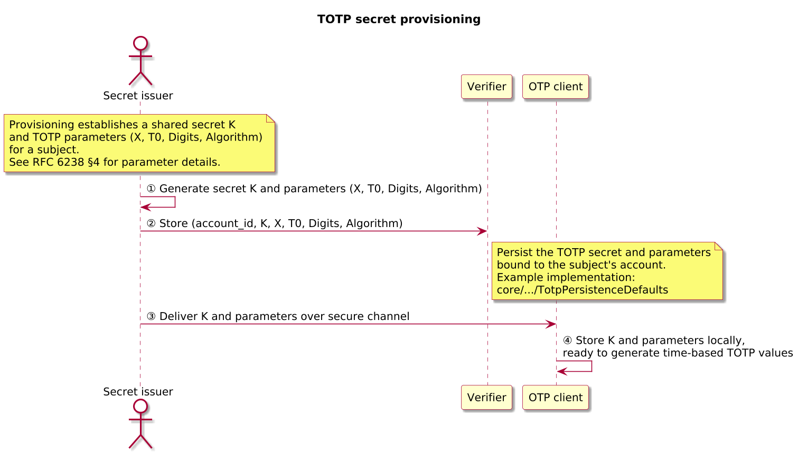
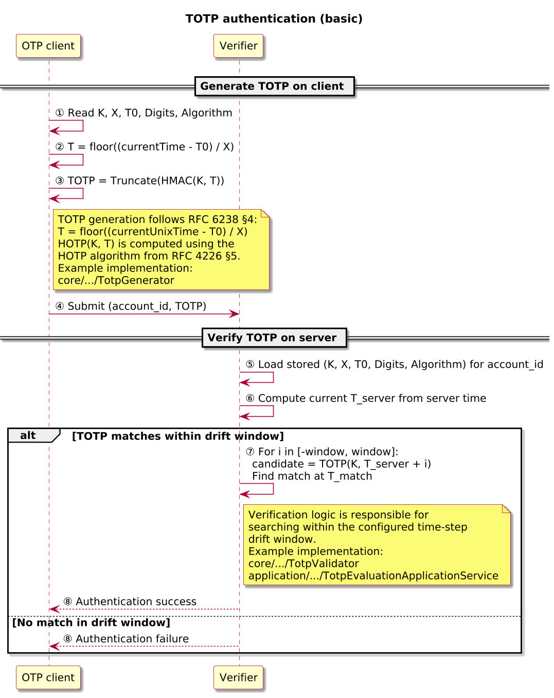
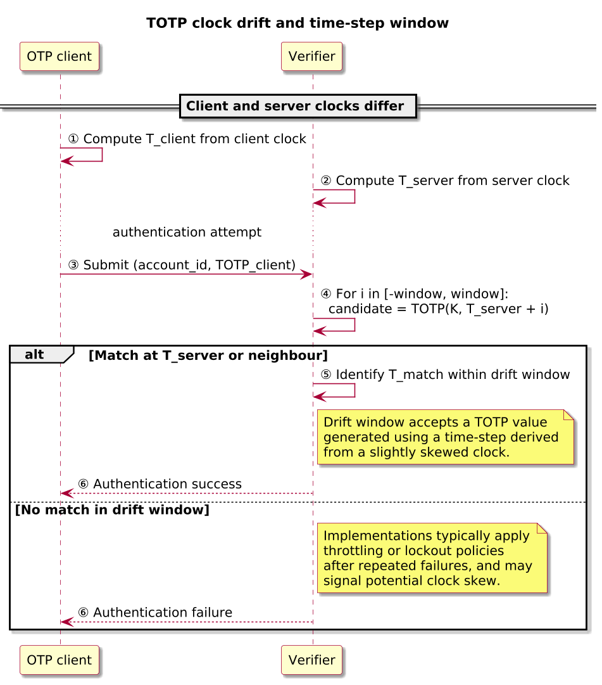
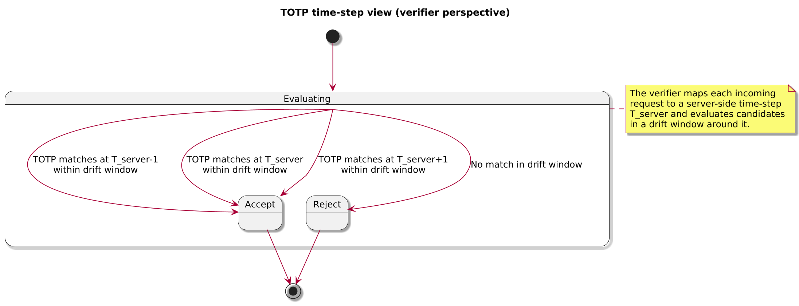

# TOTP – Time-Based One-Time Password

> [!IMPORTANT]
> RFC 6238 (and HOTP in RFC 4226) are the normative specifications for TOTP. This note is an explanatory companion for the OpenAuth Simulator; where there is disagreement, the RFCs take precedence.

> [!NOTE]
> Conceptually, TOTP is just HOTP with a time-derived counter: `TOTP(K, t) = HOTP(K, T(t))` where `T(t) = floor((t - T0) / X)`. See the HOTP document in this repository for the underlying HOTP algorithm and dynamic truncation details.

Audience: engineers exploring the simulator who are familiar with basic HMAC and HOTP concepts.

TOTP extends the HOTP one-time password mechanism by deriving short numeric codes from a shared secret and the current time instead of an explicit counter. It is widely used in authenticator applications and tokens that display time-limited codes for multi-factor authentication.

## TOTP in one page

- Purpose: Time-based one-time password used as a second factor.
- Shared state (per `account_id`): secret key `K`, time-step `X`, initial time `T0`, HMAC hash `Algorithm`, and number of digits `Digits`.
- Time-step and algorithm:
  - `T(t) = floor((t - T0) / X)` where `t` is the current Unix time in seconds.
  - `TOTP(K, t) = Truncate(HMAC_Algorithm(K, T(t))) mod 10^Digits`.
- Verifier behaviour:
  - Compute current server time-step `T_s`.
  - Check candidate TOTP values for `T` in a drift window (for example, `[T_s - w_-, T_s + w_+]`).
  - Enforce rate limiting and lockout policies on repeated failures.
- Typical deployments: mobile authenticator apps, browser extensions, and some hardware tokens.
- Example (symbolic):
  - `K`: 20-byte random secret; `X = 30` seconds; `T0 = 0`; `Digits = 6`.
  - At `t = 1_700_000_030`, `T(t) = floor(1_700_000_030 / 30) = 56_666_667`.
  - Client computes `TOTP(K, 56_666_667)` (for example, `428931`) and displays it; the verifier computes its own `T_s` and accepts `428931` if step `56_666_667` is in its drift window.

## References and status

| Field | Value |
|-------|-------|
| Normative specs | [RFC 6238 – Time-Based One-Time Password Algorithm (TOTP)](https://www.rfc-editor.org/rfc/rfc6238) |
| Profiles | None (base TOTP only) |
| Version focus | TOTP as defined in RFC 6238, derived from HOTP (RFC 4226) |
| Scope | Protocol behaviour and flows; simulator implementation details are secondary |

## Actors and terminology

The table below introduces only the roles needed to read the diagrams and discussion in this document.

| Actor | Role in this document | Term in RFC 6238 |
|-------|------------------------|------------------|
| Secret issuer | System that provisions TOTP secrets and parameters for a subject | Not explicitly named |
| OTP client | Device or application that generates TOTP values for a subject | Token / client |
| Verifier | Service that validates TOTP values and drives account authentication | Authentication server |

## Core flows

### TOTP secret provisioning

In a typical deployment, a secret issuer provisions a subject with a TOTP secret key `K` and associated parameters such as the time step `X`, initial Unix time `T0`, hash algorithm, and number of digits. The same values are stored on the verifier side, tied to an account identifier. Provisioning often happens via QR code (for example, an `otpauth://` URI), secure file exchange, or direct injection into a token; the transport itself is out of scope for RFC 6238 but must be secured to protect `K`.

Once provisioning completes, the OTP client and verifier share the same secret and timing parameters for the subject. All subsequent TOTP values generated by the OTP client and verified by the verifier depend on the integrity and confidentiality of this shared state.

#### Sequence

1. The secret issuer generates a secret key `K` and selects parameters (`X`, `T0`, `Algorithm`, `Digits`) for a given `account_id` (diagram step ①).
2. The verifier stores `K` and the same parameters for that `account_id` in its credential store (diagram step ②).
3. The OTP client receives `K` and the parameters via a secure provisioning channel (for example, an `otpauth://` URI encoded in a QR code, secure file exchange, or hardware injection) (diagram step ③).
4. After provisioning completes, the OTP client persists `K` and the parameters locally so that both OTP client and verifier hold the same `(K, X, T0, Algorithm, Digits)` configuration for the subject (diagram step ④).

#### Key parameters

| Field | Description | Spec reference |
|-------|-------------|----------------|
| `K` | Shared secret key used as the HMAC input key for TOTP generation | RFC 6238 §4 |
| `X` | Time step in seconds between successive TOTP values (for example, 30) | RFC 6238 §4 |
| `T0` | Unix time to start counting steps from (often 0 or a fixed epoch) | RFC 6238 §4 |
| `Digits` | Number of decimal digits in the TOTP value | RFC 6238 §4 |
| `Algorithm` | HMAC hash algorithm (for example, SHA-1, SHA-256, SHA-512) | RFC 6238 §4 |
| `account_id` | Local identifier that associates the secret with a subject or account | Not defined by RFC 6238 |

#### Policy knobs

- Choose secret length, entropy, and encoding for `K` (for example, a 20-byte random secret encoded in Base32 or hex); secrets must be generated by a cryptographically secure RNG.
- Decide on `X`, `T0`, `Algorithm`, and `Digits` with interoperability in mind; many existing authenticators assume `X = 30` seconds, `T0 = 0`, and `Algorithm = SHA-1`.
- Treat provisioning as a security-critical operation: select transport channels and binding steps (for example, QR codes plus out-of-band verification) that match the deployment’s threat model; RFC 6238 does not prescribe UI or UX.

### TOTP authentication (basic)

During authentication, the OTP client uses its local copy of `K`, `X`, `T0`, and the current time to compute a time-step value `T = floor((currentTime - T0) / X)` and derive a TOTP value. The user presents this value to the verifier, typically by reading or copying the code into a login form. The verifier recomputes candidate TOTP values for `T` and neighbouring time steps to account for clock skew and accepts the authentication if one of the candidate values matches.

Because TOTP codes are time-based, the same code is valid for a limited time window (for example, 30 seconds per code, with an additional window on either side to accommodate clock drift).

#### Sequence

1. The OTP client reads its configuration (`K`, `X`, `T0`, `Digits`, `Algorithm`), then reads the current time `t_client` and computes its time-step `T_client = floor((t_client - T0) / X)` (diagram steps ①–②).
2. The OTP client computes `TOTP(K, T_client)` and displays the resulting code to the user (diagram step ③).
3. The user submits the TOTP value together with `account_id` to the verifier (for example, via a login form) (diagram step ④).
4. The verifier loads the stored configuration (`K`, `X`, `T0`, `Digits`, `Algorithm`) for the `account_id`, reads its current time `t_server`, computes `T_s = floor((t_server - T0) / X)`, and recomputes candidate TOTP values over a configured drift window around `T_s` (for example, `T_s - w_-` through `T_s + w_+`) (diagram steps ⑤–⑦).
5. If a match is found at some time-step `T*` within the accepted window, authentication succeeds; otherwise, authentication fails and the verifier may apply rate limiting or lockout policies (diagram step ⑧).

#### Key parameters

| Field | Description | Spec reference |
|-------|-------------|----------------|
| `T` | Time-step value derived from the current time, `T = floor((currentTime - T0) / X)` | RFC 6238 §4 |
| `TOTP` | Numeric one-time password value derived from HMAC(K, T) and dynamic truncation | RFC 6238 §4 |
| `account_id` | Identity or account for which the TOTP value is being verified | Not defined by RFC 6238 |

#### Policy knobs

- Choose and document the drift window around `T_s` (for example, allowing `T_s` and ±1 neighbouring step); larger windows tolerate more clock skew but increase the number of valid candidates an attacker can attempt.
- Decide whether to treat TOTP values as single-use (for example, recording the last accepted time-step per `account_id` and rejecting codes for steps ≤ last-accepted) or allow limited reuse within the valid window; RFC 6238 does not require strict single-use semantics.
- Configure rate limiting and lockout strategies for repeated failures (per-account counters, backoff, temporary lockouts, alerting) and ensure failures are logged with enough context (for example, offset from `T_s`) to diagnose clock issues or abuse.
- Ensure verifier time is kept accurate via NTP or equivalent; TOTP reliability and security depend on reasonably synchronised clocks.

#### What to remember

- TOTP is HOTP evaluated over a time-derived counter `T(t)`; both client and verifier reason in terms of time-steps rather than raw timestamps.
- Client and verifier must agree on `K`, `X`, `T0`, `Algorithm`, and `Digits` for each `account_id`; mismatches lead to immediate verification failures.
- Drift windows are an explicit usability–security trade-off; increasing them makes it easier for users with skewed clocks but also increases the guessing surface.
- Single-use semantics require additional state tracking on the verifier and become more complex in multi-device setups that share secrets.

#### Drift handling and time-step window

In practice, the OTP client and verifier clocks may not be perfectly synchronised. To compensate, implementations define a skew window: when verification fails at the current server time-step `T_s`, the verifier checks a limited number of steps before and after `T_s`.

If a valid TOTP value is found within this window, the verifier accepts the authentication. If no match is found, the verifier rejects the attempt and may apply rate limiting or lockout policies. Deployments must balance usability against the increased attack surface introduced by accepting more time steps.

Some readers find it useful to visualise how time steps map to valid TOTP values. The following diagram sketches how the verifier might interpret incoming requests relative to its own time-step view. This is informational and does not introduce new protocol rules beyond RFC 6238; it simply illustrates how accepted and rejected steps align with the configured drift window.

## Configuration parameters and trade-offs

The table below summarises common configuration parameters for TOTP and how they affect behaviour.

| Parameter | Typical values | Effect on behaviour | Risk if chosen poorly |
|-----------|----------------|---------------------|------------------------|
| `X` (time step) | 30 or 60 seconds | Controls how long each TOTP value remains valid and how often users see new codes. | Too large increases the replay window for intercepted codes; too small can degrade usability. |
| `T0` (initial time) | `0` or a fixed epoch | Defines alignment of time-steps between client and verifier. | Misaligned `T0` values cause systematic verification failures across all time-steps. |
| `Digits` | 6–8 digits | Determines entropy per code; more digits reduce guessing probability. | Too few digits (for example, 4) significantly increase online guessing feasibility. |
| `Algorithm` | SHA-1, SHA-256, SHA-512 | Balances interoperability with existing authenticators against cryptographic profile. | Non-standard choices may break interop; weaker algorithms can reduce confidence in long-term usage. |
| Drift window | Typically ±1 time-step | Governs tolerance for clock skew between client and verifier. | Overly large windows multiply the number of valid candidates per attempt and weaken rate-limiting. |
| Single-use vs reuse | Single-use or reuse within window | Controls whether a TOTP can be accepted multiple times within its time window. | Allowing reuse simplifies implementation but is more vulnerable to replay; strict single-use increases complexity. |
| Rate limiting and lockout | Per-account attempts, backoff, temporary lockouts | Limits repeated guesses and signals suspicious behaviour. | Weak or absent limits allow brute-force attempts across many time-steps. |

## Security properties and failure modes

> [!WARNING]
> If the TOTP secret `K` is compromised, an attacker can compute valid TOTP values for any time-step; TOTP does not provide forward secrecy, and time-limited validity does not prevent use of stolen codes within their window.

- TOTP security depends on the secrecy and quality of `K` and on reasonably accurate clocks on both client and verifier; weak key generation, reused keys across accounts, or key disclosure allow attackers to compute valid TOTP values for any time-step. RFC 6238 supports HMAC-SHA-1/256/512; although SHA-1’s collision resistance is considered weak today, the more relevant property for TOTP is HMAC preimage resistance. The simulator intentionally mirrors the RFC profiles for interoperability.
- Time-limited validity restricts the window in which an intercepted TOTP can be reused, but it does not prevent real-time relay: an attacker who captures a code and submits it before expiry can still succeed unless additional controls are in place.
- Large drift windows, long time-steps, and weak or absent rate limiting significantly increase the feasibility of online guessing and replay; deployments should keep drift windows conservative, enforce robust throttling and lockout policies, and monitor failure patterns (including failure offsets relative to `T_s`) to detect systemic clock issues or abuse.
- Reusing the same secret `K` across multiple services or devices increases the blast radius of compromise; where possible, secrets should be unique per subject and per relying party, with careful handling for multi-device scenarios.
- TOTP codes are not origin-bound and are easily phishable; they are best treated as one factor within a multi-factor authentication scheme. For phishing-resistant authentication, mechanisms such as FIDO2/WebAuthn are more appropriate.

## Simulator implementation pointers

While this document focuses on the protocol, the simulator implements TOTP behaviour in the `core` and `application` modules. The table below maps the flows described above to representative types and tests so readers can move directly from diagrams to code.

| Flow / concern | Key types | Representative tests |
|----------------|-----------|----------------------|
| Core TOTP generation from `K` and time-steps | [TotpGenerator.java](../../../core/src/main/java/io/openauth/sim/core/otp/totp/TotpGenerator.java) | [TotpGeneratorTest.java](../../../core/src/test/java/io/openauth/sim/core/otp/totp/TotpGeneratorTest.java) |
| Verification with drift window | [TotpValidator.java](../../../core/src/main/java/io/openauth/sim/core/otp/totp/TotpValidator.java) | [TotpGeneratorTest.java](../../../core/src/test/java/io/openauth/sim/core/otp/totp/TotpGeneratorTest.java) (via vectors), additional verification tests |
| Persistence defaults for secrets and parameters | [TotpPersistenceDefaults.java](../../../core/src/main/java/io/openauth/sim/core/otp/totp/TotpPersistenceDefaults.java) | Covered by TOTP application tests |
| Secret and parameter seeding (provisioning) | [TotpSeedApplicationService.java](../../../application/src/main/java/io/openauth/sim/application/totp/TotpSeedApplicationService.java) | [TotpSeedApplicationServiceTest.java](../../../application/src/test/java/io/openauth/sim/application/totp/TotpSeedApplicationServiceTest.java) |
| Sample generation and preview flows | [TotpSampleApplicationService.java](../../../application/src/main/java/io/openauth/sim/application/totp/TotpSampleApplicationService.java) | [TotpSampleApplicationServiceTest.java](../../../application/src/test/java/io/openauth/sim/application/totp/TotpSampleApplicationServiceTest.java) |
| Evaluation and telemetry (including Native Java usage) | [TotpEvaluationApplicationService.java](../../../application/src/main/java/io/openauth/sim/application/totp/TotpEvaluationApplicationService.java) | [TotpEvaluationApplicationServiceTest.java](../../../application/src/test/java/io/openauth/sim/application/totp/TotpEvaluationApplicationServiceTest.java), [TotpNativeJavaApiUsageTest.java](../../../application/src/test/java/io/openauth/sim/application/totp/TotpNativeJavaApiUsageTest.java) |

These pointers are provided for convenience when exploring this repository. RFC 6238 (and its use of HOTP from RFC 4226) remains the definitive description of the TOTP algorithm and its requirements.
