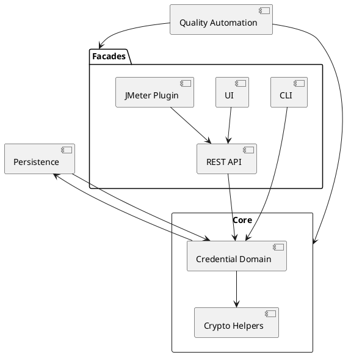

# Architecture Knowledge Map

_Status: Draft_
_Last updated: 2025-09-27_

This living map captures the explicit relationships between modules, data flows, and external interfaces so future agents can reason about change impact quickly. Update it after every iteration that introduces or modifies a component, dependency, or contract.

## Update Procedure
1. Review the latest feature plan and closed work to identify new elements or interactions.
2. Describe the change in prose (one line per relationship) under **Current Links**.
3. Update the PlantUML view (or replace it with another diagram) so visualisations stay in sync. Regenerate any exported assets in `docs/_assets/` if required.
4. Note outstanding follow-ups or ambiguities in the **Open Items** table and mirror them in `docs/4-architecture/open-questions.md`.

## Current Links
- Core module owns protocol-specific credential models consumed by facade modules.
- MapDB-backed persistence layer (planned) will expose repositories consumed by CLI, REST API, UI, and JMeter plugin.
- Quality automation (ArchUnit, mutation testing, security prompts) enforces boundary rules across modules.

## Open Items
| Date | Topic | Question | Status | Follow-up |
|------|-------|----------|--------|-----------|
| 2025-09-27 | Persistence design | Confirm MapDB caching topology (shared vs per facade) | Open | Add to feature plan once clarified |

## PlantUML Sketch

_Preview note: VS Code is configured to render PlantUML blocks through the Kroki server (`.vscode/settings.json`), avoiding the need for a local `plantuml.jar`._

Update the diagram together with the bullet list whenever the architecture shifts. If PlantUML becomes unwieldy, replace it with another markdown-embedded viewpoint and document how to regenerate it.
