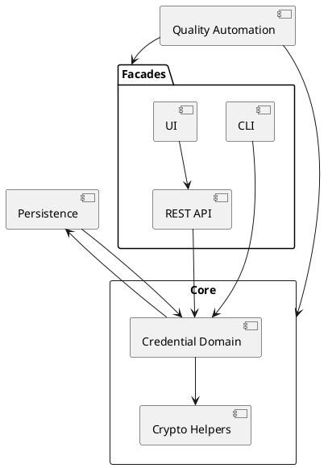

# Architecture Knowledge Map

_Status: Draft_
_Last updated: 2025-11-01_

This living map captures the explicit relationships between modules, data flows, and external interfaces so future agents can reason about change impact quickly. Update it after every iteration that introduces or modifies a component, dependency, or contract.

## Update Procedure
1. Review the latest feature plan and closed work to identify new elements or interactions.
2. Describe the change in prose (one line per relationship) under **Current Links**.
3. Update the PlantUML view (or replace it with another diagram) so visualisations stay in sync. Regenerate any exported assets in `docs/_assets/` if required.
4. Note outstanding follow-ups or ambiguities in the **Open Items** table and mirror them in `docs/4-architecture/open-questions.md`.

## Current Links
- Feature 011 is now the sole governance source of truth. Its spec/plan/tasks (`docs/4-architecture/features/011/{spec,plan,tasks}.md`) catalogue FR-011-01..08 and NFR-011-01..05, describe AGENTS/runbook/constitution ownership, spell out gitlint + Palantir formatter policies, and require logging every `git config core.hooksPath`, `githooks/pre-commit`, and `./gradlew --no-daemon spotlessApply check`/`qualityGate` invocation in `_current-session.md`.
- Feature 012 consolidates persistence guidance across deployment profiles, cache tuning, telemetry contracts, maintenance helpers, optional encryption, unified `credentials.db` defaults, and IDE remediation workflows. Reference `docs/4-architecture/features/012/{spec,plan,tasks}.md` and `docs/2-how-to/configure-persistence-profiles.md` together whenever cryptography/persistence docs require updates.
- Feature 013 now owns the entire toolchain/quality backlog. Its spec/plan/tasks (`docs/4-architecture/features/013/{spec,plan,tasks}.md`) enumerate CLI exit harness coverage, Maintenance CLI Jacoco buffers, reflection policy enforcement, Java 17 refactors, architecture harmonization, SpotBugs/PMD enforcement, Gradle wrapper upgrades, and the command suite (`qualityGate`, Jacoco hotspots, `reflectionScan`, `spotbugsMain`, `pmdMain pmdTest`, wrapper + warning-mode sweeps) that must be logged in `_current-session.md` during migrations.
- Core module currently exposes the OCRA credential domain consumed by facade modules; additional protocol packages will be introduced via future specifications.
- Feature 009 is the authoritative home for all operator-console UI/JS work, documenting the shared tab shell, verbose trace dock, preset helpers, Base32 inputs, preview windows, and the modular JS harness that keeps REST/CLI/UI linkages aligned.
- Feature 010 governs documentation and knowledge automation: it keeps the Java/CLI/REST guides, README, roadmap, knowledge map, and session quick reference aligned with `_current-session.md` logs, and owns the `qualityGate` automation notes/CI workflow so doc changes and quality reports stay in sync.
- Feature 040 specification now scopes the EUDIW OpenID4VP simulator to remote verifier flows, introducing `application.eudi.openid4vp` services, DCQL evaluators, Generate/Validate facade modes (Evaluate/Replay tabs), inline SD-JWT/mdoc credential entry, friendly Trusted Authority labels, ETSI Trust List/OpenID Federation ingestion, global verbose trace integration, and shared fixtures so REST/CLI/UI can replay or verify HAIP-compliant presentations with Trusted Authorities filtering and telemetry parity.
- Application `eudi.openid4vp` services now emit per-presentation trace diagnostics (credential ID, holder binding, hash summaries, Trusted Authority verdict) so REST/CLI/operator UI consumers can map verbose-trace entries back to each result section.
- The EUDIW operator UI fragment now posts directly to `/requests`, `/wallet/simulate`, and `/validate`, renders VP Token JSON exclusively inside the result card, and relays verbose trace payloads to the shared dock through `VerboseTraceConsole` (no protocol-specific toggle).
- Operator UI now includes the EUDIW OpenID4VP tab delivered in T4015a: Evaluate/Replay columns reuse the shared layout, render the baseline HAIP banner, DCQL preview, Trusted Authority labels, sample selectors, ASCII QR preview, result card, and JS controller that reuses the REST endpoints and feeds the global trace dock (S7 foundation for T4015b/T4016).
- Operator UI result cards (Feature 040 T4016) now render one collapsible section per OpenID4VP presentation with per-section copy/download actions and `data-trace-id` attributes that align with the verbose trace dock, ensuring multi-credential DCQL responses remain traceable across Evaluate/Replay flows.
- Core `eudi.openid4vp` package now exposes `TrustedAuthorityFixtures` and `SyntheticKeyFixtures`, loading HAIP baseline trusted authority snapshots, stored presentation stubs, and synthetic issuer/holder ES256 keys from `docs/test-vectors/eudiw/openid4vp/` to unblock Feature 040 ingestion tests.
- Synthetic PID fixture bundles (`docs/test-vectors/eudiw/openid4vp/fixtures/synthetic/`) now include SD-JWT VC artifacts (claims, disclosures, digests, KB-JWT) and ISO mdoc DeviceResponse assets plus deterministic seed files to drive upcoming simulator services and smoke tests.
- Core `eudi.openid4vp` now exposes `MdocDeviceResponseFixtures`, hydrating ISO DeviceResponse payloads and Claim Path Pointer metadata that feed the application-layer `MdocWalletSimulationService` for Trusted Authority filtering and HAIP encryption enforcement.
- Application `eudi.openid4vp` services now surface `Oid4vpProblemDetails`/`Oid4vpValidationException`, enabling REST/CLI facades to lift Trusted Authority problem-details via shared adapters.
- Application `eudi.openid4vp` package now exposes `OpenId4VpValidationService`, resolving stored vs inline submissions, recomputing disclosure hashes, and emitting `oid4vp.response.validated/failed` telemetry while reusing `TrustedAuthorityEvaluator` and `Oid4vpProblemDetails` for Trusted Authority enforcement.
- REST API adds `Oid4vpProblemDetailsAdvice`, translating `Oid4vpValidationException` into RFC 7807 payloads for future OpenID4VP endpoints.
- Feature 040 ingestion path now includes `FixtureDatasets`, `OpenId4VpStoredPresentationFixtures`, and `OpenId4VpFixtureIngestionService`, enabling synthetic vs conformance dataset toggles, provenance metadata exposure, and the `oid4vp.fixtures.ingested` telemetry event for future REST/CLI seeding commands.
- Feature 040 specification now codifies telemetry redaction guidance for `oid4vp.request.*`, `oid4vp.wallet.responded`, and validation events, requiring all facades (REST/CLI/UI) to reuse `TrustedAuthorityEvaluator` verdicts and `Oid4vpProblemDetails` when validation flows ship.
- REST module now exposes `Oid4vpController` under `/api/v1/eudiw/openid4vp` plus Spring configuration that wires fixture-backed repositories, Trusted Authority evaluators, and telemetry publishers into the authorization, wallet, validation, and seeding endpoints.
- CLI ships a dedicated `eudiw` Picocli root with `request create`, `wallet simulate`, and `validate` commands that reuse the same application services/fixtures and emit JSON-compatible output for contract parity with the REST surface.
- Application module now ships `DirectPostJwtEncryptionService` (T4011) implementing HAIP `direct_post.jwt` encryption via P-256 ECDH-ES + A128GCM, deriving verifier coordinates from fixture private keys when needed, capturing telemetry latency, and surfacing `invalid_request` problem-details on failure.
- CLI introduces `Oid4vpProblemDetailsFormatter`, ensuring upcoming EUDIW commands can render the same problem-details structure via the terminal.
- Core OCRA package normalises RFC 6287 suites into descriptor records consumed by the credential registry and future factory helpers.
- Core persistence serialization contracts convert protocol descriptors into versioned credential records, now stored by `MapDbCredentialStore` with optional schema migrations when configured.
- OCRA validation telemetry emits structured debug events that future observability modules can ingest without exposing secret material.
- `docs/1-concepts/README.md` documents the OCRA capability matrix and telemetry contract operators should consult when integrating facades.
- Core TOTP package implements RFC 6238 descriptors, generators, validators, and drift window helpers that will feed shared persistence and facade services in Feature 023.
- docs/totp_validation_vectors.json now centralises RFC 6238 TOTP fixtures consumed by the core loader (`TotpJsonVectorFixtures`) so CLI, REST, and operator UI presets stay in sync without duplicating literals.
- Application module now exposes `TotpEvaluationApplicationService`, generating stored/inline OTPs (and validating on replay) through the shared `CredentialStore`, emitting `totp.evaluate` telemetry via `TelemetryContracts`.
- MapDB persistence now normalises TOTP credential attributes (algorithm, digits, step, drift windows) under schema v1 alongside existing HOTP defaults so shared stores can serve mixed protocol records.
- REST HOTP evaluate/replay endpoints now propagate verbose trace payloads (including validation/error cases) aligned with the TOTP contract, reusing `VerboseTracePayload` for MockMvc/OpenAPI parity.
- REST OCRA verification endpoints now emit verbose trace payloads for stored/inline replay flows (including comparison steps) and share the same `VerboseTracePayload` schema consumed by CLI and operator UI facades.
- HOTP replay workflows now perform bounded window scanning (default look-ahead 10) and emit match-derivation traces that mirror the evaluate pipeline; ordered trace attributes surface through CLI, REST JSON (`orderedAttributes`), and the operator UI formatter.
- REST OCRA evaluate flows plus WebAuthn evaluation/replay/attestation endpoints now share the same `VerboseTracePayload` contract, and the regenerated OpenAPI snapshots document the trace schema for cross-facade consumers.
- REST WebAuthn attestation replay now surfaces `verify.signature` trace steps that reuse the shared `SignatureInspector`, exposing signature encodings, low-S status, and policy metadata for operators.
- Stored WebAuthn attestation metadata responses now include read-only trust-anchor summaries so the operator console can display curated root names/certificate subjects without enabling inline edits.
- CLI/REST/operator UI attestation replay accept curated metadata anchor identifiers, feeding them to `WebAuthnTrustAnchorResolver` alongside manual PEM bundles and logging the identifier set in telemetry for cross-facade observability.
- Core WebAuthn parsing utilities now include `WebAuthnAuthenticatorDataParser` and `WebAuthnExtensionDecoder`, decoding authenticator-data CBOR (flags, counters, extensions) so application services, CLI, REST, and operator UI traces surface extension metadata and unknown entries consistently.
- Core EMV CAP package (`core.emv.cap`) now derives session keys, generates AC payloads, and applies issuer proprietary bitmasks, exposing fixtures consumed by upcoming application and REST layers.
- EMV verbose traces now surface ATC, branch factor, height, mask length, and preview window offsets across application, REST, CLI, and operator UI facades so diagnostics match preview controls and telemetry fields.
- EMV operator console inline evaluations now forward the selected preset identifier as part of inline submissions so server-side secret hydration occurs without exposing masked fields, while inline overrides continue to take precedence when provided.
- CLI module now exposes `emv cap evaluate`, wiring the application service with sanitized telemetry, JSON/text outputs, trace toggling, and inline overrides so operators can exercise Identify/Respond/Sign flows outside REST/UI.
- CLI module now exposes `emv cap replay`, delegating to `EmvCapReplayApplicationService` for stored/inline flows, mirroring REST replay payloads (status, metadata, verbose traces), and emitting `cli-emv-cap-replay-*` telemetry IDs with include-trace controls.
- Application `EmvCapSeedApplicationService` + `EmvCapCredentialPersistenceAdapter` persist canonical EMV/CAP fixtures; shared `EmvCapSeedSamples` feed REST `/api/v1/emv/cap/credentials/seed` and Picocli `emv cap seed` so MapDB presets stay consistent across facades.
- Extended EMV/CAP fixtures (`identify-b2-h6`, `identify-b6-h10`, `respond-challenge4`, `respond-challenge8`, `sign-amount-0845`, `sign-amount-50375`) drive parameterized coverage in core/application/REST suites while keeping CLI and operator UI presets in sync with cross-surface vectors.
- Application module now exposes `application.emv.cap.EmvCapEvaluationApplicationService`, translating CAP requests into core inputs, emitting sanitized `emv.cap.*` telemetry frames, and assembling optional trace payloads for downstream facades.
- REST API now exposes `POST /api/v1/emv/cap/evaluate`, mapping EMV/CAP DTOs to the application service, enforcing validation with detailed problem-details responses, and returning optional trace payloads with sanitized telemetry metadata and `includeTrace` toggle.
- REST API now exposes `POST /api/v1/emv/cap/replay`, validating stored or inline OTPs with preview-window bounds, emitting `match`/`mismatch` metadata (credential source, matched delta, supplied OTP length), and sharing the same verbose trace payloads when callers enable `includeTrace`.
- REST API now serves `GET /api/v1/emv/cap/credentials`, returning sanitized stored-descriptor summaries (mode, master key, derivation parameters, metadata) so CLI/REST/operator console presets stay in sync.
- Stored EMV credential summaries now expose only `masterKeySha256` digests plus per-field hex-length metadata; REST/CLI/operator UI stored submissions hydrate secrets on the server while masked placeholders and inline overrides require explicit operator input.
- CLI module now includes `TotpCli` list/evaluate commands that wrap the TOTP application service and emit `cli.totp.evaluate` telemetry without persisting secrets.
- Core module now includes a `fido2` package where `WebAuthnAssertionVerifier` parses COSE public keys, validates client/ authenticator payloads, and produces signature-verification outcomes for downstream facades.
- Application module now provides `TotpSeedApplicationService`, with REST facades (`TotpCredentialSeedService`/`TotpCredentialDirectoryController`) exposing `/api/v1/totp/credentials/seed` and `/api/v1/totp/credentials`; operator console seed controls consume `TotpOperatorSampleData` to bootstrap demo credentials and emit `totp.seed` telemetry.
- Core WebAuthn package now exposes `WebAuthnFixtures`, lifting W3C §16 sample vectors (ES256 plus newly consolidated ES384/ES512/RS256/Ed25519 in `docs/webauthn_w3c_vectors.json`) into main scope so application, CLI, REST, and UI layers can share consistent seed/preset data without duplicating decoding logic; generator presets now derive JWK material from the same fixtures while the synthetic `synthetic-packed-ps256` bundle covers PS256 until the specification publishes an official fixture.
- Core WebAuthn utilities now expose `SignatureInspector`, decoding COSE/DER signatures (ECDSA/RSA/EdDSA) into structured trace metadata; application services consume it alongside `WebAuthnSignaturePolicy` to emit low-S enforcement state across verbose traces.
- WebAuthn stored credential directory endpoints and operator console dropdowns now share a canonical algorithm ordering helper (ES256 -> ES384 -> ES512 -> RS256 -> PS256 -> EdDSA) so REST responses, CLI listings, and UI selectors remain deterministic for verbose trace comparisons and audit reviews.
- docs/ocra_validation_vectors.json now centralises RFC 6287 Appendix C OCRA vectors and feeds `OcraJsonVectorFixtures`, keeping core/CLI/REST/operator UI presets in sync while leaving draft-only suites in `OcraDraftHotpVariantsVectorFixtures`.
- Operator console HOTP, TOTP, OCRA, and WebAuthn panels now route invalid REST responses through the shared `ResultCard` helper so inline/replay/attestation workflows surface status messages and hints consistently; Selenium suites guard the new messaging paths.
- OCRA operator evaluate/replay panels attach verbose requests to the shared `VerboseTraceConsole`, rendering traces when REST responses include them while preserving hidden defaults when no trace is returned; Selenium coverage (`OcraOperatorUiSeleniumTest`) verifies verbose flag propagation.
- Operator console now provides a global verbose-trace toggle and terminal-style dock that forwards HOTP/TOTP/WebAuthn evaluation/replay calls with the REST `verbose` flag, renders `VerboseTracePayload` steps (operation, metadata, ordered trace entries), hides the panel automatically when verbose mode is disabled, and clears stale traces whenever operators switch protocols, modes, or stored/inline contexts.
- Core FIDO2 package now includes a `WebAuthnCredentialPersistenceAdapter` that serialises relying-party metadata, COSE public keys, and counters into MapDB schema v1 so downstream CLI/REST/UI facades can retrieve `WebAuthnCredentialDescriptor` entries alongside HOTP/TOTP/OCRA records.
- Application module now exposes `WebAuthnEvaluationApplicationService` and `WebAuthnReplayApplicationService`, resolving MapDB-backed descriptors through the persistence adapter, delegating to the core verifier, and emitting sanitized `fido2.evaluate`/`fido2.replay` telemetry ahead of facade wiring.
- CLI (`Fido2Cli`), REST (`/api/v1/webauthn/*`), and operator-console panels now sit directly on those evaluation/replay services plus the attestation generators, reusing `docs/webauthn_*` fixtures, trust-anchor metadata, and shared telemetry events so Feature 004 remains the single governance point for WebAuthn assertion + attestation flows.
- Application module now introduces `WebAuthnAttestationVerificationApplicationService` and `WebAuthnAttestationReplayApplicationService`, layering trust-anchor enforcement and sanitized `fido2.attest`/`fido2.attestReplay` telemetry on top of the core attestation verifier for inline attestation workflows.
- Application module now provides `WebAuthnAttestationSeedService` and stored-generation commands that persist curated attestation descriptors into the shared MapDB credential store; CLI `seed-attestations`, REST `/api/v1/webauthn/attestations/seed`, and operator UI stored selectors reuse the metadata endpoints to drive Preset/Manual/Stored generation parity across facades.
- Attestation seeding now enriches the existing canonical WebAuthn assertion credentials in place, preserving the original credential secret while layering stored attestation payload attributes so dropdowns/directories never accumulate duplicates.
- Application module now provides `WebAuthnGeneratorSamples`, delivering deterministic presets (challenge + authenticator private-key JWKs) keyed to W3C fixture identifiers (for example `packed-es256`) that the CLI, REST API, and operator console share when generating WebAuthn assertions.
- Application module now exposes `WebAuthnAttestationSamples`, indexing the attestation JSON bundles so CLI vector listings, REST metadata, and operator UI catalogues consume a shared fixture catalogue sourced from `WebAuthnAttestationFixtures`.
- Application module now provides `WebAuthnMetadataCatalogue`, hydrating offline MDS bundles under `docs/webauthn_attestation/mds/` so trust-anchor resolvers and future ingestion helpers can share deterministic metadata + certificate fingerprints.
- Application trust-anchor resolver now consumes the metadata catalogue, combining offline anchors with operator-provided PEM bundles while surfacing `metadata`, `manual`, or `metadata_manual` telemetry for downstream CLI/REST/UI flows; curated `curated-mds-v3.json` tracks Ledger (packed), YubiKey (U2F), WinMagic (TPM), and IDmelon (Android Key) roots sourced from FIDO MDS v3 production.
- Application module now introduces `WebAuthnTrustAnchorResolver`, parsing PEM bundles with caching and surfacing anchor warnings/metadata to CLI, REST API, and operator UI flows consuming the attestation services.
- Application module now normalises WebAuthn replay `publicKey` inputs by accepting Base64URL COSE blobs, JSON JWK objects, or PEM/PKCS#8 payloads and converting them into COSE form before verification; the REST replay service delegates to the same decoder so facades share consistent format handling.
- CLI module now provides `Fido2Cli` with stored/inline evaluate, replay, and attestation commands (verify + replay) that delegate to the corresponding application services, reuse sanitized telemetry fields, trim attestation generation output to `clientDataJSON`/`attestationObject`, and now honour the `inputSource` contract (including `--input-source stored` + `--credential-id`) while surfacing `seedPresetId`/`storedCredentialId` telemetry for audit trails.
- CLI stored attestation replay enforces persisted certificate usage: providing trust-anchor flags emits `stored_trust_anchor_unsupported`, and telemetry maps stored failure reasons (`stored_credential_not_found`, `stored_attestation_required`, etc.) to CLI exit codes for operator feedback.
- REST API module now exposes `/api/v1/webauthn/attest` and `/api/v1/webauthn/attest/replay`, validating attestation payloads with optional PEM trust anchors, mapping telemetry (`fido2.attest` / `fido2.attestReplay`), and returning sanitized credential metadata alongside verification outcomes.
- Operator UI Replay tab now supports Manual/Stored attestation flows: manual mode keeps all inline fields editable, while stored mode hydrates relying party, origin, challenge, and format from `/api/v1/webauthn/attestations/{id}`, keeps the submit control enabled, and routes to `/api/v1/webauthn/attest/replay` with `inputSource=STORED` while telemetry renders stored credential metadata in the result card.
- Operator UI Evaluate attestation workflow now delegates to `/api/v1/webauthn/attest`, pre-filling deterministic vectors from `WebAuthnAttestationSamples`, exposing signing mode/custom-root options, and rendering generated payloads plus a telemetry-derived summary (signature included flag, certificate chain count) in the Selenium result panel (Feature 026 I14/I17).
- Core module now publishes `HotpJsonVectorFixtures`, loading RFC 4226 HOTP validation vectors from `docs/hotp_validation_vectors.json` so CLI, REST, and operator UI layers share a single source of truth for sample secrets/OTPs and avoid duplicating literals.
- REST API module now offers `/api/v1/webauthn/evaluate`, `/evaluate/inline`, and `/replay` endpoints via `WebAuthnEvaluationController`/`WebAuthnReplayController`, marshalling requests into the application services and returning sanitized metadata (telemetry IDs, relying-party info) without exposing raw challenges, client data, or signatures.
- Operator console WebAuthn presets now load curated generator samples (one per supported algorithm) sourced from `WebAuthnGeneratorSamples`; `Fido2OperatorSampleData` deduplicates by algorithm, emits preset metadata (including vector ids), and supplies telemetry-friendly `credentialName` hints while CLI/REST facades still expose the full catalogue for QA reproducibility.
- Operator console Evaluate tab now provides an assertion/attestation ceremony toggle: assertion mode retains stored/inline flows, while attestation mode surfaces an inline-only form with trust-anchor textarea that locks out stored evaluation and posts to the `/api/v1/webauthn/attest` endpoint via the updated `ui/fido2/console.js` state machine.
- FIDO2 operator console panels share stored credential state across evaluate and replay tabs, render all assertion payload fields as visible textareas, default replay presets to JWK public keys, and display seed-count parity messaging with counter controls that mirror HOTP/TOTP/OCRA behaviour.
- Docs under `docs/2-how-to/use-fido2-*.md` capture the CLI, REST, and operator UI workflows, including guidance on JWK key material and JSON vector handling.
- docs/test-vectors/emv-cap/{identify,respond,sign}-baseline.json capture CAP Identify/Respond/Sign derivation inputs, session keys, cryptogram overlays, and OTP outputs from emvlab.org to seed Feature 039 tests across modules.
- REST API module now exposes `/api/v1/totp/evaluate` endpoints for stored and inline validation, logging `rest.totp.evaluate` telemetry while leaving secrets redacted.
- REST API module now exposes `/api/v1/totp/replay`, delegating to `TotpReplayApplicationService`, returning non-mutating diagnostics, and emitting `rest.totp.replay` telemetry with matched skew metadata.
- REST API module now exposes `/api/v1/totp/credentials/{credentialId}/sample`, delegating to `TotpSampleApplicationService` to produce deterministic OTP/timestamp payloads and logging `totp.sample` telemetry for operator diagnostics.
- HOTP, TOTP, OCRA, FIDO2/WebAuthn, and EMV/CAP evaluation now run within the operator console (stored credential selectors, inline submissions, read-only diagnostics, curated presets, seed helpers, verbose trace toggles); EMV/CAP verbose traces render through the shared `VerboseTraceConsole` so copy/download controls and Selenium helpers stay aligned with other protocols. EUDI wallet packages (OpenID4VP 1.0, ISO/IEC 18013-5, SIOPv2) remain placeholder tabs pending specifications.
- Operator console UI now exposes TOTP evaluation and replay panels backed by `/api/v1/totp/evaluate` and `/api/v1/totp/replay`, with drift/timestamp controls, inline sample presets sourced from `TotpOperatorSampleData`, telemetry surfacing (including preset metadata), and tab/mode persistence coordinated through `ui/totp/console.js`.
- Operator console stored replay form now includes a **Load sample data** button positioned directly beneath the **Stored credential** selector, calling the sample endpoint to populate OTP/timestamp/drift fields while surfacing telemetry metadata.
- MapDB-backed persistence layer (planned) will expose repositories consumed by CLI, REST API, and UI facades.
- MapDB-backed persistence now emits Level.FINE telemetry events (`persistence.credential.lookup` / `persistence.credential.mutation`) capturing cache hit/miss and latency metrics without leaking secret material.
- MapDB maintenance helper (T205) provides synchronous compaction and integrity checks with structured `MaintenanceResult` outputs and telemetry so admin facades can surface maintenance outcomes.
- MapDB persistence supports optional AES-GCM secret encryption via in-memory key callbacks, keeping secrets encrypted at rest while preserving the existing `CredentialStore` contract.
- Application module now owns shared telemetry adapters (`TelemetryContracts`) that produce consistent `TelemetryFrame` payloads for CLI and REST, replacing facade-local telemetry classes.
- Application module now exposes HOTP evaluation and issuance services that mutate shared `CredentialStore` counters and emit `hotp.evaluate`/`hotp.issue` events through `TelemetryContracts` while redacting OTP material.
- CLI module now includes HOTP import/list/evaluate commands that wrap the application services, emit `cli.hotp.issue`/`cli.hotp.evaluate` telemetry, and mirror the OCRA CLI response formatting.
- REST API module now exposes HOTP evaluation controllers for stored and inline flows, delegating to `HotpEvaluationApplicationService`, emitting `rest.hotp.evaluate` telemetry, and persisting counter updates through `CredentialStoreFactory`; the companion `/api/v1/hotp/credentials` directory feeds UI dropdowns with algorithm/digit/counter metadata.
- REST API module now adds a dedicated HOTP replay controller/service pair for stored and inline diagnostics, calling `HotpReplayApplicationService`, logging `rest.hotp.replay` telemetry, and returning non-mutating counter metadata for UI/API consumers.
- HOTP inline evaluation now omits operator-supplied identifiers; REST/application services emit telemetry without credential references while preserving algorithm/digit metadata.
- HOTP evaluate flows surface SHA-1 and SHA-256 inline presets that auto-populate form inputs, emit preset key/label metadata through REST responses, and display the generated OTP without manual entry.
- HOTP operator stored-mode panel now exposes a seeding control that drives `/api/v1/hotp/credentials/seed`, refreshes the credential directory, and reuses the seeded metadata for replay/sample presets.
- REST HOTP module serves `/api/v1/hotp/credentials/{credentialId}/sample`, deriving the current counter + OTP via `HotpSampleApplicationService` so UI replay flows fetch deterministic samples without advancing counters.
- Operator console replay flows call the same HOTP replay service, surface sample payload loaders, and normalise telemetry identifiers from `rest-hotp-*` to `ui-hotp-*` prefixes so operators can distinguish UI traffic while preserving the original telemetry payload for log correlation.
- `infra-persistence` module centralises `CredentialStoreFactory` wiring so CLI, REST, and tests acquire MapDB-backed stores through a shared configuration seam while keeping encryption profiles and future migrations/overrides injectable.
- CLI module now exposes `maintenance <compact|verify>` commands that orchestrate the helper for operators working on local MapDB stores.
- Unified operator console at `/ui/console` now embeds HOTP, TOTP, OCRA, FIDO2/WebAuthn, and EMV/CAP evaluation/replay flows, with placeholder tabs remaining only for the forthcoming EUDI wallet protocols; legacy `/ui/ocra/evaluate` and `/ui/ocra/replay` views now redirect/not-found so the console remains the single entry point.
- EMV/CAP operator UI replay now reuses the shared credential cache, preview-window controls, and `VerboseTraceConsole`, surfacing REST metadata (credential source, matched delta, supplied OTP) so Selenium and manual operators observe parity with CLI/REST replay traces.
- Operator console canonicalises deep links for HOTP/TOTP/OCRA/FIDO2 using the shared `protocol`, `tab`, and `mode` query parameters so refreshes and history navigation reopen the correct protocol/mode; the router still remembers per-protocol preferences and accepts legacy `totp*`/`fido2Mode` parameters for existing bookmarks.
- Operator console panels standardise on the evaluate/replay pill header, shared summary messaging, and hint styling so HOTP, OCRA, and forthcoming credential tabs retain a uniform UX while protocol-specific forms capture their unique inputs/outputs.
- Operator console now exposes a JSON-driven protocol info drawer/modal that syncs with tab selection, persists seen/surface/panel state in localStorage, auto-opens once per protocol on wide viewports, honours reduced-motion preferences, toggles aria-hidden on the console when the modal is active, dispatches CustomEvents for open/close/spec interactions, and is triggered by a single global info button aligned beside the tablist.
- Embeddable Protocol Info assets (`protocol-info.css` / `protocol-info.js`) plus a standalone demo and how-to guide enable vanilla DOM integrations outside the operator console while reusing the same API.
- Console state (protocol + tab + mode) is now encoded via query parameters so deep links and history navigation stay in sync across active HOTP/TOTP/OCRA/FIDO2 panels and future placeholder tabs, with telemetry unaffected because tab changes remain client-side.
- REST OCRA verification metadata now includes a `mode` attribute (stored vs inline) exposed to telemetry so replay facades can log outcome context consistently.
- Operator console replay mode posts sanitized telemetry summaries to `TelemetryContracts.ocraVerificationAdapter`, tagging `origin=ui` and surfacing mode/outcome/fingerprint for downstream analytics.
- REST OCRA directory now serves `/api/v1/ocra/credentials/{id}/sample`, returning curated challenge/context fingerprints used by operator-facing sample loaders.
- Operator console replay mode exposes a manual “Load sample data” action that fetches curated payloads on demand, keeping stored credentials untouched until operators opt in.
- `core-shared` module centralises credential models, repository utilities, and persistence primitives consumed by `core`, `core-ocra`, and higher-level facades.
- `core-ocra` module owns OCRA descriptors, registry defaults, and persistence hooks; `OcraStoreMigrations` centralises builder configuration even though no legacy migrations remain.
- CLI module now orchestrates OCRA credential import/list/delete/evaluate commands, delegating to MapDB persistence and core OCRA adapters while emitting sanitized telemetry.
- CLI command hierarchy seals `OcraCli.AbstractOcraCommand` to the known Picocli subcommands, keeping package-private seams for tests while preventing ad-hoc extensions.
- Caffeine cache layer exposes per-profile defaults (in-memory, file-backed, container) with expire-after-access/write strategies to sustain ≥10k RPS targets while keeping overrides available via builder hooks; operators can reference `docs/2-how-to/configure-persistence-profiles.md` for configuration steps.
- Toolchain and quality automation suite (Feature 013) formalises ArchUnit boundary checks plus PIT/Jacoco thresholds across modules, running locally and in GitHub Actions under the consolidated spec/plan/tasks set.
- Spotless now enforces Palantir Java Format 2.78.0 via the managed pre-commit hook and CI, standardising a 120-character wrap across all JVM modules.
- SpotBugs dead-state enforcement (Feature 013) adds a shared include filter and complementary PMD `UnusedPrivateField`/`UnusedPrivateMethod` rules so unread/unwritten state fails `./gradlew check` uniformly across JVM modules.
- `core-architecture-tests` Gradle module hosts facade/persistence ArchUnit rules, ensuring CLI/REST/UI modules stay isolated while persistence remains core-internal; invoked via `./gradlew :core-architecture-tests:test` or root `./gradlew architectureTest` and planned to roll into `qualityGate`.
- Reflection guardrails (Feature 013) combine an ArchUnit rule and the Gradle `reflectionScan` task (wired into `qualityGate`) to keep production/tests free of `java.lang.reflect` usage while providing allow-listed seams for testing.
- Aggregated Jacoco tasks (`jacocoAggregatedReport`, `jacocoCoverageVerification`) monitor OCRA module coverage with current thresholds (line ≥77%, branch ≥62%) and output to `build/reports/jacoco/aggregated/` pending future threshold increases.
- Root `mutationTest` task runs PIT against `core` OCRA classes (threshold ≥85%, current score ≈87.6%) and excludes `OcraChallengeFormat`/`OcraCredentialFactory` pending new tests; CLI/REST facades queued for future expansion once mutation coverage improves.
- Root `qualityGate` aggregates `spotlessCheck` and `check` (architecture, coverage, mutation), accepts `-Ppit.skip=true` for faster local iteration, now runs in GitHub Actions via the `ci.yml` workflow, and has operator guidance in `docs/5-operations/quality-gate.md`.
- REST API spec for session-aware OCRA evaluation was drafted 2025-09-28; broader facade endpoints remain pending.
- REST API now serves `/api/v1/ocra/evaluate`, delegating to `OcraResponseCalculator` and emitting redaction-friendly telemetry aligned with the CLI helper.
- REST API publishes an auto-generated OpenAPI contract (`/v3/api-docs`) with checked-in JSON and YAML snapshots at `docs/3-reference/rest-openapi.json` and `docs/3-reference/rest-openapi.yaml` for downstream integrations.
- REST API now exposes `/api/v1/ocra/verify`, delegating to `OcraReplayVerifier` for OTP replay checks and sharing telemetry metadata with CLI verification flows.
- REST verification services publish package-private normalized request records and telemetry emitters so tests and future modules can exercise behaviour without reflection, mirroring the evaluation service seams.
- REST OCRA evaluation and verification services now normalize payloads into sealed variants (stored vs inline), reducing mode detection to pattern matching instead of nullable fields.
- REST OCRA telemetry snapshot is archived under `docs/3-reference/rest-ocra-telemetry-snapshot.md` to illustrate redaction guarantees for operators.
- REST OCRA telemetry events now emit `reasonCode` and `sanitized` attributes so downstream alerting can distinguish validation failures from unexpected errors without leaking secrets.
- REST OCRA evaluation supports credential lookup via `credentialId`, resolving descriptors from the persistence adapter while preserving the existing inline secret mode.
- REST module now serves the unified Thymeleaf operator console through `OperatorConsoleController` at `/ui/console`, reusing `/ui/ocra` fragments under the hood while delegating evaluations to the REST endpoint and enforcing session-backed CSRF tokens; replay telemetry posts to `/ui/console/replay/telemetry` via `OperatorConsoleTelemetryLogger` and the shared `TelemetryContracts` adapter.
- REST module exposes `/api/v1/ocra/credentials` to surface sanitized OCRA credential summaries for operator dropdowns without leaking secret material.
- Shared MapDB persistence now defaults to `data/credentials.db` at the repository root; operators must rename or explicitly configure legacy `*-credentials.db` files if they wish to continue using them.
- MapDB store now exposes a package-private cache accessor used by internal tests, eliminating the need for reflective field access while keeping cache internals encapsulated.
- Ocra credential factory provides a package-private telemetry logger accessor so validation logging assertions remain reflection-free.
- Operator UI templates expose an accessible mode toggle (inline vs credential) and a sanitized telemetry summary panel so escalations reuse REST metadata without revealing secrets.
- Operator UI submissions now rely on asynchronous JSON `fetch` calls (Selenium harnesses enable HtmlUnit’s built-in polyfill) to invoke `/api/v1/ocra/evaluate`, rendering result/error panels client-side while the server-side controller remains read-only.
- OCRA operator inline presets now include a timestamp auto-fill toggle that injects the current Unix second (and re-computes it on submission) to stay inside the simulator’s one-second drift window while still allowing operators to fall back to published vector timestamps.
- Inline policy presets surface curated OCRA test vectors in the UI, now covering one representative for every RFC 6287 Appendix C suite plus the draft-only `OCRA-1:HOTP-SHA256-6:C-QH64` example so inline evaluations and canonical seeds remain aligned.
- Ocra operator sample catalog centralises inline presets and canonical seeding definitions so UI tests and REST endpoints remain in sync without re-encoding RFC datasets.
- REST seeding endpoint delegates credential creation to the application-layer `OcraSeedApplicationService`, ensuring facades no longer instantiate core factories directly while supporting append-only MapDB inserts.
- Operator console now reveals the seeding control only when stored credential mode is active, keeping inline-mode evaluations uncluttered while still allowing append-only seeding flows.
- Stored credential mode now ships with a client-side “Auto-fill parameters” helper that parses the selected OCRA suite and generates compatible challenge/counter/session/timestamp values, clearing disallowed inputs to avoid REST validation errors.
- Replay inline presets auto-populate immediately just like evaluation presets, keeping the UI flows consistent without extra controls.
- Evaluation result cards now present only OTP and status; sanitisation remains enforced server-side without an explicit UI indicator.
- Replay result cards now surface reason code and outcome while dropping the UI-only mode label; telemetry still records mode for audits.
- REST facade now boots a MapDB-backed `CredentialStore` bean (path configurable via `openauth.sim.persistence.database-path`), enabling stored credential evaluations in both REST and UI flows.
- `infra-persistence` module exposes `CredentialStoreFactory`, centralising MapDB provisioning so CLI and REST facades obtain `CredentialStore` instances without direct builder usage.
- How-to catalogue documents the Appendix B Java workflow for generating new OCRA test vectors, keeping domain/UI fixtures aligned with the draft reference implementation.
- Operator documentation suite under `docs/2-how-to` now includes REST, CLI, Java integration, and EMV/CAP operator UI guides, each referencing sanitized telemetry fields, preset seeding steps, and the shared `includeTrace` toggle exposed across facades.
- OCRA replay & verification flows (Feature 003) now extend CLI and REST facades with strict OTP verification using stored or inline credentials while emitting hashed OTP telemetry for audit purposes; shipped 2025-10-01 with shared `core.ocra.verify` instrumentation.
- Operator console TOTP evaluate and replay panels now expose **Use current Unix seconds** toggles (with reset helpers) so operators can snap timestamps to the console clock’s current step; JavaScript quantises the epoch seconds according to each credential’s step size while keeping manual overrides available when toggles are cleared.
- Core-shared now ships `Base32SecretCodec`, converting Base32 secrets into uppercase hex for HOTP/TOTP/OCRA flows; REST facades call it through `InlineSecretInput` so telemetry and persistence stay hex-only even when operators submit Base32 payloads.
- Operator console inline HOTP/TOTP/OCRA panels now share `static/ui/shared/secret-fields.js`, synchronising Base32 and hex inputs client-side while enforcing single-encoding submissions that match REST validation feedback.
- Operator console evaluation result cards render three-column preview tables with centred Δ headers and protocol-tinted Δ = 0 accents; accessibility audit confirmed the bold/accent pairing remains perceivable without colour reliance.
- Features 001/002/003 now own the HOTP/TOTP/OCRA stacks (core, persistence, CLI/REST/UI, replay tooling) while legacy artefacts remain archived under `docs/4-architecture/features/003/legacy/` for auditability.
- Feature 004 houses the combined WebAuthn assertion + attestation flows (former Features 024/026) with deterministic fixtures, trust-anchor handling, and telemetry guidance; Feature 005 owns EMV/CAP simulation docs, Feature 006 owns the EUDIW OpenID4VP simulator, and Feature 010 governs documentation/knowledge automation for these stacks while Features 007/008 stay reserved for future mdoc/SIOPv2 work.
- Feature 004’s spec/plan/tasks now serve as the canonical reference for WebAuthn assertion/attestation requirements, OpenAPI snapshots, and verification commands captured in `_current-session.md`.

## Open Items
| Date | Topic | Question | Status | Follow-up |
|------|-------|----------|--------|-----------|
| 2025-09-27 | Persistence design | Confirm MapDB caching topology (shared vs per facade) | Resolved | Resolved 2025-09-27 – Shared MapDB store with core-managed shared cache for all facades |
| 2025-10-01 | Architecture harmonization | Capture shared application layer + telemetry relationships once implemented | Resolved | Resolved 2025-10-15 – Documented FIDO2 application services, facades, and operator console wiring above |

## PlantUML Sketch

Update the diagram together with the bullet list whenever the architecture shifts. If PlantUML becomes unwieldy, replace it with another markdown-embedded viewpoint and document how to regenerate it.
