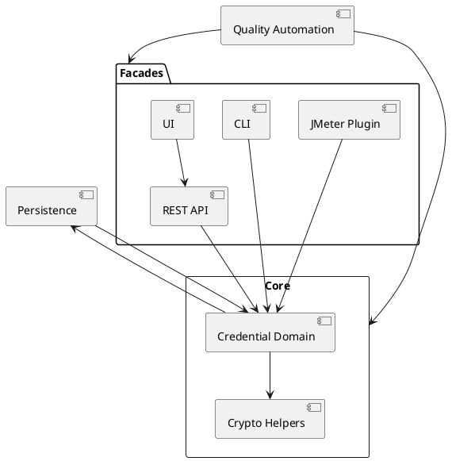

# Architecture Knowledge Map

_Status: Draft_
_Last updated: 2025-09-28_

This living map captures the explicit relationships between modules, data flows, and external interfaces so future agents can reason about change impact quickly. Update it after every iteration that introduces or modifies a component, dependency, or contract.

## Update Procedure
1. Review the latest feature plan and closed work to identify new elements or interactions.
2. Describe the change in prose (one line per relationship) under **Current Links**.
3. Update the PlantUML view (or replace it with another diagram) so visualisations stay in sync. Regenerate any exported assets in `docs/_assets/` if required.
4. Note outstanding follow-ups or ambiguities in the **Open Items** table and mirror them in `docs/4-architecture/open-questions.md`.

## Current Links
- Core module owns protocol-specific credential models consumed by facade modules, grouped into per-protocol packages (ocra, fido2, eudiw, emvcap) for staged rollout.
- Core module will surface issuance and presentation simulators for EU Digital Identity Wallet flows that facades consume for registration/authentication journeys.
- Core OCRA package normalises RFC 6287 suites into descriptor records consumed by the credential registry and future factory helpers.
- Core persistence serialization contracts convert protocol descriptors into versioned credential records, now stored by `MapDbCredentialStore` with schema-aware migrations.
- OCRA validation telemetry emits structured debug events that future observability modules can ingest without exposing secret material.
- `docs/1-concepts/README.md` documents the OCRA capability matrix and telemetry contract operators should consult when integrating facades.
- FIDO2, EUDI, and EMV packages remain pending; future knowledge-map updates will add their relationships once plans land.
- MapDB-backed persistence layer (planned) will expose repositories consumed by CLI, REST API, UI, and JMeter plugin.
- MapDB-backed persistence now emits Level.FINE telemetry events (`persistence.credential.lookup` / `persistence.credential.mutation`) capturing cache hit/miss and latency metrics without leaking secret material.
- MapDB maintenance helper (T205) provides synchronous compaction and integrity checks with structured `MaintenanceResult` outputs and telemetry so admin facades can surface maintenance outcomes.
- MapDB persistence supports optional AES-GCM secret encryption via in-memory key callbacks, keeping secrets encrypted at rest while preserving the existing `CredentialStore` contract.
- CLI module now exposes `maintenance <compact|verify>` commands that orchestrate the helper for operators working on local MapDB stores.
- Caffeine cache layer exposes per-profile defaults (in-memory, file-backed, container) with expire-after-access/write strategies to sustain ≥10k RPS targets while keeping overrides available via builder hooks; operators can reference `docs/2-how-to/configure-persistence-profiles.md` for configuration steps.
- JMeter plugin drives high-volume scenarios by invoking the core credential domain directly (no REST dependency).
- Quality automation (ArchUnit, mutation testing, security prompts) enforces boundary rules across modules.
- REST API will surface session-aware OCRA evaluation endpoint reusing core calculator, sharing telemetry contract with CLI (spec drafted 2025-09-28).

## Open Items
| Date | Topic | Question | Status | Follow-up |
|------|-------|----------|--------|-----------|
| 2025-09-27 | Persistence design | Confirm MapDB caching topology (shared vs per facade) | Resolved | Resolved 2025-09-27 – Shared MapDB store with core-managed shared cache for all facades |

## PlantUML Sketch

Update the diagram together with the bullet list whenever the architecture shifts. If PlantUML becomes unwieldy, replace it with another markdown-embedded viewpoint and document how to regenerate it.
