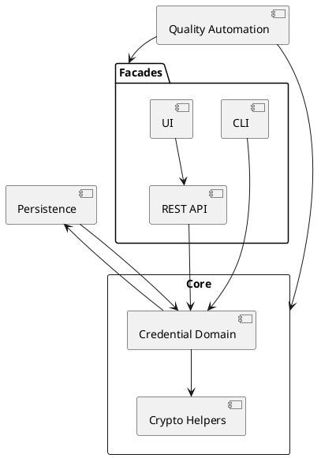

# Architecture Knowledge Map

_Status: Draft_
_Last updated: 2025-10-05_

This living map captures the explicit relationships between modules, data flows, and external interfaces so future agents can reason about change impact quickly. Update it after every iteration that introduces or modifies a component, dependency, or contract.

## Update Procedure
1. Review the latest feature plan and closed work to identify new elements or interactions.
2. Describe the change in prose (one line per relationship) under **Current Links**.
3. Update the PlantUML view (or replace it with another diagram) so visualisations stay in sync. Regenerate any exported assets in `docs/_assets/` if required.
4. Note outstanding follow-ups or ambiguities in the **Open Items** table and mirror them in `docs/4-architecture/open-questions.md`.

## Current Links
- Core module currently exposes the OCRA credential domain consumed by facade modules; additional protocol packages will be introduced via future specifications.
- Future work will surface issuance and presentation simulators for EU Digital Identity Wallet flows once the dedicated features are prioritised.
- Core OCRA package normalises RFC 6287 suites into descriptor records consumed by the credential registry and future factory helpers.
- Core persistence serialization contracts convert protocol descriptors into versioned credential records, now stored by `MapDbCredentialStore` with optional schema migrations when configured.
- OCRA validation telemetry emits structured debug events that future observability modules can ingest without exposing secret material.
- `docs/1-concepts/README.md` documents the OCRA capability matrix and telemetry contract operators should consult when integrating facades.
- HOTP evaluation and replay now run within the operator console (stored credential counters, inline submissions, and read-only replay diagnostics), while TOTP, FIDO2/WebAuthn, EMV/CAP, and EUDI wallet packages (OpenID4VP 1.0, ISO/IEC 18013-5, SIOPv2) remain pending as placeholder tabs until their specs and facades land.
- MapDB-backed persistence layer (planned) will expose repositories consumed by CLI, REST API, and UI facades.
- MapDB-backed persistence now emits Level.FINE telemetry events (`persistence.credential.lookup` / `persistence.credential.mutation`) capturing cache hit/miss and latency metrics without leaking secret material.
- MapDB maintenance helper (T205) provides synchronous compaction and integrity checks with structured `MaintenanceResult` outputs and telemetry so admin facades can surface maintenance outcomes.
- MapDB persistence supports optional AES-GCM secret encryption via in-memory key callbacks, keeping secrets encrypted at rest while preserving the existing `CredentialStore` contract.
- Application module now owns shared telemetry adapters (`TelemetryContracts`) that produce consistent `TelemetryFrame` payloads for CLI and REST, replacing facade-local telemetry classes.
- Application module now exposes HOTP evaluation and issuance services that mutate shared `CredentialStore` counters and emit `hotp.evaluate`/`hotp.issue` events through `TelemetryContracts` while redacting OTP material.
- CLI module now includes HOTP import/list/evaluate commands that wrap the application services, emit `cli.hotp.issue`/`cli.hotp.evaluate` telemetry, and mirror the OCRA CLI response formatting.
- REST API module now exposes HOTP evaluation controllers for stored and inline flows, delegating to `HotpEvaluationApplicationService`, emitting `rest.hotp.evaluate` telemetry, and persisting counter updates through `CredentialStoreFactory`; the companion `/api/v1/hotp/credentials` directory feeds UI dropdowns with algorithm/digit/counter metadata.
- REST API module now adds a dedicated HOTP replay controller/service pair for stored and inline diagnostics, calling `HotpReplayApplicationService`, logging `rest.hotp.replay` telemetry, and returning non-mutating counter metadata for UI/API consumers.
- HOTP inline evaluation now omits operator-supplied identifiers; REST/application services emit telemetry without credential references while preserving algorithm/digit metadata.
- Operator console replay flows call the same HOTP replay service, surface sample payload loaders, and normalise telemetry identifiers from `rest-hotp-*` to `ui-hotp-*` prefixes so operators can distinguish UI traffic while preserving the original telemetry payload for log correlation.
- `infra-persistence` module centralises `CredentialStoreFactory` wiring so CLI, REST, and tests acquire MapDB-backed stores through a shared configuration seam while keeping encryption profiles and future migrations/overrides injectable.
- CLI module now exposes `maintenance <compact|verify>` commands that orchestrate the helper for operators working on local MapDB stores.
- Unified operator console at `/ui/console` now embeds OCRA evaluation/replay flows alongside HOTP evaluation and replay cards, with placeholder tabs remaining for TOTP, EMV/CAP, FIDO2/WebAuthn, and the EUDI wallet protocols; legacy `/ui/ocra/evaluate` and `/ui/ocra/replay` views now redirect/not-found so the console remains the single entry point.
- Operator console encodes HOTP evaluate/replay tab selection into the `protocol`/`tab` query parameters so refreshes and deep links land on the correct HOTP panel; the shared console router now remembers per-protocol tabs for both OCRA and HOTP to keep history/refresh flows aligned.
- Operator console panels standardise on the evaluate/replay pill header, shared summary messaging, and hint styling so HOTP, OCRA, and forthcoming credential tabs retain a uniform UX while protocol-specific forms capture their unique inputs/outputs.
- Operator console now exposes a JSON-driven protocol info drawer/modal that syncs with tab selection, persists seen/surface/panel state in localStorage, auto-opens once per protocol on wide viewports, honours reduced-motion preferences, toggles aria-hidden on the console when the modal is active, dispatches CustomEvents for open/close/spec interactions, and is triggered by a single global info button aligned beside the tablist.
- Embeddable Protocol Info assets (`protocol-info.css` / `protocol-info.js`) plus a standalone demo and how-to guide enable vanilla DOM integrations outside the operator console while reusing the same API.
- Console state (protocol + OCRA tab) is now encoded via query parameters so deep links and history navigation stay in sync across disabled placeholders, with telemetry unaffected because tab changes remain client-side.
- REST OCRA verification metadata now includes a `mode` attribute (stored vs inline) exposed to telemetry so replay facades can log outcome context consistently.
- Operator console replay mode posts sanitized telemetry summaries to `TelemetryContracts.ocraVerificationAdapter`, tagging `origin=ui` and surfacing mode/outcome/fingerprint for downstream analytics.
- REST OCRA directory now serves `/api/v1/ocra/credentials/{id}/sample`, returning curated challenge/context fingerprints used by operator-facing sample loaders.
- Operator console replay mode exposes a manual “Load sample data” action that fetches curated payloads on demand, keeping stored credentials untouched until operators opt in.
- `core-shared` module centralises credential models, repository utilities, and persistence primitives consumed by `core`, `core-ocra`, and higher-level facades.
- `core-ocra` module owns OCRA descriptors, registry defaults, and persistence hooks; `OcraStoreMigrations` centralises builder configuration even though no legacy migrations remain.
- CLI module now orchestrates OCRA credential import/list/delete/evaluate commands, delegating to MapDB persistence and core OCRA adapters while emitting sanitized telemetry.
- CLI command hierarchy seals `OcraCli.AbstractOcraCommand` to the known Picocli subcommands, keeping package-private seams for tests while preventing ad-hoc extensions.
- Caffeine cache layer exposes per-profile defaults (in-memory, file-backed, container) with expire-after-access/write strategies to sustain ≥10k RPS targets while keeping overrides available via builder hooks; operators can reference `docs/2-how-to/configure-persistence-profiles.md` for configuration steps.
- Quality automation suite (Feature 008) formalises ArchUnit boundary checks plus PIT/Jacoco thresholds across modules, running locally and in GitHub Actions.
- SpotBugs dead-state enforcement (Feature 015) adds a shared include filter and complementary PMD `UnusedPrivateField`/`UnusedPrivateMethod` rules so unread/unwritten state fails `./gradlew check` uniformly across JVM modules.
- `core-architecture-tests` Gradle module hosts facade/persistence ArchUnit rules, ensuring CLI/REST/UI modules stay isolated while persistence remains core-internal; invoked via `./gradlew :core-architecture-tests:test` or root `./gradlew architectureTest` and planned to roll into `qualityGate`.
- Reflection guardrails (Feature 011) combine an ArchUnit rule and the Gradle `reflectionScan` task (wired into `qualityGate`) to keep production/tests free of `java.lang.reflect` usage while providing allow-listed seams for testing.
- Aggregated Jacoco tasks (`jacocoAggregatedReport`, `jacocoCoverageVerification`) monitor OCRA module coverage with current thresholds (line ≥77%, branch ≥62%) and output to `build/reports/jacoco/aggregated/` pending future threshold increases.
- Root `mutationTest` task runs PIT against `core` OCRA classes (threshold ≥85%, current score ≈87.6%) and excludes `OcraChallengeFormat`/`OcraCredentialFactory` pending new tests; CLI/REST facades queued for future expansion once mutation coverage improves.
- Root `qualityGate` aggregates `spotlessCheck` and `check` (architecture, coverage, mutation), accepts `-Ppit.skip=true` for faster local iteration, now runs in GitHub Actions via the `ci.yml` workflow, and has operator guidance in `docs/5-operations/quality-gate.md`.
- REST API spec for session-aware OCRA evaluation was drafted 2025-09-28; broader facade endpoints remain pending.
- REST API now serves `/api/v1/ocra/evaluate`, delegating to `OcraResponseCalculator` and emitting redaction-friendly telemetry aligned with the CLI helper.
- REST API publishes an auto-generated OpenAPI contract (`/v3/api-docs`) with checked-in JSON and YAML snapshots at `docs/3-reference/rest-openapi.json` and `docs/3-reference/rest-openapi.yaml` for downstream integrations.
- REST API now exposes `/api/v1/ocra/verify`, delegating to `OcraReplayVerifier` for OTP replay checks and sharing telemetry metadata with CLI verification flows.
- REST verification services publish package-private normalized request records and telemetry emitters so tests and future modules can exercise behaviour without reflection, mirroring the evaluation service seams.
- REST OCRA evaluation and verification services now normalize payloads into sealed variants (stored vs inline), reducing mode detection to pattern matching instead of nullable fields.
- REST OCRA telemetry snapshot is archived under `docs/3-reference/rest-ocra-telemetry-snapshot.md` to illustrate redaction guarantees for operators.
- REST OCRA telemetry events now emit `reasonCode` and `sanitized` attributes so downstream alerting can distinguish validation failures from unexpected errors without leaking secrets.
- REST OCRA evaluation supports credential lookup via `credentialId`, resolving descriptors from the persistence adapter while preserving the existing inline secret mode.
- REST module now serves the unified Thymeleaf operator console at `/ui/console`, reusing `/ui/ocra` fragments under the hood while delegating evaluations to the REST endpoint and enforcing session-backed CSRF tokens.
- REST module exposes `/api/v1/ocra/credentials` to surface sanitized OCRA credential summaries for operator dropdowns without leaking secret material.
- Shared MapDB persistence defaults to `data/ocra-credentials.db` at the repository root, keeping CLI, REST, and UI facades aligned unless overridden.
- MapDB store now exposes a package-private cache accessor used by internal tests, eliminating the need for reflective field access while keeping cache internals encapsulated.
- Ocra credential factory provides a package-private telemetry logger accessor so validation logging assertions remain reflection-free.
- Operator UI templates expose an accessible mode toggle (inline vs credential) and a sanitized telemetry summary panel so escalations reuse REST metadata without revealing secrets.
- Operator UI submissions now rely on asynchronous JSON `fetch` calls (with an XMLHttpRequest fallback for HtmlUnit) to invoke `/api/v1/ocra/evaluate`, rendering result/error panels client-side while the server-side controller remains read-only.
- Inline policy presets surface curated OCRA test vectors in the UI, auto-filling inline evaluation fields for QA and operator training.
- Ocra operator sample catalog centralises inline presets and canonical seeding definitions so UI tests and REST endpoints remain in sync without re-encoding RFC datasets.
- REST seeding endpoint delegates credential creation to the application-layer `OcraSeedApplicationService`, ensuring facades no longer instantiate core factories directly while supporting append-only MapDB inserts.
- Operator console now reveals the seeding control only when stored credential mode is active, keeping inline-mode evaluations uncluttered while still allowing append-only seeding flows.
- Stored credential mode now ships with a client-side “Auto-fill parameters” helper that parses the selected OCRA suite and generates compatible challenge/counter/session/timestamp values, clearing disallowed inputs to avoid REST validation errors.
- Replay inline presets auto-populate immediately just like evaluation presets, keeping the UI flows consistent without extra controls.
- Evaluation result cards now present only OTP and status; sanitisation remains enforced server-side without an explicit UI indicator.
- Replay result cards now surface reason code and outcome while dropping the UI-only mode label; telemetry still records mode for audits.
- REST facade now boots a MapDB-backed `CredentialStore` bean (path configurable via `openauth.sim.persistence.database-path`), enabling stored credential evaluations in both REST and UI flows.
- `infra-persistence` module exposes `CredentialStoreFactory`, centralising MapDB provisioning so CLI and REST facades obtain `CredentialStore` instances without direct builder usage.
- How-to catalogue documents the Appendix B Java workflow for generating new OCRA test vectors, keeping domain/UI fixtures aligned with the draft reference implementation.
- Operator documentation suite under `docs/2-how-to` now includes REST, CLI, and Java integration guides that point operators to shared MapDB defaults and Swagger UI entry points.
- OCRA replay & verification flows (Feature 009) now extend CLI and REST facades with strict OTP verification using stored or inline credentials while emitting hashed OTP telemetry for audit purposes; shipped 2025-10-01 with shared `core.ocra.verify` instrumentation.

## Open Items
| Date | Topic | Question | Status | Follow-up |
|------|-------|----------|--------|-----------|
| 2025-09-27 | Persistence design | Confirm MapDB caching topology (shared vs per facade) | Resolved | Resolved 2025-09-27 – Shared MapDB store with core-managed shared cache for all facades |
| 2025-10-01 | Architecture harmonization | Capture shared application layer + telemetry relationships once implemented | Open | Update after R1403–R1408 to reflect new modules and contracts |

## PlantUML Sketch

Update the diagram together with the bullet list whenever the architecture shifts. If PlantUML becomes unwieldy, replace it with another markdown-embedded viewpoint and document how to regenerate it.
